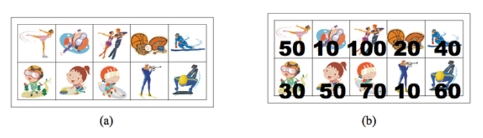
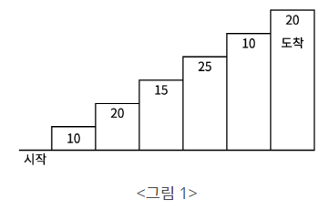
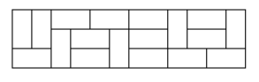

# 02. 백준 동적 계획법 정리 | Dynamic Programming | DP | JAVA | BOJ

🤠 동적 계획법 문제 모음으로 [알고리즘 문제풀이(PS) 시작하기](https://plzrun.tistory.com/entry/%EC%95%8C%EA%B3%A0%EB%A6%AC%EC%A6%98-%EB%AC%B8%EC%A0%9C%ED%92%80%EC%9D%B4PS-%EC%8B%9C%EC%9E%91%ED%95%98%EA%B8%B0) 글에서 뽑아준 문제들로만 정리해봤다.

:::tip

무작정 문제만 풀어왔는데, 동적계획법(`Dynamic Programming`, 그냥 있어보이게 지은 이름이라고 한다.)이라는 게 있는지도 몰랐다.

알고리즘을 따로 공부해야 한다는 게 이래서인가 보다.. 나처럼 무작정 풀면서 시간 낭비하지말고, 이론을 먼저 읽고 문제를 풀어서 공부 시간을 훨씬 단축시키길 바란다.

몇 개를 읽어도 이해가 잘 안돼서 어려웠는데, 특히 정리가 잘 되고 깔끔한 블로그들이 있었다. 그 블로그 글을 링크로 걸어두고, 설명은 생략,,

* [[자료구조와 알고리즘] 동적 계획법(Dynamic Programming, DP)](https://velog.io/@chelsea/1-%EB%8F%99%EC%A0%81-%EA%B3%84%ED%9A%8D%EB%B2%95Dynamic-Programming-DP)

* [알고리즘 - Dynamic Programming(동적 계획법)](https://hongjw1938.tistory.com/47)


:::

## [1463. 1로 만들기](http://boj.kr/1463)

<h3>🔒 문제</h3>

정수 X에 사용할 수 있는 연산은 다음과 같이 세 가지 이다.

1. X가 3으로 나누어 떨어지면, 3으로 나눈다.
2. X가 2로 나누어 떨어지면, 2로 나눈다.
3. 1을 뺀다.

정수 N이 주어졌을 때, 위와 같은 연산 세 개를 적절히 사용해서 1을 만들려고 한다. 연산을 사용하는 횟수의 최솟값을 출력하시오.

<h3>📢 입력</h3>

* 첫째 줄에 1보다 크거나 같고, $10^6$ 보다 작거나 같은 정수 N이 주어진다.

<h3>📢 출력</h3>

* 첫째 줄에 연산을 하는 횟수의 최솟값을 출력한다.

<h3>📢 입출력 예</h3>

| 예제 입력 1 | 예제 출력 1 |
| --- | --- |
| 2 | 1 |

| 예제 입력 2 | 예제 출력 2 |
| --- | --- |
| 10 | 3 |


<h3>📢 힌트</h3>

* 10의 경우에 10 -> 9 -> 3 -> 1 로 3번 만에 만들 수 있다.

<h3>🔑 풀이</h3>

```java
import java.util.Scanner;

public class Main {

    public static void main(String[] args) {
        Scanner sc = new Scanner(System.in);
        int N = sc.nextInt();
        int[] dp = new int[N+1];

        for (int i=2; i<=N; i++) {
            // i-1 연산에 +1
            dp[i] = dp[i-1] + 1;
            if (i%2 == 0) {
                // 위 계산한 i연산 이거나 혹은 /2 연산 중 최소값
                dp[i] = Math.min(dp[i], dp[i/2] + 1);
            }
            if (i%3 == 0) {
                // 위 계산한 i연산 이거나 혹은 /3 연산 중 최소값
                dp[i] = Math.min(dp[i], dp[i/3] + 1);
            }
        }

        System.out.println(dp[N]);
    }
}
```

## [11726. 2×n 타일링](http://boj.kr/11726)

<h3>🔒 문제</h3>

2×n 크기의 직사각형을 1×2, 2×1 타일로 채우는 방법의 수를 구하는 프로그램을 작성하시오.

아래 그림은 2×5 크기의 직사각형을 채운 한 가지 방법의 예이다.

<h3>📢 입력</h3>

* 첫째 줄에 n이 주어진다. (1 ≤ n ≤ 1,000)

<h3>📢 출력</h3>
 
* 첫째 줄에 2×n 크기의 직사각형을 채우는 방법의 수를 10,007로 나눈 나머지를 출력한다.

<h3>📢 입출력 예</h3>

| 예제 입력 1 | 예제 출력 1 |
| --- | --- |
| 2 | 2 |


| 예제 입력 2 | 예제 출력 2 |
| --- | --- |
| 9 | 55 |

<h3>🔐</h3>

1~5 까지 그림을 그려보면, `dp[i] = dp[i-1] + dp[i-2]`와 같은 점화식이 도출되는 걸 금방 확인할 수 있다.

<h3>🔑 풀이</h3>

```java
import java.util.Scanner;

public class Main {

    public static void main(String[] args) {
        Scanner sc = new Scanner(System.in);
        int N = sc.nextInt();
        int[] dp = new int[N+1];

        // index 지정
        dp[0] = 1;
        dp[1] = 1;

        for (int i = 2; i <= N; i++) {
            // 점화식
            dp[i] = (dp[i - 2] + dp[i - 1]) % 10007;
        }

        System.out.println(dp[N]);
    }
}
```

## [11727. 2×n 타일링 2](http://boj.kr/11727)

<h3>🔒 문제</h3>

2×n 직사각형을 1×2, 2×1과 2×2 타일로 채우는 방법의 수를 구하는 프로그램을 작성하시오.

아래 그림은 2×17 직사각형을 채운 한가지 예이다.

<h3>📢 입력</h3>

* 첫째 줄에 n이 주어진다. (1 ≤ n ≤ 1,000)

<h3>📢 출력</h3>
 
* 첫째 줄에 2×n 크기의 직사각형을 채우는 방법의 수를 10,007로 나눈 나머지를 출력한다.

<h3>📢 입출력 예</h3>

| 예제 입력 1 | 예제 출력 1 |
| --- | --- |
| 2 | 3 |


| 예제 입력 2 | 예제 출력 2 |
| --- | --- |
| 8 | 171 |

| 예제 입력 3 | 예제 출력 3 |
| --- | --- |
| 12 | 2731 |

<h3>🔐</h3>

1~5 까지 그림을 그려보면, `dp[i] = dp[i-1] + 2*dp[i-2]`와 같은 점화식이 도출되는 걸 금방 확인할 수 있다.

<h3>🔑 풀이</h3>

```java
import java.util.Scanner;

public class Main {

    public static void main(String[] args) {
        Scanner sc = new Scanner(System.in);
        int N = sc.nextInt();
        int[] dp = new int[N+1];

        // index 지정
        dp[0] = 1;
        dp[1] = 1;

        for (int i = 2; i <= N; i++) {
            // 점화식
            dp[i] = (dp[i - 1] + 2*dp[i - 2]) % 10007;
        }

        System.out.println(dp[N]);
    }

}
```

## [9095. 1, 2, 3 더하기](http://boj.kr/9095)

<h3>🔒 문제</h3>

정수 4를 1, 2, 3의 합으로 나타내는 방법은 총 7가지가 있다. 합을 나타낼 때는 수를 1개 이상 사용해야 한다.

* 1+1+1+1

* 1+1+2

* 1+2+1

* 2+1+1

* 2+2

* 1+3

* 3+1

정수 n이 주어졌을 때, n을 1, 2, 3의 합으로 나타내는 방법의 수를 구하는 프로그램을 작성하시오.

<h3>📢 입력</h3>

* 첫째 줄에 테스트 케이스의 개수 T가 주어진다. 각 테스트 케이스는 한 줄로 이루어져 있고, 정수 n이 주어진다. n은 양수이며 11보다 작다.

<h3>📢 출력</h3>
 
* 각 테스트 케이스마다, n을 1, 2, 3의 합으로 나타내는 방법의 수를 출력한다.

<h3>📢 입출력 예</h3>

| 예제 입력 1 | 예제 출력 1 |
| --- | --- |
| 3<br>4<br>7<br>10 | 7<br>44<br>274 |


<h3>🔐</h3>

점화식 도출  `dp[j] = dp[j-3] + dp[j-2] + dp[j-1]`

<h3>🔑 풀이</h3>

```java
import java.util.Scanner;

public class Main {

    public static void main(String[] args) {
        Scanner sc = new Scanner(System.in);
        int cnt = sc.nextInt();

        // 11인 이유: 문제 확인! n은 양수이며 11보다 작다
        int[] dp = new int[11+1];

        // index 지정
        dp[1] = 1;
        dp[2] = 2;
        dp[3] = 4;

        for (int i=0; i<cnt; i++) {
            int n = sc.nextInt();
            for (int j = 4; j<=n; j++) {
                // 점화식
                dp[j] = dp[j-3] + dp[j-2] + dp[j-1];
            }
            System.out.println(dp[n]);
        }
    }

}
```

## [10844. 쉬운 계단 수](http://boj.kr/10844)

<h3>🔒 문제</h3>

45656이란 수를 보자.

이 수는 인접한 모든 자리의 차이가 1이다. 이런 수를 계단 수라고 한다.

N이 주어질 때, 길이가 N인 계단 수가 총 몇 개 있는지 구해보자. 0으로 시작하는 수는 계단수가 아니다.

<h3>📢 입력</h3>

* 첫째 줄에 N이 주어진다. N은 1보다 크거나 같고, 100보다 작거나 같은 자연수이다.

<h3>📢 출력</h3>
 
* 첫째 줄에 정답을 1,000,000,000으로 나눈 나머지를 출력한다.

<h3>📢 입출력 예</h3>

| 예제 입력 1 | 예제 출력 1 |
| --- | --- |
| 1 | 9 |

| 예제 입력 2 | 예제 출력 2 |
| --- | --- |
| 2 | 17 |

<h3>🔐</h3>

2차원 배열(**dp[자릿수][끝자리수]**) 로 그려보면 이전행의 앞 뒤를 더한 값이 정답인 걸 알 수 있다.
`dp[i][j] = dp[i - 1][j - 1] + dp[i - 1][j + 1]`

<u>예외의 경우 끝자리가 0인 경우와 9인 경우가 있다. </u>
끝자리가 0인 경우는, 이전행의 1열이 답이고 (`dp[i][0] = dp[i-1][1]`) 
9인 경우는 이전행의 8열(`dp[i][9] = dp[i-1][8]`)이 답이다.

오버플로우를 대비하여 모든 경우를 mod(1000000000)로 나누었다.


<h3>🔑 풀이</h3>

```java
import java.util.Scanner;

public class Main {

    public static void main(String[] args) {
        Scanner sc = new Scanner(System.in);
        int n = sc.nextInt();
        long mod = 1000000000;

        long[][] dp = new long[n+1][10];

        // 한자리 수의 경의 경우의 수 1개
        for (int i=1; i<=9; i++) {
            dp[1][i] = 1L;
        }

        for (int i=2; i<= n; i++) {
            dp[i][0] = dp[i-1][1]%mod; // 끝자리 0인 경우
            dp[i][9] = dp[i-1][8]%mod; // 끝자리 9인 경우

            // 이외의 경우
            for (int j=1; j<=8; j++) {
                dp[i][j] = (dp[i-1][j-1]%mod + dp[i-1][j+1]%mod)%mod; 
            }
        }

        // N자리 수 모든 결과 더해주기 
        long result = 0;
        for (int i=0; i<10; i++) {
            result = (result + dp[n][i])%mod;
        }

        System.out.println(result);
    }

}
```

## [11057. 오르막 수](http://boj.kr/11057)

<h3>🔒 문제</h3>

오르막 수는 수의 자리가 오름차순을 이루는 수를 말한다. 이때, 인접한 수가 같아도 오름차순으로 친다.

예를 들어, 2234와 3678, 11119는 오르막 수이지만, 2232, 3676, 91111은 오르막 수가 아니다.

수의 길이 N이 주어졌을 때, 오르막 수의 개수를 구하는 프로그램을 작성하시오. 수는 0으로 시작할 수 있다.

<h3>📢 입력</h3>

* 첫째 줄에 N (1 ≤ N ≤ 1,000)이 주어진다.

<h3>📢 출력</h3>
 
* 첫째 줄에 길이가 N인 오르막 수의 개수를 10,007로 나눈 나머지를 출력한다.

<h3>📢 입출력 예</h3>

| 예제 입력 1 | 예제 출력 1 |
| --- | --- |
| 1 | 10 |

| 예제 입력 2 | 예제 출력 2 |
| --- | --- |
| 2 | 55 |

| 예제 입력 3 | 예제 출력 3 |
| --- | --- |
| 3 | 220 |

<h3>🔐</h3>

2차원 배열 **(dp[자릿수][끝자리수])** 로 그려보면 이전행(자릿수-1)의 끝자릿수~9까지 **(dp[자릿수-1][끝자리수]~dp[자릿수-1][9])** 더한 값임을 알 수 있다.
`dp[i][j] = dp[i-1][j]~dp[i-1][9] 까지 더한 값`

<h3>🔑 풀이</h3>

```java
import java.util.Scanner;

public class Main {

    public static void main(String[] args) {
        Scanner sc = new Scanner(System.in);
        int N = sc.nextInt();
        int[][] dp = new int[N+2][10];

        for (int i=0; i<10; i++) {
            dp[1][i] = 1;
        }

        for (int i=2; i<=N+1; i++) {
            for (int j=0; j<10; j++) {
                for (int k=j; k<10; k++) {
                    dp[i][j] += dp[i-1][k];
                    dp[i][j] %= 10007;
                }
            }
        }


        System.out.println(dp[N+1][0]);
    }
}
```

## [2193. 이친수](http://boj.kr/2193)

<h3>🔒 문제</h3>

0과 1로만 이루어진 수를 이진수라 한다. 이러한 이진수 중 특별한 성질을 갖는 것들이 있는데, 이들을 이친수(pinary number)라 한다. 이친수는 다음의 성질을 만족한다.

* 이친수는 0으로 시작하지 않는다.

* 이친수에서는 1이 두 번 연속으로 나타나지 않는다. 즉, 11을 부분 문자열로 갖지 않는다.

예를 들면 1, 10, 100, 101, 1000, 1001 등이 이친수가 된다. 하지만 0010101이나 101101은 각각 1, 2번 규칙에 위배되므로 이친수가 아니다.

N(1 ≤ N ≤ 90)이 주어졌을 때, N자리 이친수의 개수를 구하는 프로그램을 작성하시오.

<h3>📢 입력</h3>

* 첫째 줄에 N이 주어진다.

<h3>📢 출력</h3>
 
* 첫째 줄에 N자리 이친수의 개수를 출력한다.

<h3>📢 입출력 예</h3>

| 예제 입력 1 | 예제 출력 1 |
| --- | --- |
| 3 | 2 |

<h3>🔐</h3>

끝자리수가 0인 경우와 1인 경우를 나누어서 생각해보자.

* **끝자리 수가 0인 경우**
    끝자리 바로 전에 0/1 아무거나 와도 되므로 `dp[n-1]`이 된다.
* **끝자리 수가 1인 경우**
    끝자리 바로 전에 0만 와야한다. 이 경우에 또, 0바로 앞에는 0/1 아무거나 와도 되므로 `dp[n-2]`의 개수가 된다.

    | 자릿수 | | | | | |
    | --- | --- | --- | --- | --- | --- | 
    | 3 자릿수 | **100** | **101** | | | |
    | 4 자릿수 | **1000** | **1010** | **1001** | | |
    | 5 자릿수 | **100**0<u>0</u> | **101**0<u>0</u> | **1001**<u>0</u> | **1010**<u>1</u> | **1000**<u>1</u> |

**점화식 : `dp[n] = dp[n-2] + dp[n-1]`**

<h3>🔑 풀이</h3>

```java
import java.util.Scanner;

public class Main {

    public static void main(String[] args) {
        Scanner sc = new Scanner(System.in);
        int N = sc.nextInt();

        long[] dp = new long[N+1];

        dp[0] = 0;
        dp[1] = 1;

        for (int i = 2; i <=N ; i++) {
            dp[i] = dp[i-2] + dp[i-1];
        }

        System.out.println(dp[N]);
    }
}
```

## [9465. 스티커](http://boj.kr/9465)

<h3>🔒 문제</h3>

상근이의 여동생 상냥이는 문방구에서 스티커 2n개를 구매했다. 스티커는 그림 (a)와 같이 2행 n열로 배치되어 있다. 상냥이는 스티커를 이용해 책상을 꾸미려고 한다.

상냥이가 구매한 스티커의 품질은 매우 좋지 않다. 스티커 한 장을 떼면, 그 스티커와 변을 공유하는 스티커는 모두 찢어져서 사용할 수 없게 된다. 즉, 뗀 스티커의 왼쪽, 오른쪽, 위, 아래에 있는 스티커는 사용할 수 없게 된다.



모든 스티커를 붙일 수 없게된 상냥이는 각 스티커에 점수를 매기고, 점수의 합이 최대가 되게 스티커를 떼어내려고 한다. 먼저, 그림 (b)와 같이 각 스티커에 점수를 매겼다. 상냥이가 뗄 수 있는 스티커의 점수의 최댓값을 구하는 프로그램을 작성하시오. 즉, 2n개의 스티커 중에서 점수의 합이 최대가 되면서 서로 변을 공유 하지 않는 스티커 집합을 구해야 한다.

위의 그림의 경우에 점수가 50, 50, 100, 60인 스티커를 고르면, 점수는 260이 되고 이 것이 최대 점수이다. 가장 높은 점수를 가지는 두 스티커 (100과 70)은 변을 공유하기 때문에, 동시에 뗄 수 없다.

<h3>📢 입력</h3>

* 첫째 줄에 테스트 케이스의 개수 T가 주어진다. 각 테스트 케이스의 첫째 줄에는 n (1 ≤ n ≤ 100,000)이 주어진다. 다음 두 줄에는 n개의 정수가 주어지며, 각 정수는 그 위치에 해당하는 스티커의 점수이다. 연속하는 두 정수 사이에는 빈 칸이 하나 있다. 점수는 0보다 크거나 같고, 100보다 작거나 같은 정수이다. 

<h3>📢 출력</h3>
 
* 각 테스트 케이스 마다, 2n개의 스티커 중에서 두 변을 공유하지 않는 스티커 점수의 최댓값을 출력한다.

<h3>📢 입출력 예</h3>

| 예제 입력 1 | 예제 출력 1 |
| --- | --- |
| 2<br/>5<br/>50 10 100 20 40<br/>30 50 70 10 60<br/>7<br/>10 30 10 50 100 20 40<br/>20 40 30 50 60 20 80 | 260<br/>290 |

<h3>🔐</h3>

그림을 그려보면 각 칸마다 두가지의 경우를 가질 수 있음을 알게 되고, 그 중 최댓값을 고르도록 점화식을 아래와 같이 짜면 된다.

<h3>🔑 풀이</h3>

```java
import java.util.Scanner;

public class Main {

    public static void main(String[] args) {
        Scanner sc = new Scanner(System.in);
        int t = sc.nextInt(); // 테스트 케이스

        for (int i=0; i<t; i++) {
            int n = sc.nextInt();
            int[][] stc = new int[2][n+1]; // 스티커
            int[][] dp = new int[2][n+1]; // 각 칸에서 최댓값 dp

            // initialize (스티커 값 입력)
            for (int j=0; j<2; j++) { // 2행
                for (int k=1; k<=n; k++) { // 1열~n열
                    stc[j][k] = sc.nextInt();
                }
            }

            // 1열의 각 칸까지는 각자가 최댓값
            dp[0][1] = stc[0][1];
            dp[1][1] = stc[1][1];

            for (int a=2; a<=n; a++) { // a-2까지 처리하기 위해 2부터
                dp[0][a] = Math.max(dp[1][a-1], dp[1][a-2]) + stc[0][a];
                dp[1][a] = Math.max(dp[0][a-1], dp[0][a-2]) + stc[1][a];
            }
            
            System.out.println(Math.max(dp[0][n], dp[1][n]));
        }
    }
}
```

## [2156. 포도주 시식](http://boj.kr/2156)

<h3>🔒 문제</h3>

효주는 포도주 시식회에 갔다. 그 곳에 갔더니, 테이블 위에 다양한 포도주가 들어있는 포도주 잔이 일렬로 놓여 있었다. 효주는 포도주 시식을 하려고 하는데, 여기에는 다음과 같은 두 가지 규칙이 있다.

1. 포도주 잔을 선택하면 그 잔에 들어있는 포도주는 모두 마셔야 하고, 마신 후에는 원래 위치에 다시 놓아야 한다.
2. 연속으로 놓여 있는 3잔을 모두 마실 수는 없다.

효주는 될 수 있는 대로 많은 양의 포도주를 맛보기 위해서 어떤 포도주 잔을 선택해야 할지 고민하고 있다. 1부터 n까지의 번호가 붙어 있는 n개의 포도주 잔이 순서대로 테이블 위에 놓여 있고, 각 포도주 잔에 들어있는 포도주의 양이 주어졌을 때, 효주를 도와 가장 많은 양의 포도주를 마실 수 있도록 하는 프로그램을 작성하시오. 

예를 들어 6개의 포도주 잔이 있고, 각각의 잔에 순서대로 6, 10, 13, 9, 8, 1 만큼의 포도주가 들어 있을 때, 첫 번째, 두 번째, 네 번째, 다섯 번째 포도주 잔을 선택하면 총 포도주 양이 33으로 최대로 마실 수 있다.

<h3>📢 입력</h3>

* 첫째 줄에 포도주 잔의 개수 n이 주어진다. (1 ≤ n ≤ 10,000) 둘째 줄부터 n+1번째 줄까지 포도주 잔에 들어있는 포도주의 양이 순서대로 주어진다. 포도주의 양은 1,000 이하의 음이 아닌 정수이다.

<h3>📢 출력</h3>
 
* 첫째 줄에 최대로 마실 수 있는 포도주의 양을 출력한다.

<h3>📢 입출력 예</h3>

| 예제 입력 1 | 예제 출력 1 |
| --- | --- |
| 6<br/>6<br/>10<br/>13<br/>9<br/>8<br/>1 | 33 |

<h3>🔑 풀이</h3>

```java
import java.util.Scanner;

public class Main {

    public static void main(String[] args) {
        Scanner sc = new Scanner(System.in);
        int n = sc.nextInt();

        int[] wine = new int[n];
        int[] dp = new int[n];

        for (int i=0; i<n; i++) {
           wine[i] = sc.nextInt();
        }

        if (n >=1) {
            dp[0] = wine[0]; // 한잔일 경우 한잔마심
        }
        if (n>=2) {
            dp[1] = wine[0] + wine[1]; // 두잔일 경우 두잔 다 마심
        }
        if (n >=3) {
            dp[2] = Math.max(dp[1], Math.max(dp[0] + wine[2], wine[1] + wine[2])); // 3잔 있을 경우
        }

        if (n>=4) {
            for (int i=3; i<n; i++) { // 4잔부터
                // 1. 가장 마지막 잔 안 마실 경우, dp[i-1]의 경우
                // 2. 마지막 기준, 한잔만 마실 경우, dp[i-2]의 경우 + 마지막잔
                // 3. 마지막 기준, 두잔 마실 경우, dp[i-3]의 경우 + 마지막 두잔
                dp[i] = Math.max(dp[i-1], Math.max(dp[i-2] + wine[i], dp[i-3] + wine[i-1] + wine[i]));
            }
        }
        
        System.out.println(dp[n-1]);
    }
}
```

## [11053. 가장 긴 증가하는 부분 수열](http://boj.kr/11053)

<h3>🔒 문제</h3>

수열 A가 주어졌을 때, 가장 긴 증가하는 부분 수열을 구하는 프로그램을 작성하시오.

예를 들어, 수열 A = {10, 20, 10, 30, 20, 50} 인 경우에 가장 긴 증가하는 부분 수열은 A = {<b>10</b>, <b>20</b>, 10, <b>30</b>, 20, <b>50</b>} 이고, 길이는 4이다.

<h3>📢 입력</h3>

* 첫째 줄에 수열 A의 크기 N ($1 \leq N \leq 1,000$)이 주어진다.

* 둘째 줄에는 수열 A를 이루고 있는 $A_i$가 주어진다. ($1 \leq A_i \leq 1,000$)

<h3>📢 출력</h3>
 
* 첫째 줄에 수열 A의 가장 긴 증가하는 부분 수열의 길이를 출력한다.

<h3>📢 입출력 예</h3>

| 예제 입력 1 | 예제 출력 1 |
| --- | --- |
| 6<br/>10 20 10 30 20 50 | 4 |

<h3>🔐</h3>

<h3>🔑 풀이</h3>

```java
import java.util.Scanner;

public class Main {

    public static void main(String[] args) {
        Scanner sc = new Scanner(System.in);
        int n = sc.nextInt();   // 수열 길이

        int cost[] = new int[n];
        int dp[] = new int[n];

        for (int i=0; i<n; i++) {   // 값 입력
            cost[i] = sc.nextInt();
        }

        for (int i=0; i<n; i++) {
            dp[i] = 1;  // 기본값 1 입력
            for (int j=0; j<i; j++) {
                // 이전 수보다 크고, 그 수의 cost+1이 현재 cost보다 크면 현재 cost에도 +1을 해줘야함.
                if (cost[j]<cost[i] && dp[i]<dp[j]+1) {
                    dp[i] = dp[j] + 1;
                }
            }
        }

        // 최댓값
        int max = 0;
        for(int i = 0; i < n; i++) {
            max = Math.max(max, dp[i]);
        }
        System.out.println(max);
    }
}
```

## [11055. 가장 큰 증가 부분 수열](http://boj.kr/11055)

<h3>🔒 문제</h3>

수열 A가 주어졌을 때, 그 수열의 증가 부분 수열 중에서 합이 가장 큰 것을 구하는 프로그램을 작성하시오.

예를 들어, 수열 A = {1, 100, 2, 50, 60, 3, 5, 6, 7, 8} 인 경우에 합이 가장 큰 증가 부분 수열은 A = {<b>1</b>, 100, <b>2</b>, <b>50</b>, <b>60</b>, 3, 5, 6, 7, 8} 이고, 합은 113이다.

<h3>📢 입력</h3>

* 첫째 줄에 수열 A의 크기 N ($1 \leq N \leq 1,000$)이 주어진다.

* 둘째 줄에는 수열 A를 이루고 있는 $A_i$가 주어진다. ($1 \leq A_i \leq 1,000$)

<h3>📢 출력</h3>
 
* 첫째 줄에 수열 A의 합이 가장 큰 증가 부분 수열의 합을 출력한다.

<h3>📢 입출력 예</h3>

| 예제 입력 1 | 예제 출력 1 |
| --- | --- |
| 10<br/>1 100 2 50 60 3 5 6 7 8 | 113 |

<h3>🔐</h3>

`비교cost값`과 `현재cost값`을 비교하여, <u>`현재cost값`이 더 크고 -</u> 
<u>`현재dp값`에 들어있는 값이 `비교dp값+현재cost값`보다 작으면</u> `비교dp값+현재cost값`으로 `현재dp값`을 변경해준다.


<h3>🔑 풀이</h3>

```java
import java.util.Scanner;

public class Main {

    public static void main(String[] args) {
        Scanner sc = new Scanner(System.in);
        int n = sc.nextInt();

        int cost[] = new int[n];
        int dp[] = new int[n];

        for (int i=0; i<n; i++) {
            cost[i] = sc.nextInt();
        }

        for (int i=0; i<n; i++) {
            dp[i] = cost[i];
            for (int j=0; j<i; j++) {
                if (cost[j]<cost[i] && dp[i]<dp[j]+cost[i]) {
                    dp[i] = dp[j]+cost[i];
                }
            }
        }

        int max = 0;
        for(int i = 0; i < n; i++) {
            max = Math.max(max, dp[i]);
        }
        System.out.println(max);
    }
}
```

## [11722. 가장 긴 감소하는 부분 수열](http://boj.kr/11722)

<h3>🔒 문제</h3>

수열 A가 주어졌을 때, 가장 긴 감소하는 부분 수열을 구하는 프로그램을 작성하시오.

예를 들어, 수열 A = {10, 30, 10, 20, 20, 10} 인 경우에 가장 긴 감소하는 부분 수열은 A = {10, <b>30</b>, 10, <b>20</b>, 20, <b>10</b>}  이고, 길이는 3이다.

<h3>📢 입력</h3>

* 첫째 줄에 수열 A의 크기 N ($1 \leq N \leq 1,000$)이 주어진다.

* 둘째 줄에는 수열 A를 이루고 있는 Ai가 주어진다. ($1 \leq A_i \leq 1,000$)

<h3>📢 출력</h3>
 
* 첫째 줄에 수열 A의 가장 긴 감소하는 부분 수열의 길이를 출력한다.

<h3>📢 입출력 예</h3>

| 예제 입력 1 | 예제 출력 1 |
| --- | --- |
| 6<br/>10 30 10 20 20 10 | 3 |

<h3>🔐</h3>

`cost[현재]`이 `cost[이전]`보다 작고, `dp[이전]+1`이 `dp[현재]`보다 크면 `dp[이전]+1`을 해준다.

<h3>🔑 풀이</h3>

```java
import java.util.Scanner;

public class Main {

    public static void main(String[] args) {
        Scanner sc = new Scanner(System.in);
        int n = sc.nextInt();

        int cost[] = new int[n];
        int dp[] = new int[n];

        for (int i=0; i<n; i++) {
            cost[i] = sc.nextInt();
        }

        for (int i=0; i<n; i++) {
            dp[i] = 1;
            for (int j=0; j<i; j++) {
                if (cost[i]<cost[j] && dp[i]<dp[j]+1) {
                    dp[i] = dp[j]+1;
                }
            }
        }

        int max = 0;
        for(int i = 0; i < n; i++) {
            max = Math.max(max, dp[i]);
        }
        System.out.println(max);
    }
}
```

## [11054. 가장 긴 바이토닉 부분 수열](http://boj.kr/11054)

<h3>🔒 문제</h3>

수열 S가 어떤 수 $S_k$를 기준으로 $S_1 < S_2 < ... S_{k-1} < S_k > S_{k+1} > ... S_(N-1) > S_N$을 만족한다면, 그 수열을 바이토닉 수열이라고 한다.

예를 들어, {10, 20, <b>30</b>, 25, 20}과 {10, 20, 30, <b>40</b>}, {<b>50</b>, 40, 25, 10} 은 바이토닉 수열이지만,  {1, 2, 3, 2, 1, 2, 3, 2, 1}과 {10, 20, 30, 40, 20, 30} 은 바이토닉 수열이 아니다.

수열 A가 주어졌을 때, 그 수열의 부분 수열 중 바이토닉 수열이면서 가장 긴 수열의 길이를 구하는 프로그램을 작성하시오.

<h3>📢 입력</h3>

* 첫째 줄에 수열 A의 크기 N이 주어지고, 둘째 줄에는 수열 A를 이루고 있는 $A_i$가 주어진다. ($1 \leq N \leq 1000$, $1 \leq A_i \leq 1000$)

<h3>📢 출력</h3>
 
* 첫째 줄에 수열 A의 부분 수열 중에서 가장 긴 바이토닉 수열의 길이를 출력한다.

<h3>📢 입출력 예</h3>

| 예제 입력 1 | 예제 출력 1 |
| --- | --- |
| 10<br/>1 5 2 1 4 3 4 5 2 1 | 7 |

<h3>📢 힌트</h3>

예제의 경우 {<b>1</b> 5 <b>2</b> 1 4 <b>3</b> <b>4</b> <b>5</b> <b>2</b> <b>1</b>}이 가장 긴 바이토닉 부분 수열이다.

<h3>🔐</h3>

기준값으로부터 <u><b>[0]</b>--->오름차순---><b>[기준값]</b><---오름차순---<b>[마지막값]</b></u> 으로 생각해보자.

<h3>🔑 풀이</h3>

```java
import java.util.Scanner;

public class Main {

    public static void main(String[] args) {
        Scanner sc = new Scanner(System.in);
        int n = sc.nextInt(); // 수열 길이

        int cost[] = new int[n]; // 수열
        int l_dp[] = new int[n]; // 왼쪽에서부터 dp [0]-->오름차순-->[기준]
        int r_dp[] = new int[n]; // 오른쪽에서부터 dp [기준]<--오름차순<--[마지막값]

        // 수열 입력
        for (int i=0; i<n; i++) {
            cost[i] = sc.nextInt();
        }

        // 왼쪽
        for (int i=0; i<n; i++) {
            l_dp[i] = 1;
            for (int j=0; j<i; j++) {
                if (cost[j]<cost[i] && l_dp[i]<l_dp[j]+1) {
                    l_dp[i] = l_dp[j]+1;
                }
            }
        }

        // 오른쪽
        for (int i=n-1; i>=0; i--) {
            r_dp[i] = 1;
            for (int j=n-1; j>=i; j--) {
                if (cost[j]<cost[i] && r_dp[i]<r_dp[j]+1) {
                    r_dp[i] = r_dp[j]+1;
                }
            }
        }

        // 최대값
        int max = 0;
        for(int i = 0; i < n; i++) {
            max = Math.max(l_dp[i]+r_dp[i], max);
        }

        // 기준값 겹치므로
        System.out.println(max-1);
    }
}
```

## [1912. 연속합](http://boj.kr/1912)

<h3>🔒 문제</h3>

n개의 정수로 이루어진 임의의 수열이 주어진다. 우리는 이 중 연속된 몇 개의 수를 선택해서 구할 수 있는 합 중 가장 큰 합을 구하려고 한다. 단, 수는 한 개 이상 선택해야 한다.

예를 들어서 10, -4, 3, 1, 5, 6, -35, 12, 21, -1 이라는 수열이 주어졌다고 하자. 여기서 정답은 12+21인 33이 정답이 된다.

<h3>📢 입력</h3>

* 첫째 줄에 정수 n(1 ≤ n ≤ 100,000)이 주어지고 둘째 줄에는 n개의 정수로 이루어진 수열이 주어진다. 수는 -1,000보다 크거나 같고, 1,000보다 작거나 같은 정수이다.

<h3>📢 출력</h3>
 
* 첫째 줄에 답을 출력한다.

<h3>📢 입출력 예</h3>

| 예제 입력 1 | 예제 출력 1 |
| --- | --- |
| 10<br/>10 -4 3 1 5 6 -35 12 21 -1 | 33 |

| 예제 입력 2 | 예제 출력 2 |
| --- | --- |
| 10<br/>2 1 -4 3 4 -4 6 5 -5 1 | 14 |

| 예제 입력 3 | 예제 출력 3 |
| --- | --- |
| 5<br/>-1 -2 -3 -4 -5 | -1 |

<h3>🔑 풀이</h3>

```java
import java.util.Scanner;

public class Main {

    public static void main(String[] args)  {
        Scanner sc = new Scanner(System.in);
        int n = sc.nextInt(); // 수열 길이

        int[] cost = new int[n]; // 수열
        Integer[] dp = new Integer[n]; // dp

        // 수열 입력
        for (int i=0; i<n; i++) {
            cost[i] = sc.nextInt();
        }

        // 각 자릿수에서 최대값 구하기
        dp[0] = cost[0];
        for(int i=1;i<n;i++) {
            dp[i] = Math.max(dp[i-1]+cost[i], cost[i]);
        }

        int max =Integer.MIN_VALUE;
        for(int i=0;i<n;i++) {
            if(dp[i] > max)
                max = dp[i];
        }
        System.out.println(max);
    }

}
```

## [2579. 계단 오르기](http://boj.kr/2579)

<h3>🔒 문제</h3>

계단 오르기 게임은 계단 아래 시작점부터 계단 꼭대기에 위치한 도착점까지 가는 게임이다. <그림 1>과 같이 각각의 계단에는 일정한 점수가 쓰여 있는데 계단을 밟으면 그 계단에 쓰여 있는 점수를 얻게 된다.



예를 들어 <그림 2>와 같이 시작점에서부터 첫 번째, 두 번째, 네 번째, 여섯 번째 계단을 밟아 도착점에 도달하면 총 점수는 10 + 20 + 25 + 20 = 75점이 된다.


계단 오르는 데는 다음과 같은 규칙이 있다.

1. 계단은 한 번에 한 계단씩 또는 두 계단씩 오를 수 있다. 즉, 한 계단을 밟으면서 이어서 다음 계단이나, 다음 다음 계단으로 오를 수 있다.
2. 연속된 세 개의 계단을 모두 밟아서는 안 된다. 단, 시작점은 계단에 포함되지 않는다.
3. 마지막 도착 계단은 반드시 밟아야 한다.

따라서 첫 번째 계단을 밟고 이어 두 번째 계단이나, 세 번째 계단으로 오를 수 있다. 하지만, 첫 번째 계단을 밟고 이어 네 번째 계단으로 올라가거나, 첫 번째, 두 번째, 세 번째 계단을 연속해서 모두 밟을 수는 없다.

각 계단에 쓰여 있는 점수가 주어질 때 이 게임에서 얻을 수 있는 총 점수의 최댓값을 구하는 프로그램을 작성하시오.

<h3>📢 입력</h3>

* 입력의 첫째 줄에 계단의 개수가 주어진다.

* 둘째 줄부터 한 줄에 하나씩 제일 아래에 놓인 계단부터 순서대로 각 계단에 쓰여 있는 점수가 주어진다. 계단의 개수는 300이하의 자연수이고, 계단에 쓰여 있는 점수는 10,000이하의 자연수이다.

<h3>📢 출력</h3>
 
* 첫째 줄에 계단 오르기 게임에서 얻을 수 있는 총 점수의 최댓값을 출력한다.

<h3>📢 입출력 예</h3>

| 예제 입력 1 | 예제 출력 1 |
| --- | --- |
| 6<br/>10<br/>20<br/>15<br/>25<br/>10<br/>20 | 75 |

<h3>🔑 풀이</h3>

```java
package algorithmTest;

import java.io.BufferedReader;
import java.io.IOException;
import java.io.InputStreamReader;

public class Main {

    static Integer dp[];
    static int cost[];
    public static void main(String[] args) throws IOException {
        BufferedReader br = new BufferedReader((new InputStreamReader(System.in)));
        int N = Integer.parseInt(br.readLine());

        dp = new Integer[N+1];
        cost = new int[N+1];

        for (int i=1; i<=N; i++) { // 수열 입력
            cost[i] = Integer.parseInt(br.readLine());
        }

        dp[0] = cost[0];
        dp[1] = cost[1];

        if (N >= 2) {
            dp[2] = cost[1] + cost[2];
        }

        System.out.println(find(N));
    }

    static int find(int N) {
        if (dp[N] == null) {
            dp[N] = Math.max(find(N-2), find(N-3)+cost[N-1]) + cost[N]; // (두 칸 전) or (세 칸 전+한 칸 전) 중 최댓값 + 현재칸
        }
        return dp[N];
    }

}
```

## [1699. 제곱수의 합](http://boj.kr/1699)

<h3>🔒 문제</h3>

어떤 자연수 N은 그보다 작거나 같은 제곱수들의 합으로 나타낼 수 있다. 예를 들어 $11=3^2+1^2+1^2$(3개 항)이다. 이런 표현방법은 여러 가지가 될 수 있는데, 11의 경우 $11=2^2+2^2+1^2+1^2+1^2$(5개 항)도 가능하다. 이 경우, 수학자 숌크라테스는 “11은 3개 항의 제곱수 합으로 표현할 수 있다.”라고 말한다. 또한 11은 그보다 적은 항의 제곱수 합으로 표현할 수 없으므로, 11을 그 합으로써 표현할 수 있는 제곱수 항의 최소 개수는 3이다.

주어진 자연수 N을 이렇게 제곱수들의 합으로 표현할 때에 그 항의 최소개수를 구하는 프로그램을 작성하시오.

<h3>📢 입력</h3>

* 첫째 줄에 자연수 N이 주어진다. (1 ≤ N ≤ 100,000)

<h3>📢 출력</h3>
 
* 주어진 자연수를 제곱수의 합으로 나타낼 때에 그 제곱수 항의 최소 개수를 출력한다.

<h3>📢 입출력 예</h3>

| 예제 입력 1 | 예제 출력 1 |
| --- | --- |
| 7 | 4 |

| 예제 입력 2 | 예제 출력 2 |
| --- | --- |
| 1 | 1 |

| 예제 입력 3 | 예제 출력 3 |
| --- | --- |
| 4 | 1 |

| 예제 입력 4 | 예제 출력 4 |
| --- | --- |
| 11 | 3 |

| 예제 입력 5 | 예제 출력 5 |
| --- | --- |
| 13 | 2 |

<h3>🔑 풀이</h3>

```java
import java.io.BufferedReader;
import java.io.IOException;
import java.io.InputStreamReader;

public class Main {

    public static void main(String[] args) throws IOException {
        BufferedReader br = new BufferedReader((new InputStreamReader(System.in)));
        int N = Integer.parseInt(br.readLine());

        int[] dp = new int[N+1];

        for (int i=1; i<=N; i++) {
            dp[i] = i;
            for (int j=1; j*j<=i; j++) {
                dp[i] = Math.min(dp[i], dp[i-j*j] + 1);
            }
        }

        System.out.println(dp[N]);
    }
}
```

## [2133. 타일 채우기](http://boj.kr/2133)

<h3>🔒 문제</h3>

3×N 크기의 벽을 2×1, 1×2 크기의 타일로 채우는 경우의 수를 구해보자.

<h3>📢 입력</h3>

* 첫째 줄에 N(1 ≤ N ≤ 30)이 주어진다.

<h3>📢 출력</h3>
 
* 첫째 줄에 경우의 수를 출력한다.

<h3>📢 입출력 예</h3>

| 예제 입력 1 | 예제 출력 1 |
| --- | --- |
| 2 | 3 |

<h3>📢 힌트</h3>

아래 그림은 3×12 벽을 타일로 채운 예시이다.



<h3>🔐</h3>

이 문제는 다시 봐도 이해가 잘 될거 같지 않아 [풀이 링크](https://yabmoons.tistory.com/536)를 따로 올린다.. 

<h3>🔑 풀이</h3>

```java
import java.io.BufferedReader;
import java.io.IOException;
import java.io.InputStreamReader;

public class Main {

    public static void main(String[] args) throws IOException {
        BufferedReader br = new BufferedReader((new InputStreamReader(System.in)));
        int N = Integer.parseInt(br.readLine());

        int[] dp = new int[N+1];


        int answer = 0;
        if (N%2 != 1) {
            dp[0] = 1;
            dp[2] = 3;
            for (int i=4; i<=N; i += 2) {
                dp[i] = dp[i-2]*dp[2];
                for (int j=i-4; j>=0; j -= 2) {
                    dp[i] += (dp[j]*2);
                }
            }
            answer = dp[N];
        }

        System.out.println(answer);
    }
}
```

## [9461. 파도반 수열](http://boj.kr/9461)

<h3>🔒 문제</h3>

오른쪽 그림과 같이 삼각형이 나선 모양으로 놓여져 있다. 첫 삼각형은 정삼각형으로 변의 길이는 1이다. 그 다음에는 다음과 같은 과정으로 정삼각형을 계속 추가한다. 나선에서 가장 긴 변의 길이를 k라 했을 때, 그 변에 길이가 k인 정삼각형을 추가한다.

파도반 수열 P(N)은 나선에 있는 정삼각형의 변의 길이이다. P(1)부터 P(10)까지 첫 10개 숫자는 1, 1, 1, 2, 2, 3, 4, 5, 7, 9이다.

N이 주어졌을 때, P(N)을 구하는 프로그램을 작성하시오.


<h3>📢 입력</h3>

* 첫째 줄에 테스트 케이스의 개수 T가 주어진다. 각 테스트 케이스는 한 줄로 이루어져 있고, N이 주어진다. (1 ≤ N ≤ 100)

<h3>📢 출력</h3>
 
* 각 테스트 케이스마다 P(N)을 출력한다.

<h3>📢 입출력 예</h3>

| 예제 입력 1 | 예제 출력 1 |
| --- | --- |
| 2<br/>6<br/>12 | 3<br/>16 |

<h3>🔐</h3>

dp의 타입이 `long`인게 중요했다..!

<h3>🔑 풀이</h3>

```java
import java.io.BufferedReader;
import java.io.IOException;
import java.io.InputStreamReader;

public class Main {

    public static void main(String[] args) throws IOException {
        BufferedReader br = new BufferedReader((new InputStreamReader(System.in)));
        int N = Integer.parseInt(br.readLine());

        int[] arr = new int[N];

        int max = 0;
        for (int i=0; i<N; i++) {
            arr[i] = Integer.parseInt(br.readLine());
            max = Math.max(max, arr[i]);
        }

        long[] dp = new long[max+1];

        dp[0] = 0;
        dp[1] = 1;
        dp[2] = 1;
        dp[3] = 1;
        dp[4] = 2;
        
        if (max > 4) {
            for (int i=5; i<=max; i++) {
                dp[i] = dp[i-1] + dp[i-5];
            }
        }

        for (int i=0; i<N; i++) {
            System.out.println(dp[arr[i]]);
        }
    }
}
```

<!--
## [문제번호. 제목](http://boj.kr/문제번호)

<h3>🔒 문제</h3>
 수식: $S_k$를 기준으로 $S_1 < S_2 < ... S_{k-1} < S_k > S_{k+1} > ... S_(N-1) > S_N$

<h3>📢 입력</h3>

* 

<h3>📢 출력</h3>
 
* 

<h3>📢 입출력 예</h3>

| 예제 입력 1 | 예제 출력 1 |
| --- | --- |
| 10 | 7 |

<h3>📢 힌트</h3>

힌트

<h3>🔐</h3>

풀이방법

<h3>🔑 풀이</h3>

```java
import java.util.Scanner;

public class Main {

    public static void main(String[] args) {
        Scanner sc = new Scanner(System.in);
        int n = sc.nextInt(); 
    }
}
```
```java
import java.io.BufferedReader;
import java.io.IOException;
import java.io.InputStreamReader;

public class Main {

    public static void main(String[] args) throws IOException {
        BufferedReader br = new BufferedReader((new InputStreamReader(System.in)));
        int N = Integer.parseInt(br.readLine());
    }
}
```
-->