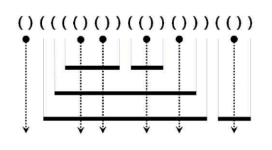

# 02. 백준 문제 모음 | Dynamic Programming | JAVA | BOJ

🤠 여러 백준 문제 모음으로 [알고리즘 문제풀이(PS) 시작하기](https://plzrun.tistory.com/entry/%EC%95%8C%EA%B3%A0%EB%A6%AC%EC%A6%98-%EB%AC%B8%EC%A0%9C%ED%92%80%EC%9D%B4PS-%EC%8B%9C%EC%9E%91%ED%95%98%EA%B8%B0) 글에서 뽑아준 문제들로만 정리해봤다. DP 다음으로 정리된 문제들 모음이다. 람다나 스트림 같은 걸 활용하면 좋은 문제가 많으므로 [모던 자바 인 액션](https://hueleev.github.io/JAVA_%EB%AA%A8%EB%8D%98%20%EC%9E%90%EB%B0%94%20%EC%9D%B8%20%EC%95%A1%EC%85%98/01.html)을 정리해둔 걸 한번 훑어보면 좋을 거 같다.

## [2751. 수 정렬하기 2](http://boj.kr/2751)

<h3>🔒 문제</h3>

N개의 수가 주어졌을 때, 이를 오름차순으로 정렬하는 프로그램을 작성하시오.

<h3>📢 입력</h3>

* 첫째 줄에 수의 개수 N(1 ≤ N ≤ 1,000,000)이 주어진다. 둘째 줄부터 N개의 줄에는 수가 주어진다. 이 수는 절댓값이 1,000,000보다 작거나 같은 정수이다. 수는 중복되지 않는다.

<h3>📢 출력</h3>
 
* 첫째 줄부터 N개의 줄에 오름차순으로 정렬한 결과를 한 줄에 하나씩 출력한다.

<h3>📢 입출력 예</h3>

| 예제 입력 1 | 예제 출력 1 |
| --- | --- |
| 5<br/>5<br/>4<br/>3<br/>2<br/>1 | 1<br/>2<br/>3<br/>4<br/>5 |

<h3>🔑 풀이</h3>

```java
import java.io.BufferedReader;
import java.io.IOException;
import java.io.InputStreamReader;
import java.util.ArrayList;
import java.util.Collections;
import java.util.List;

public class Main {

    public static void main(String[] args) throws IOException {
        BufferedReader br= new BufferedReader((new InputStreamReader(System.in)));
        Integer n = Integer.parseInt(br.readLine());

        List<Integer> arr = new ArrayList<>();

        for (int i=1; i<=n; i++) {
            arr.add(Integer.parseInt(br.readLine()));
        }

        Collections.sort(arr);

        StringBuilder ans = new StringBuilder();
        for (int value : arr) {
            ans.append(value).append("\n");
        }
        System.out.println(ans);
    }
}
```

## [11650. 좌표 정렬하기](http://boj.kr/11650)

<h3>🔒 문제</h3>

2차원 평면 위의 점 N개가 주어진다. 좌표를 x좌표가 증가하는 순으로, x좌표가 같으면 y좌표가 증가하는 순서로 정렬한 다음 출력하는 프로그램을 작성하시오.

<h3>📢 입력</h3>

* 첫째 줄에 점의 개수 N (1 ≤ N ≤ 100,000)이 주어진다. 둘째 줄부터 N개의 줄에는 i번점의 위치 $x_i$와 $y_i$가 주어진다. ($-100,000 ≤ x_i$, $y_i ≤ 100,000$) 좌표는 항상 정수이고, 위치가 같은 두 점은 없다.

<h3>📢 출력</h3>
 
* 첫째 줄부터 N개의 줄에 점을 정렬한 결과를 출력한다.

<h3>📢 입출력 예</h3>

| 예제 입력 1 | 예제 출력 1 |
| --- | --- |
| 5<br/>3 4<br/>1 1<br/>1 -1<br/>2 2<br/>3 3 | 1 -1<br/>1 1<br/>2 2<br/>3 3<br/>3 4 |

<h3>🔐</h3>

람다식을 활용하여 sort 한다.

<h3>🔑 풀이</h3>

```java
import java.io.BufferedReader;
import java.io.IOException;
import java.io.InputStreamReader;
import java.util.Arrays;

public class Main {

    public static void main(String[] args) throws IOException {
        BufferedReader br= new BufferedReader((new InputStreamReader(System.in)));
        int n = Integer.parseInt(br.readLine());

        int[][] xy = new int[n][2];

        for (int i=0; i<n; i++) {
            String[] line = br.readLine().split(" ");
            xy[i][0] = Integer.parseInt(line[0]);
            xy[i][1] = Integer.parseInt(line[1]);
        }

        Arrays.sort(xy, (el1, el2) -> {
            if (el1[0] == el2[0]) {
                return el1[1] - el2[1];
            }
            else {
                return el1[0] - el2[0];
            }
        });

        for(int i=0; i<n; i++) {
            System.out.println(xy[i][0] + " " + xy[i][1]);
        }
    }
}
```

## [11651. 좌표 정렬하기2](http://boj.kr/11651)

<h3>🔒 문제</h3>

2차원 평면 위의 점 N개가 주어진다. 좌표를 y좌표가 증가하는 순으로, y좌표가 같으면 x좌표가 증가하는 순서로 정렬한 다음 출력하는 프로그램을 작성하시오.

<h3>📢 입력</h3>

* 첫째 줄에 점의 개수 N (1 ≤ N ≤ 100,000)이 주어진다. 둘째 줄부터 N개의 줄에는 i번점의 위치 $x_i$와 $y_i$가 주어진다. ($-100,000 ≤ x_i$, $y_i ≤ 100,000$) 좌표는 항상 정수이고, 위치가 같은 두 점은 없다.

<h3>📢 출력</h3>
 
* 첫째 줄부터 N개의 줄에 점을 정렬한 결과를 출력한다.

<h3>📢 입출력 예</h3>

| 예제 입력 1 | 예제 출력 1 |
| --- | --- |
| 5<br/>0 4<br/>1 2<br/>1 -1<br/>2 2<br/>3 3 | 1 -1<br/>1 2<br/>2 2<br/>3 3<br/>0 4 |

<h3>🔐</h3>

람다식을 활용하여 sort 한다.

<h3>🔑 풀이</h3>

```java
import java.io.BufferedReader;
import java.io.IOException;
import java.io.InputStreamReader;
import java.util.Arrays;

public class Main {

    public static void main(String[] args) throws IOException {
        BufferedReader br= new BufferedReader((new InputStreamReader(System.in)));
        int n = Integer.parseInt(br.readLine());

        int[][] xy = new int[n][2];

        for (int i=0; i<n; i++) {
            String[] line = br.readLine().split(" ");
            xy[i][0] = Integer.parseInt(line[0]);
            xy[i][1] = Integer.parseInt(line[1]);
        }

        Arrays.sort(xy, (el1, el2) -> {
            if (el1[1] == el2[1]) {
                return el1[0] - el2[0];
            }
            else {
                return el1[1] - el2[1];
            }
        });

        for(int i=0; i<n; i++) {
            System.out.println(xy[i][0] + " " + xy[i][1]);
        }
    }
}
```

## [10814. 나이순 정렬](http://boj.kr/10814)

<h3>🔒 문제</h3>

온라인 저지에 가입한 사람들의 나이와 이름이 가입한 순서대로 주어진다. 이때, 회원들을 나이가 증가하는 순으로, 나이가 같으면 먼저 가입한 사람이 앞에 오는 순서로 정렬하는 프로그램을 작성하시오.

<h3>📢 입력</h3>

* 첫째 줄에 온라인 저지 회원의 수 N이 주어진다. (1 ≤ N ≤ 100,000)

둘째 줄부터 N개의 줄에는 각 회원의 나이와 이름이 공백으로 구분되어 주어진다. 나이는 1보다 크거나 같으며, 200보다 작거나 같은 정수이고, 이름은 알파벳 대소문자로 이루어져 있고, 길이가 100보다 작거나 같은 문자열이다. 입력은 가입한 순서로 주어진다.

<h3>📢 출력</h3>
 
* 첫째 줄부터 총 N개의 줄에 걸쳐 온라인 저지 회원을 나이 순, 나이가 같으면 가입한 순으로 한 줄에 한 명씩 나이와 이름을 공백으로 구분해 출력한다.

<h3>📢 입출력 예</h3>

| 예제 입력 1 | 예제 출력 1 |
| --- | --- |
| 3<br/>21 Junkyu<br/>21 Dohyun<br/>20 Sunyoung | 20 Sunyoung<br/>21 Junkyu<br/>21 Dohyun |

<h3>🔐</h3>

람다식을 활용하여 sort 한다.

<h3>🔑 풀이</h3>

```java
import java.io.BufferedReader;
import java.io.IOException;
import java.io.InputStreamReader;
import java.util.ArrayList;
import java.util.List;

public class Main {

    public static void main(String[] args) throws IOException {
        BufferedReader br= new BufferedReader((new InputStreamReader(System.in)));
        int n = Integer.parseInt(br.readLine());

        List<String> arr = new ArrayList<>();

        for (int i=0; i<n; i++) {
            arr.add(br.readLine());
        }

        arr.sort((a, b)-> {
            int age = Integer.parseInt(a.split(" ")[0]);
            int age2 = Integer.parseInt(b.split(" ")[0]);

            if (age == age2) {
                return 0;
            } else {
                return age-age2;
            }
        });

        for(int i=0; i<n; i++) {
            System.out.println(arr.get(i));
        }
    }
}
```

## [10825. 국영수](http://boj.kr/10825)

<h3>🔒 문제</h3>

도현이네 반 학생 N명의 이름과 국어, 영어, 수학 점수가 주어진다. 이때, 다음과 같은 조건으로 학생의 성적을 정렬하는 프로그램을 작성하시오.

1. 국어 점수가 감소하는 순서로
2. 국어 점수가 같으면 영어 점수가 증가하는 순서로
3. 국어 점수와 영어 점수가 같으면 수학 점수가 감소하는 순서로
4. 모든 점수가 같으면 이름이 사전 순으로 증가하는 순서로 (단, 아스키 코드에서 대문자는 소문자보다 작으므로 사전순으로 앞에 온다.)

<h3>📢 입력</h3>

* 첫째 줄에 도현이네 반의 학생의 수 N (1 ≤ N ≤ 100,000)이 주어진다. 둘째 줄부터 한 줄에 하나씩 각 학생의 이름, 국어, 영어, 수학 점수가 공백으로 구분해 주어진다. 점수는 1보다 크거나 같고, 100보다 작거나 같은 자연수이다. 이름은 알파벳 대소문자로 이루어진 문자열이고, 길이는 10자리를 넘지 않는다.

<h3>📢 출력</h3>
 
* 문제에 나와있는 정렬 기준으로 정렬한 후 첫째 줄부터 N개의 줄에 걸쳐 각 학생의 이름을 출력한다.

<h3>📢 입출력 예</h3>

| 예제 입력 1 | 예제 출력 1 |
| --- | --- |
| 12<br/>Junkyu 50 60 100<br/>Sangkeun 80 60 50<br/>Sunyoung 80 70 100<br/>Soong 50 60 90<br/>Haebin 50 60 100<br/>Kangsoo 60 80 100<br/>Donghyuk 80 60 100<br/>Sei 70 70 70<br/>Wonseob 70 70 90<br/>Sanghyun 70 70 80<br/>nsj 80 80 80<br/>Taewhan 50 60 90 | Donghyuk<br/>Sangkeun<br/>Sunyoung<br/>nsj<br/>Wonseob<br/>Sanghyun<br/>Sei<br/>Kangsoo<br/>Haebin<br/>Junkyu<br/>Soong<br/>Taewhan |

<h3>🔐</h3>

람다식을 활용하여 sort 한다.

<h3>🔑 풀이</h3>

```java
import java.io.BufferedReader;
import java.io.IOException;
import java.io.InputStreamReader;
import java.util.ArrayList;
import java.util.List;

public class Main {

    public static void main(String[] args) throws IOException {
        BufferedReader br= new BufferedReader((new InputStreamReader(System.in)));
        int n = Integer.parseInt(br.readLine());

        List<Student> arr = new ArrayList<>();

        for (int i=0; i<n; i++) {
            String[] line = br.readLine().split(" ");
            arr.add(new Student(line[0], Integer.parseInt(line[1]), Integer.parseInt(line[2]),Integer.parseInt(line[3])));
        }

        arr.sort((s1, s2)-> {
            if (s1.getEng() == s2.getEng() && s1.getKor() == s2.getKor() && s1.getMath() == s2.getMath()) {
                return s1.getName().compareTo(s2.getName());
            } else if (s1.getEng() == s2.getEng() && s1.getKor() == s2.getKor()) {
                return s2.getMath() - s1.getMath();
            } else if (s1.getKor() == s2.getKor()) {
                return s1.getEng() - s2.getEng();
            } else {
                return s2.getKor() - s1.getKor();
            }
        });

        for(int i=0; i<n; i++) {
            System.out.println(arr.get(i).getName());
        }
    }
}

// 학생 클래스
class Student {
    private String name;
    private int kor;
    private int eng;
    private int math;

    public Student(String name, int kor, int eng, int math) {
        this.name = name;
        this.kor = kor;
        this.eng = eng;
        this.math = math;
    }

    public String getName() {
        return name;
    }

    public void setName(String name) {
        this.name = name;
    }

    public int getKor() {
        return kor;
    }

    public void setKor(int kor) {
        this.kor = kor;
    }

    public int getEng() {
        return eng;
    }

    public void setEng(int eng) {
        this.eng = eng;
    }

    public int getMath() {
        return math;
    }

    public void setMath(int math) {
        this.math = math;
    }
}
```

## [10989. 수 정렬하기 3](http://boj.kr/10989)

<h3>🔒 문제</h3>

N개의 수가 주어졌을 때, 이를 오름차순으로 정렬하는 프로그램을 작성하시오.

<h3>📢 입력</h3>

* 첫째 줄에 수의 개수 N(1 ≤ N ≤ 10,000,000)이 주어진다. 둘째 줄부터 N개의 줄에는 수가 주어진다. 이 수는 10,000보다 작거나 같은 자연수이다.

<h3>📢 출력</h3>
 
* 첫째 줄부터 N개의 줄에 오름차순으로 정렬한 결과를 한 줄에 하나씩 출력한다.

<h3>📢 입출력 예</h3>

| 예제 입력 1 | 예제 출력 1 |
| --- | --- |
| 10<br/>5<br/>2<br/>3<br/>1<br/>4<br/>2<br/>3<br/>5<br/>1<br/>7 | 1<br/>1<br/>2<br/>2<br/>3<br/>3<br/>4<br/>5<br/>5<br/>7 |

<h3>🔐</h3>

메모리 초과가 계속 떴다 ㅠ 메모리 조심! StringBuilder 를 사용하자.
또 이런 방식으로 푸는 사람도 있네.. [Counting Sort](https://st-lab.tistory.com/104)는 또 모야.. 정말 어렵다 어려워... 
[Counting Sort 풀이](https://velog.io/@lifeisbeautiful/Java-%EB%B0%B1%EC%A4%80-10989%EB%B2%88-%EC%88%98-%EC%A0%95%EB%A0%AC%ED%95%98%EA%B8%B03-%EC%9E%90%EB%B0%94)

<h3>🔑 풀이</h3>

```java
import java.io.BufferedReader;
import java.io.IOException;
import java.io.InputStreamReader;
import java.util.Arrays;

public class Main {

    public static void main(String[] args) throws IOException {
        BufferedReader br= new BufferedReader((new InputStreamReader(System.in)));
        int n = Integer.parseInt(br.readLine());

        int[] arr = new int[n];

        for (int i=0; i<n; i++) {
            arr[i] = Integer.parseInt(br.readLine());
        }

        Arrays.sort(arr);

        StringBuilder ans = new StringBuilder();
        for (int value : arr) {
            ans.append(value).append("\n");
        }
        System.out.println(ans);
    }
}
```

## [11652. 카드](http://boj.kr/11652)

<h3>🔒 문제</h3>

준규는 숫자 카드 N장을 가지고 있다. 숫자 카드에는 정수가 하나 적혀있는데, 적혀있는 수는 $-2^{62}$보다 크거나 같고, $2^{62}$보다 작거나 같다.

준규가 가지고 있는 카드가 주어졌을 때, 가장 많이 가지고 있는 정수를 구하는 프로그램을 작성하시오. 만약, 가장 많이 가지고 있는 정수가 여러 가지라면, 작은 것을 출력한다.

<h3>📢 입력</h3>

* 첫째 줄에 준규가 가지고 있는 숫자 카드의 개수 N (1 ≤ N ≤ 100,000)이 주어진다. 둘째 줄부터 N개 줄에는 숫자 카드에 적혀있는 정수가 주어진다.

<h3>📢 출력</h3>
 
* 첫째 줄에 준규가 가장 많이 가지고 있는 정수를 출력한다.

<h3>📢 입출력 예</h3>

| 예제 입력 1 | 예제 출력 1 |
| --- | --- |
| 5<br/>1<br/>2<br/>1<br/>2<br/>1 | 1 |

| 예제 입력 2 | 예제 출력 2 |
| --- | --- |
| 6<br/>1<br/>2<br/>1<br/>2<br/>1<br/>2 | 1 |

<h3>🔐</h3>

`map.getOrDefault(input, 0)` 이거 처음 본다! key값이 존재하면 있는 값을 가져오고, 없으면 기본으로 지정하고 싶은 값을 두번째 파람에 넣어주면 된다.

<h3>🔑 풀이</h3>

```java
import java.io.BufferedReader;
import java.io.IOException;
import java.io.InputStreamReader;
import java.util.*;

public class Main {

    public static void main(String[] args) throws IOException {
        BufferedReader br= new BufferedReader((new InputStreamReader(System.in)));
        int n = Integer.parseInt(br.readLine());

        HashMap<Long, Integer> map = new HashMap<>();

        for (int i=0; i<n; i++) {
            long input = Long.parseLong(br.readLine());
            map.put(input, map.getOrDefault(input, 0) + 1);
        }

        Iterator<Long> keys = map.keySet().iterator();
        List<Long> answerList = new ArrayList<>();
        long value = 0;

        while (keys.hasNext()) {
            long key = keys.next();
            if (value == 0) {
                value = map.get(key);
                answerList.add(key);
                continue;
            }

            if (value <= map.get(key)) {
                if (value != map.get(key)) {
                    value = map.get(key);
                    answerList.clear();
                }
                answerList.add(key);
            }
        }

        System.out.println(Collections.min(answerList));
    }
}
```

## [11004. K번째 수](http://boj.kr/11004)

<h3>🔒 문제</h3>

수 N개 $A_1$, $A_2$, ..., $A_N$이 주어진다. A를 오름차순 정렬했을 때, 앞에서부터 K번째 있는 수를 구하는 프로그램을 작성하시오.

<h3>📢 입력</h3>

* 첫째 줄에 N(1 ≤ N ≤ 5,000,000)과 K (1 ≤ K ≤ N)이 주어진다.

* 둘째에는 $A_1$, $A_2$, ..., $A_N$이 주어진다. ($-10^9$ ≤ $A_i$ ≤ $10^9$)

<h3>📢 출력</h3>
 
* A를 정렬했을 때, 앞에서부터 K번째 있는 수를 출력한다.

<h3>📢 입출력 예</h3>

| 예제 입력 1 | 예제 출력 1 |
| --- | --- |
| 5 2<br/>4 1 2 3 5 | 2 |

<h3>🔐</h3>

`StringTokenizer`를 사용하면 굳이 String을 따로 split할 필요가 없다.

<h3>🔑 풀이</h3>

```java
import java.io.BufferedReader;
import java.io.IOException;
import java.io.InputStreamReader;
import java.util.*;

public class Main {

    public static void main(String[] args) throws IOException {
        BufferedReader br= new BufferedReader((new InputStreamReader(System.in)));
        StringTokenizer st = new StringTokenizer(br.readLine());

        int n = Integer.parseInt(st.nextToken());
        int k = Integer.parseInt(st.nextToken());
        List<Long> arr = new ArrayList<>();

        st = new StringTokenizer(br.readLine());
        for (int i=0; i<n; i++ ) {
            arr.add(Long.parseLong(st.nextToken()));
        }

        Collections.sort(arr);

        System.out.println(arr.get(k-1));
    }
}
```

## [10828. 스택](http://boj.kr/10828)

<h3>🔒 문제</h3>

정수를 저장하는 스택을 구현한 다음, 입력으로 주어지는 명령을 처리하는 프로그램을 작성하시오.

명령은 총 다섯 가지이다.

* push X: 정수 X를 스택에 넣는 연산이다.
* pop: 스택에서 가장 위에 있는 정수를 빼고, 그 수를 출력한다. 만약 스택에 들어있는 정수가 없는 경우에는 -1을 출력한다.
* size: 스택에 들어있는 정수의 개수를 출력한다.
* empty: 스택이 비어있으면 1, 아니면 0을 출력한다.
* top: 스택의 가장 위에 있는 정수를 출력한다. 만약 스택에 들어있는 정수가 없는 경우에는 -1을 출력한다.


<h3>📢 입력</h3>

* 첫째 줄에 주어지는 명령의 수 N (1 ≤ N ≤ 10,000)이 주어진다. 둘째 줄부터 N개의 줄에는 명령이 하나씩 주어진다. 주어지는 정수는 1보다 크거나 같고, 100,000보다 작거나 같다. 문제에 나와있지 않은 명령이 주어지는 경우는 없다.

<h3>📢 출력</h3>
 
* 출력해야하는 명령이 주어질 때마다, 한 줄에 하나씩 출력한다.

<h3>📢 입출력 예</h3>

| 예제 입력 1 | 예제 출력 1 |
| --- | --- |
| 14<br/>push 1<br/>push 2<br/>top<br/>size<br/>empty<br/>pop<br/>pop<br/>pop<br/>size<br/>empty<br/>pop<br/>push 3<br/>empty<br/>top | 2<br/>2<br/>0<br/>2<br/>1<br/>-1<br/>0<br/>1<br/>-1<br/>0<br/>3 |


| 예제 입력 2 | 예제 출력 2 |
| --- | --- |
| 7<br/>pop<br/>top<br/>push 123<br/>top<br/>pop<br/>top<br/>pop | -1<br/>-1<br/>123<br/>123<br/>-1<br/>-1 |

<h3>🔑 풀이</h3>

```java
import java.io.BufferedReader;
import java.io.IOException;
import java.io.InputStreamReader;
import java.util.*;

public class Main {

    public static void main(String[] args) throws IOException {
        BufferedReader br= new BufferedReader((new InputStreamReader(System.in)));
        int num = Integer.parseInt(br.readLine());

        Stack<Integer> stack = new Stack<>();
        StringBuilder sb = new StringBuilder();

        for (int i=0; i<num; i++ ) {
            StringTokenizer st = new StringTokenizer(br.readLine());
            String cmd = st.nextToken();
            int append = 0;
            switch (cmd) {
                case "push":
                    stack.push(Integer.parseInt(st.nextToken()));
                    break;
                case "pop":
                    append = stack.size() == 0 ? -1 : stack.pop();
                    sb.append(append).append("\n");
                    break;
                case "size":
                    sb.append(stack.size()).append("\n");
                    break;
                case "empty":
                    sb.append(stack.empty() ? 1 : 0).append("\n");
                    break;
                case "top":
                    append = stack.size() == 0 ? -1 : stack.peek();
                    sb.append(append).append("\n");
                    break;
                default:
                    break;
            }
        }

        System.out.println(sb);
    }
}
```

## [9012. 괄호](http://boj.kr/9012)

<h3>🔒 문제</h3>

괄호 문자열(Parenthesis String, PS)은 두 개의 괄호 기호인 ‘(’ 와 ‘)’ 만으로 구성되어 있는 문자열이다. 그 중에서 괄호의 모양이 바르게 구성된 문자열을 올바른 괄호 문자열(Valid PS, VPS)이라고 부른다. 한 쌍의 괄호 기호로 된 “( )” 문자열은 기본 VPS 이라고 부른다. 만일 x 가 VPS 라면 이것을 하나의 괄호에 넣은 새로운 문자열 “(x)”도 VPS 가 된다. 그리고 두 VPS x 와 y를 접합(concatenation)시킨 새로운 문자열 xy도 VPS 가 된다. 예를 들어 “(())()”와 “((()))” 는 VPS 이지만 “(()(”, “(())()))” , 그리고 “(()” 는 모두 VPS 가 아닌 문자열이다. 

여러분은 입력으로 주어진 괄호 문자열이 VPS 인지 아닌지를 판단해서 그 결과를 YES 와 NO 로 나타내어야 한다. 

<h3>📢 입력</h3>

* 입력 데이터는 표준 입력을 사용한다. 입력은 T개의 테스트 데이터로 주어진다. 입력의 첫 번째 줄에는 입력 데이터의 수를 나타내는 정수 T가 주어진다. 각 테스트 데이터의 첫째 줄에는 괄호 문자열이 한 줄에 주어진다. 하나의 괄호 문자열의 길이는 2 이상 50 이하이다. 

<h3>📢 출력</h3>
 
* 출력은 표준 출력을 사용한다. 만일 입력 괄호 문자열이 올바른 괄호 문자열(VPS)이면 “YES”, 아니면 “NO”를 한 줄에 하나씩 차례대로 출력해야 한다. 

<h3>📢 입출력 예</h3>

| 예제 입력 1 | 예제 출력 1 |
| --- | --- |
| 6<br/>(())())<br/>(((()())()<br/>(()())((()))<br/>((()()(()))(((())))()<br/>()()()()(()()())()<br/>(()((())()( | NO<br/>NO<br/>YES<br/>NO<br/>YES<br/>NO |

| 예제 입력 2 | 예제 출력 2 |
| --- | --- |
| 3<br/>((<br/>))<br/>())(() | NO<br/>NO<br/>NO |

<h3>🔑 풀이</h3>

```java
import java.io.BufferedReader;
import java.io.IOException;
import java.io.InputStreamReader;
import java.util.*;

public class Main {

    public static void main(String[] args) throws IOException {
        BufferedReader br= new BufferedReader((new InputStreamReader(System.in)));
        int num = Integer.parseInt(br.readLine());
        StringBuilder sb = new StringBuilder();
        for (int i=0; i<num; i++) {
            String str = br.readLine();
            boolean answer = true;
            if (str.startsWith(")")) { // ) 로 시작하면 NO
                answer = false;
            } else {
                Stack<String> stack = new Stack<>();
                for (int j=0; j<str.length();j++) {
                    String ch = Character.toString(str.charAt(j));
                    // ( 면 stack에 쌓고, ) 이면 stack을 뺀다.
                    if (ch.equals("(")) {
                        stack.push(ch);
                    } else if (stack.empty()) { // ) 인데 stack이 비어있으면 NO
                        answer = false;
                        break;
                    } else {
                        stack.pop();
                    }
                }
                if (!stack.isEmpty()) { // stack이 비어있지 않으면 (가 남는 것이므로 NO
                    answer = false;
                }
            }
            sb.append(answer ? "YES" : "NO").append("\n");
        }

        System.out.println(sb);
    }
}
```

## [10799. 쇠막대기](http://boj.kr/10799)

<h3>🔒 문제</h3>

여러 개의 쇠막대기를 레이저로 절단하려고 한다. 효율적인 작업을 위해서 쇠막대기를 아래에서 위로 겹쳐 놓고, 레이저를 위에서 수직으로 발사하여 쇠막대기들을 자른다. 쇠막대기와 레이저의 배치는 다음 조건을 만족한다.

* 쇠막대기는 자신보다 긴 쇠막대기 위에만 놓일 수 있다. - 쇠막대기를 다른 쇠막대기 위에 놓는 경우 완전히 포함되도록 놓되, 끝점은 겹치지 않도록 놓는다.

* 각 쇠막대기를 자르는 레이저는 적어도 하나 존재한다.

* 레이저는 어떤 쇠막대기의 양 끝점과도 겹치지 않는다. 

아래 그림은 위 조건을 만족하는 예를 보여준다. 수평으로 그려진 굵은 실선은 쇠막대기이고, 점은 레이저의 위치, 수직으로 그려진 점선 화살표는 레이저의 발사 방향이다.



이러한 레이저와 쇠막대기의 배치는 다음과 같이 괄호를 이용하여 왼쪽부터 순서대로 표현할 수 있다.

1. 레이저는 여는 괄호와 닫는 괄호의 인접한 쌍 ‘( ) ’ 으로 표현된다. 또한, 모든 ‘( ) ’는 반드시 레이저를 표현한다.

2. 쇠막대기의 왼쪽 끝은 여는 괄호 ‘ ( ’ 로, 오른쪽 끝은 닫힌 괄호 ‘) ’ 로 표현된다. 

위 예의 괄호 표현은 그림 위에 주어져 있다.

쇠막대기는 레이저에 의해 몇 개의 조각으로 잘려지는데, 위 예에서 가장 위에 있는 두 개의 쇠막대기는 각각 3개와 2개의 조각으로 잘려지고, 이와 같은 방식으로 주어진 쇠막대기들은 총 17개의 조각으로 잘려진다. 

쇠막대기와 레이저의 배치를 나타내는 괄호 표현이 주어졌을 때, 잘려진 쇠막대기 조각의 총 개수를 구하는 프로그램을 작성하시오.

<h3>📢 입력</h3>

* 한 줄에 쇠막대기와 레이저의 배치를 나타내는 괄호 표현이 공백없이 주어진다. 괄호 문자의 개수는 최대 100,000이다. 

<h3>📢 출력</h3>
 
* 잘려진 조각의 총 개수를 나타내는 정수를 한 줄에 출력한다.


<h3>🔐</h3>

그림을 그려보면 규칙을 찾을 수 있다. 괄호를 그리고, `()`를 '동그라미'로 치환해보자.
`(`가 나올때는 막대의 갯수가 1개씩 증가하고 `동그라미`가 나올 때는 이전 `(`의 갯수만큼 막대가 증가한다.
`)`가 나오면 쌓인 `(` 한개가 사라지고, 막대의 갯수에는 변함이 없다고 생각하면 된다.


<h3>📢 입출력 예</h3>

| 예제 입력 1 | 예제 출력 1 |
| --- | --- |
| ()(((()())(())()))(()) | 17 |

| 예제 입력 2 | 예제 출력 2 |
| --- | --- |
| (((()(()()))(())()))(()()) | 24 |

<h3>🔑 풀이</h3>

```java
import java.io.BufferedReader;
import java.io.IOException;
import java.io.InputStreamReader;
import java.util.*;

public class Main {

    public static void main(String[] args) throws IOException {
        BufferedReader br= new BufferedReader((new InputStreamReader(System.in)));
        String input = br.readLine();
        input = input.replaceAll("\\(\\)", "*"); // 괄호 치환의 경우, \\ 가 필요하다.

        Stack<String> stack = new Stack<>();
        int answer = 0;

        for (int i=0; i<input.length(); i++) {
            String ch = Character.toString(input.charAt(i));
            switch (ch) {
                case "(":
                    stack.push("(");
                    answer++;
                    break;
                case ")":
                    stack.pop();
                    break;
                case "*":
                    answer = answer + stack.size();
                    break;
                default:
                    break;
            }
        }

        System.out.println(answer);
    }
}
```

## [10845. 큐](http://boj.kr/10845)

<h3>🔒 문제</h3>

정수를 저장하는 큐를 구현한 다음, 입력으로 주어지는 명령을 처리하는 프로그램을 작성하시오.

명령은 총 여섯 가지이다.

* push X: 정수 X를 큐에 넣는 연산이다.
* pop: 큐에서 가장 앞에 있는 정수를 빼고, 그 수를 출력한다. 만약 큐에 들어있는 정수가 없는 경우에는 -1을 출력한다.
* size: 큐에 들어있는 정수의 개수를 출력한다.
* empty: 큐가 비어있으면 1, 아니면 0을 출력한다.
* front: 큐의 가장 앞에 있는 정수를 출력한다. 만약 큐에 들어있는 정수가 없는 경우에는 -1을 출력한다.
* back: 큐의 가장 뒤에 있는 정수를 출력한다. 만약 큐에 들어있는 정수가 없는 경우에는 -1을 출력한다.

<h3>📢 입력</h3>

* 첫째 줄에 주어지는 명령의 수 N (1 ≤ N ≤ 10,000)이 주어진다. 둘째 줄부터 N개의 줄에는 명령이 하나씩 주어진다. 주어지는 정수는 1보다 크거나 같고, 100,000보다 작거나 같다. 문제에 나와있지 않은 명령이 주어지는 경우는 없다.

<h3>📢 출력</h3>
 
* 출력해야하는 명령이 주어질 때마다, 한 줄에 하나씩 출력한다.

<h3>📢 입출력 예</h3>

| 예제 입력 1 | 예제 출력 1 |
| --- | --- |
| 15<br/>push 1<br/>push 2<br/>front<br/>back<br/>size<br/>empty<br/>pop<br/>pop<br/>pop<br/>size<br/>empty<br/>pop<br/>push 3<br/>empty<br/>front | 1<br/>2<br/>2<br/>0<br/>1<br/>2<br/>-1<br/>0<br/>1<br/>-1<br/>0<br/>3 |

<h3>🔑 풀이</h3>

```java
import java.io.BufferedReader;
import java.io.IOException;
import java.io.InputStreamReader;
import java.util.*;

public class Main {

    public static void main(String[] args) throws IOException {
        BufferedReader br= new BufferedReader((new InputStreamReader(System.in)));
        int num = Integer.parseInt(br.readLine());

        Queue<Integer> queue = new LinkedList<>();
        int last = 0;

        for (int i=0; i<num; i++) {
            StringTokenizer st = new StringTokenizer(br.readLine());
            switch (st.nextToken()) {
                case "push":
                    int value = Integer.parseInt(st.nextToken());
                    queue.add(value);
                    last = value;
                    break;
                case "pop":
                    System.out.println(queue.isEmpty() ? -1 : queue.poll());
                    break;
                case "size":
                    System.out.println(queue.size());
                    break;
                case "empty":
                    System.out.println(queue.isEmpty() ? 1 : 0);
                    break;
                case "front":
                    System.out.println(queue.isEmpty() ? -1 : queue.peek());
                    break;
                case "back":
                    System.out.println(queue.isEmpty() ? -1 : last);
                    break;
                default:
                    break;
            }
        }
    }
}
```

## [10866. 덱](http://boj.kr/10866)

<h3>🔒 문제</h3>

정수를 저장하는 덱(Deque)를 구현한 다음, 입력으로 주어지는 명령을 처리하는 프로그램을 작성하시오.

명령은 총 여덟 가지이다.

* push_front X: 정수 X를 덱의 앞에 넣는다.
* push_back X: 정수 X를 덱의 뒤에 넣는다.
* pop_front: 덱의 가장 앞에 있는 수를 빼고, 그 수를 출력한다. 만약, 덱에 들어있는 정수가 없는 경우에는 -1을 출력한다.
* pop_back: 덱의 가장 뒤에 있는 수를 빼고, 그 수를 출력한다. 만약, 덱에 들어있는 정수가 없는 경우에는 -1을 출력한다.
* size: 덱에 들어있는 정수의 개수를 출력한다.
* empty: 덱이 비어있으면 1을, 아니면 0을 출력한다.
* front: 덱의 가장 앞에 있는 정수를 출력한다. 만약 덱에 들어있는 정수가 없는 경우에는 -1을 출력한다.
* back: 덱의 가장 뒤에 있는 정수를 출력한다. 만약 덱에 들어있는 정수가 없는 경우에는 -1을 출력한다.


<h3>📢 입력</h3>

* 첫째 줄에 주어지는 명령의 수 N (1 ≤ N ≤ 10,000)이 주어진다. 둘째 줄부터 N개의 줄에는 명령이 하나씩 주어진다. 주어지는 정수는 1보다 크거나 같고, 100,000보다 작거나 같다. 문제에 나와있지 않은 명령이 주어지는 경우는 없다.

<h3>📢 출력</h3>
 
* 출력해야하는 명령이 주어질 때마다, 한 줄에 하나씩 출력한다.

<h3>📢 입출력 예</h3>

| 예제 입력 1 | 예제 출력 1 |
| --- | --- |
| 15<br/>push_back 1<br/>push_front 2<br/>front<br/>back<br/>size<br/>empty<br/>pop_front<br/>pop_back<br/>pop_front<br/>size<br/>empty<br/>pop_back<br/>push_front 3<br/>empty<br/>front | 2<br/>1<br/>2<br/>0<br/>2<br/>1<br/>-1<br/>0<br/>1<br/>-1<br/>0<br/>3 |

| 예제 입력 2 | 예제 출력 2 |
| --- | --- |
| 22<br/>front<br/>back<br/>pop_front<br/>pop_back<br/>push_front 1<br/>front<br/>pop_back<br/>push_back 2<br/>back<br/>pop_front<br/>push_front 10<br/>push_front 333<br/>front<br/>back<br/>pop_back<br/>pop_back<br/>push_back 20<br/>push_back 1234<br/>front<br/>back<br/>pop_back<br/>pop_back | -1<br/>-1<br/>-1<br/>-1<br/>1<br/>1<br/>2<br/>2<br/>333<br/>10<br/>10<br/>333<br/>20<br/>1234<br/>1234<br/>20 |

<h3>🔑 풀이</h3>

```java
import java.io.BufferedReader;
import java.io.IOException;
import java.io.InputStreamReader;
import java.util.*;

public class Main {

    public static void main(String[] args) throws IOException {
        BufferedReader br= new BufferedReader((new InputStreamReader(System.in)));
        int num = Integer.parseInt(br.readLine());

        Deque<Integer> deque = new LinkedList<>();

        for (int i=0; i<num; i++) {
            StringTokenizer st = new StringTokenizer(br.readLine());
            switch (st.nextToken()) {
                case "push_front":
                    deque.addFirst(Integer.parseInt(st.nextToken()));
                    break;
                case "push_back":
                    deque.addLast(Integer.parseInt(st.nextToken()));
                    break;
                case "pop_front":
                    System.out.println(deque.isEmpty() ? -1 : deque.pollFirst());
                    break;
                case "pop_back":
                    System.out.println(deque.isEmpty() ? -1 : deque.pollLast());
                    break;
                case "size":
                    System.out.println(deque.size());
                    break;
                case "empty":
                    System.out.println(deque.isEmpty() ? 1 : 0);
                    break;
                case "front":
                    System.out.println(deque.isEmpty() ? -1 : deque.peekFirst());
                    break;
                case "back":
                    System.out.println(deque.isEmpty() ? -1 : deque.peekLast());
                    break;
                default:
                    break;
            }
        }
    }
}
```


## [10808. 알파벳 개수](http://boj.kr/10808)

<h3>🔒 문제</h3>

알파벳 소문자로만 이루어진 단어 S가 주어진다. 각 알파벳이 단어에 몇 개가 포함되어 있는지 구하는 프로그램을 작성하시오.

<h3>📢 입력</h3>

* 첫째 줄에 단어 S가 주어진다. 단어의 길이는 100을 넘지 않으며, 알파벳 소문자로만 이루어져 있다.

<h3>📢 출력</h3>
 
* 단어에 포함되어 있는 a의 개수, b의 개수, …, z의 개수를 공백으로 구분해서 출력한다.

<h3>📢 입출력 예</h3>

| 예제 입력 1 | 예제 출력 1 |
| --- | --- |
| baekjoon | 1 1 0 0 1 0 0 0 0 1 1 0 0 1 2 0 0 0 0 0 0 0 0 0 0 0 |

<h3>🔐</h3>

[ASCII 코드](https://devyoseph.tistory.com/43)를 참고하자!

<h3>🔑 풀이</h3>

```java
import java.io.BufferedReader;
import java.io.IOException;
import java.io.InputStreamReader;

public class Main {

    public static void main(String[] args) throws IOException {
        BufferedReader br= new BufferedReader((new InputStreamReader(System.in)));
        String input = br.readLine();

        int[] arr = new int[26];

        for (int i=0; i<input.length(); i++) {
            int a = input.charAt(i);
            arr[a-97] += 1;
        }

        StringBuilder sb = new StringBuilder();
        for (int i=0; i<arr.length; i++) {
            sb.append(arr[i]).append(" ");
        }
        System.out.println(sb);
    }
}
```

## [10809. 알파벳 찾기](http://boj.kr/10809)

<h3>🔒 문제</h3>

알파벳 소문자로만 이루어진 단어 S가 주어진다. 각각의 알파벳에 대해서, 단어에 포함되어 있는 경우에는 처음 등장하는 위치를, 포함되어 있지 않은 경우에는 -1을 출력하는 프로그램을 작성하시오.

<h3>📢 입력</h3>

* 첫째 줄에 단어 S가 주어진다. 단어의 길이는 100을 넘지 않으며, 알파벳 소문자로만 이루어져 있다.

<h3>📢 출력</h3>
 
* 각각의 알파벳에 대해서, a가 처음 등장하는 위치, b가 처음 등장하는 위치, ... z가 처음 등장하는 위치를 공백으로 구분해서 출력한다.

* 만약, 어떤 알파벳이 단어에 포함되어 있지 않다면 -1을 출력한다. 단어의 첫 번째 글자는 0번째 위치이고, 두 번째 글자는 1번째 위치이다.

<h3>📢 입출력 예</h3>

| 예제 입력 1 | 예제 출력 1 |
| --- | --- |
| baekjoon | 1 0 -1 -1 2 -1 -1 -1 -1 4 3 -1 -1 7 5 -1 -1 -1 -1 -1 -1 -1 -1 -1 -1 -1 |

<h3>🔐</h3>

[ASCII 코드](https://devyoseph.tistory.com/43)를 참고하자!

<h3>🔑 풀이</h3>

```java
import java.io.BufferedReader;
import java.io.IOException;
import java.io.InputStreamReader;

public class Main {

    public static void main(String[] args) throws IOException {
        BufferedReader br= new BufferedReader((new InputStreamReader(System.in)));
        String input = br.readLine();

        int[] arr = new int[26];

        StringBuilder sb = new StringBuilder();
        for (int i=0; i<arr.length; i++) {
            sb.append(input.indexOf(i+97)).append(" ");
        }
        System.out.println(sb);
    }
}
```

<!--
## [문제번호. 제목](http://boj.kr/문제번호)

<h3>🔒 문제</h3>
수식: $S_k$를 기준으로 $S_1 < S_2 < ... S_{k-1} < S_k > S_{k+1} > ... S_(N-1) > S_N$

<h3>📢 입력</h3>

* 

<h3>📢 출력</h3>
 
* 

<h3>📢 입출력 예</h3>

| 예제 입력 1 | 예제 출력 1 |
| --- | --- |
| 10 | 7 |

<h3>📢 힌트</h3>

힌트

<h3>🔐</h3>

풀이방법

<h3>🔑 풀이</h3>

```java
import java.util.Scanner;

public class Main {

    public static void main(String[] args) {
        Scanner sc = new Scanner(System.in);
        int n = sc.nextInt(); 
    }
}
```
```java
import java.io.BufferedReader;
import java.io.IOException;
import java.io.InputStreamReader;

public class Main {

    public static void main(String[] args) throws IOException {
        BufferedReader br = new BufferedReader((new InputStreamReader(System.in)));
        int N = Integer.parseInt(br.readLine());
    }
}
```
-->