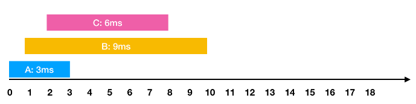
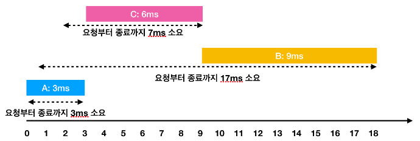

# 13. 디스크 컨트롤러_힙 | 프로그래머스 (JAVA) | HEAP | QUEUE

## 🔒 [문제](https://programmers.co.kr/learn/courses/30/lessons/42627)

**하드디스크는 한 번에 하나의 작업만 수행할 수 있습니다.** 디스크 컨트롤러를 구현하는 방법은 여러 가지가 있습니다. 가장 일반적인 방법은 요청이 들어온 순서대로 처리하는 것입니다.

예를들어

```
- 0ms 시점에 3ms가 소요되는 A작업 요청
- 1ms 시점에 9ms가 소요되는 B작업 요청
- 2ms 시점에 6ms가 소요되는 C작업 요청
```

와 같은 요청이 들어왔습니다. 이를 그림으로 표현하면 아래와 같습니다.



**한 번에 하나의 요청만을 수행**할 수 있기 때문에 각각의 작업을 요청받은 순서대로 처리하면 다음과 같이 처리 됩니다.


```
- A: 3ms 시점에 작업 완료 (요청에서 종료까지 : 3ms)
- B: 1ms부터 대기하다가, 3ms 시점에 작업을 시작해서 12ms 시점에 작업 완료(요청에서 종료까지 : 11ms)
- C: 2ms부터 대기하다가, 12ms 시점에 작업을 시작해서 18ms 시점에 작업 완료(요청에서 종료까지 : 16ms)
```

이 때 각 작업의 요청부터 종료까지 걸린 시간의 평균은 10ms(= (3 + 11 + 16) / 3)가 됩니다.

하지만 A → C → B 순서대로 처리하면



```
- A: 3ms 시점에 작업 완료(요청에서 종료까지 : 3ms)
- C: 2ms부터 대기하다가, 3ms 시점에 작업을 시작해서 9ms 시점에 작업 완료(요청에서 종료까지 : 7ms)
- B: 1ms부터 대기하다가, 9ms 시점에 작업을 시작해서 18ms 시점에 작업 완료(요청에서 종료까지 : 17ms)
```

이렇게 A → C → B의 순서로 처리하면 각 작업의 요청부터 종료까지 걸린 시간의 평균은 9ms(= (3 + 7 + 17) / 3)가 됩니다.

각 작업에 대해 [작업이 요청되는 시점, 작업의 소요시간]을 담은 2차원 배열 jobs가 매개변수로 주어질 때, <b style="color: red;"><u>작업의 요청부터 종료까지 걸린 시간의 평균을 가장 줄이는 방법</u>으로 처리하면 평균이 얼마가 되는지 return</b> 하도록 solution 함수를 작성해주세요. (단, 소수점 이하의 수는 버립니다)

### **📢 제한사항**

* jobs의 길이는 1 이상 500 이하입니다.
* jobs의 각 행은 하나의 작업에 대한 [작업이 요청되는 시점, 작업의 소요시간] 입니다.
* 각 작업에 대해 작업이 요청되는 시간은 0 이상 1,000 이하입니다.
* 각 작업에 대해 작업의 소요시간은 1 이상 1,000 이하입니다.
* 하드디스크가 작업을 수행하고 있지 않을 때에는 먼저 요청이 들어온 작업부터 처리합니다.

### **📢 입출력 예**

| jobs |	return |
| --- | --- |
| [[0, 3], [1, 9], [2, 6]]	| 9 |

### **📢 입출력 예 설명**

문제에 주어진 예와 같습니다.

    * 0ms 시점에 3ms 걸리는 작업 요청이 들어옵니다.
    * 1ms 시점에 9ms 걸리는 작업 요청이 들어옵니다.
    * 2ms 시점에 6ms 걸리는 작업 요청이 들어옵니다.

## 🔑 풀이

```java
import java.util.*;
class Solution {
     public static int solution(int[][] jobs) {
        // 대기열 → '작업이 요청되는 시점'이 빠른 순으로 정렬되는 우선순위 큐
        PriorityQueue<Job> q = new PriorityQueue(new Comparator<Job>() {
            @Override
            public int compare(Job j1, Job j2){
                return j1.reqTime - j2.reqTime;
            }
        });
        for(int[] job : jobs){
            q.offer(new Job(job[0],job[1]));
        }

        // 작업 큐 → '작업이 소요시간'이 적은 순으로 정렬되는 우선순위 큐
        PriorityQueue<Job> pq = new PriorityQueue(new Comparator<Job>() {
            @Override
            public int compare(Job j1, Job j2){
                return j1.runTime - j2.runTime;
            }
        });

        int count = 0;
        int sum = 0;
        int time = 0;
        // 모든 작업이 끝날때까지 while문 반복
        while(count < jobs.length){
            // 1ms마다 while문 반복
            // 작업 큐에 추가 (대기열이 비어있지 않고 요청 시점이 되었을 때 추가)
            while(!q.isEmpty() && time >= q.peek().reqTime){
                pq.offer(q.poll());
            }
            // 작업 큐에 작업이 있으면 우선순위에 따라 작업 진행
            if(!pq.isEmpty()){
                Job j = pq.poll();
                // 작업시작보다 요청시간이 빠른 경우를 대비하여, 요청시간 기준으로 (대기시간 포함) runTime 추가
                sum += j.runTime + (time - j.reqTime); 
                // 작업소요시간은 runTime만 추가
                time += j.runTime;
                count++;
            }
            else {  // 작업이 없으면 시간 1ms 흐름
                time++;
            }
        }
        // 작업의 요청부터 종료까지 걸린 시간의 평균 리턴
        return sum / count;
    }
}

class Job {
    int reqTime;
    int runTime;

    public Job(int req, int run){
        this.reqTime = req;
        this.runTime = run;
    }
}
```