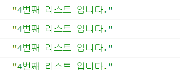
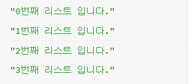

# 01. let & closure (for문 변수가 왜 바뀌지 않을까?)

경험해본적은 없지만, for문 내에서 버튼을 생성할 때 변수가 왜 바뀌지 않나 궁금하신 분들이 참조하면 좋을 거 같다.

## HTML

```html
<!DOCTYPE html>
<html>
<head>
  <meta charset="utf-8">
  <meta name="viewport" content="width=device-width">
  <title>JS Bin</title>
</head>
<body>
  <ul>
    <li>javascript</li>
    <li>java</li>
    <li>python</li>
    <li>django</li>
  </ul>
</body>
</html>
```

## var 사용

```jsx
var list = document.querySelectorAll("li");
for (var i=0; i<list.length; i++) {
  list[i].addEventListener("click", function() {
    console.log(i + "번째 리스트 입니다.");
  })
}
```

### → console



밖에 있는 i를 참조하며 share하고 있기 때문에 이런 문제가 발생한다.

## let 사용


```jsx
var list = document.querySelectorAll("li");
for (let i=0; i<list.length; i++) {
  list[i].addEventListener("click", function() {
    console.log(i + "번째 리스트 입니다.");
  })
}
```



es6가 출시되면서 let 으로 이 문제가 쉽게 해결된다.

**`var`를 `let`으로 변경하기만 하면 끝!**

### Reference

---

[https://www.inflearn.com/course/es6-강좌-자바스크립트/dashboard](https://www.inflearn.com/course/es6-%EA%B0%95%EC%A2%8C-%EC%9E%90%EB%B0%94%EC%8A%A4%ED%81%AC%EB%A6%BD%ED%8A%B8/dashboard)

[https://jsbin.com/](https://jsbin.com/)