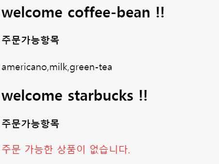

# 11. Template 사용 및 활용

🙄 **`json`으로 응답받고, `object`로 변환한 후에 데이터 처리 조작을 하여 `dom`에 추가하는 방법은 꽤나 어렵다. `데이터 + HTML`문자열의 결합이 필요하기 때문인데, 자주 사용해야 함에도 불구하고 복잡하다.**

## ✨ Template 사용법

```basic
const data = [
  {
    name: 'coffee-bean',
    order: true,
    items: ['americano', 'milk', 'green-tea']
  },
  {
    name: 'starbucks',
    order: false
  }
]

const template = `<div>welcome ${data[0].name}</div>`; // 백틱 활용!

console.log(template);
```

### 🔎 console

---

```basic
"<div>welcome coffee-bean</div>"
```

## ✨ Template 활용법

```html
<!DOCTYPE html>
<html>
<head>
  <meta charset="utf-8">
  <meta name="viewport" content="width=device-width">
  <title>JS Bin</title>
</head>
<body>
  <div id="message">
  </div>
</body>
</html>
```

```basic
const data = [
  {
    name: 'coffee-bean',
    order: true,
    items: ['americano', 'milk', 'green-tea']
  },
  {
    name: 'starbucks',
    order: false
  }
]

// Tagged template literals
function fn(tags, name, items) {
  if (typeof items == "undefined") {
    items = "<span style='color:red'>주문 가능한 상품이 없습니다.</span>";
  }
  return (tags[0] + name + tags[1] + items + tags[2]);
}

data.forEach((v) => {
  let template = fn`<h2>welcome ${v.name} !!</h2>
    <h4>주문가능항목</h4><div>${v.items}</div>`;
  console.log(template);
  document.querySelector("#message").innerHTML += template;
});
```

### 🔎 console

---

```basic
"<h2>welcome coffee-bean !!</h2>
    <h4>주문가능항목</h4><div>americano,milk,green-tea</div>"
"<h2>welcome starbucks !!</h2>
    <h4>주문가능항목</h4><div><span style='color:red'>주문 가능한 상품이 없습니다.</span></div>"
```



### Reference

---

[https://www.inflearn.com/course/es6-강좌-자바스크립트/dashboard](https://www.inflearn.com/course/es6-%EA%B0%95%EC%A2%8C-%EC%9E%90%EB%B0%94%EC%8A%A4%ED%81%AC%EB%A6%BD%ED%8A%B8/dashboard)

[https://jsbin.com/](https://jsbin.com/)