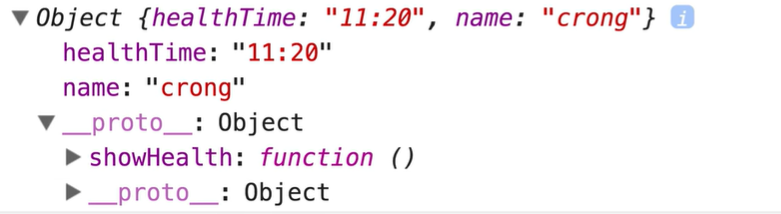
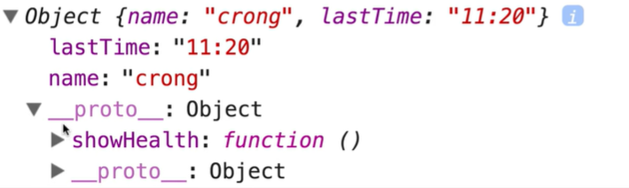
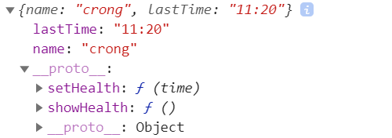
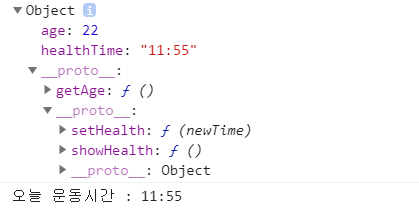

# 16. Object, ES6에서 개선된 점 (assign, setPrototypeOf)

🤨 **Object 타입이 ES6에서 어떻게 개선됐는지 봐보자**

## ✨ Object create (ES5)

```jsx
const healthObj = {
  showHealth : function() {
    console.log("오늘 운동시간 : " + this.healthTime);
  }
}

const myHealth = Object.create(healthObj);
myHealth.healthTime = "11:20";
myHealth.name = "crong";

console.log(myHealth);
```

### 🔎 console

---

`create`하는 경우, object는 `prototype`에 할당된다 !

```basic
[object Object] {
  healthTime: "11:20",
  name: "crong",
  showHealth: function() {
    window.runnerWindow.proxyConsole.log("오늘 운동시간 : " + this.healthTime);
  }
}
```



## ✨ Object assign

```jsx
const healthObj = {
  showHealth : function() {
    console.log("오늘 운동시간 : " + this.healthTime);
  }
}

const myHealth = Object.assign(Object.create(healthObj), {
  name: "crong",
  lastTime: "11:20"
}); // 첫번째 파라미터는 prototype에 할당된다.

console.log(myHealth);
```

### 🔎 console

---

`create` 과 동시에 `assign`으로 할당도 가능하다!

```basic
[object Object] {
  lastTime: "11:20",
  name: "crong",
  showHealth: function() {
    window.runnerWindow.proxyConsole.log("오늘 운동시간 : " + this.healthTime);
  }
}
```



## ✨ Object assign 으로 Immutable 객체 만들기

```jsx
const previousObj = {
  name: "crong",
  lastTime: "11:20"
};

const myHealth = Object.assign({}, // prototype 
                               previousObj, // 기존 객체 할당
                               {"lastTime": "12:30", "age": 20} // 새로운 객체 할당
                              );

console.log(myHealth);
console.log(previousObj === myHealth);
```

### 🔎 console

---

```basic
[object Object] {
  age: 20,
  lastTime: "12:30",
  name: "crong"
}
false
```

## ✨ setPrototypeOf


Object에 간단하게 `prototype`을 할당할 수 있다.

<br/>

이전에는 첫번째 파라미터가 `prototype` 이었다면 `setPrototypeOf`는 두번째 파라미터 값이 `protytype`에 할당된다.

```jsx
const healthObj = {
  showHealth : function() {
    console.log("오늘 운동시간 : " + this.healthTime);
  },
  setHealth: function(time) {
    this.healthTime = newTime;
  }
}

const newObj = Object.setPrototypeOf({
  name: "crong",
  lastTime: "11:20"
}, healthObj);

console.log(newObj);
```

### 🔎 console

---

```basic
[object Object] {
  lastTime: "11:20",
  name: "crong",
  setHealth: function(time) {
    this.healthTime = newTime;
  },
  showHealth: function() {
    window.runnerWindow.proxyConsole.log("오늘 운동시간 : " + this.healthTime);
  }
}
```



## ✨ prototype Chain - setPrototypeOf 활용

`prototype`을 체인처럼 엮을 수 있다. 상속과 같은 개념이라고 보면 된다.

<br/>

상위 객체에 없으면 더 상위로 올라가서 값을 찾는다.

```jsx
// parentObj
const healthObj = {
  showHealth : function() {
    console.log("오늘 운동시간 : " + this.healthTime);
  },
  setHealth: function(newTime) {
    this.healthTime = newTime;
  }
}

// childObj
const healthChildObj = {
  getAge: function() {
    return this.age;
  }
}

Object.setPrototypeOf(healthChildObj, healthObj);

const childObj = Object.setPrototypeOf({
  age: 22
}, healthChildObj);

console.log(childObj);

childObj.setHealth("11:55");
childObj.showHealth();
```

### 🔎 console

---

```basic
[object Object] {
  age: 22,
  getAge: function() {
    return this.age;
  },
  setHealth: function(newTime) {
    this.healthTime = newTime;
  },
  showHealth: function() {
    window.runnerWindow.proxyConsole.log("오늘 운동시간 : " + this.healthTime);
  }
}
"오늘 운동시간 : 11:55"
```



### Reference

---

[https://www.inflearn.com/course/es6-강좌-자바스크립트/dashboard](https://www.inflearn.com/course/es6-%EA%B0%95%EC%A2%8C-%EC%9E%90%EB%B0%94%EC%8A%A4%ED%81%AC%EB%A6%BD%ED%8A%B8/dashboard)

[https://jsbin.com/](https://jsbin.com/)