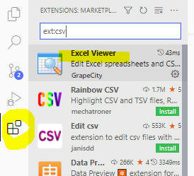
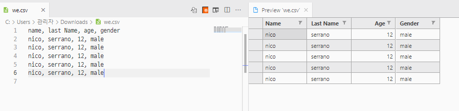
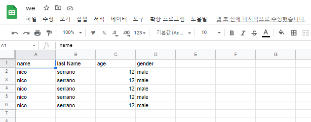

# 🎈 Python으로 웹 스크래퍼 만들기 (nomad coders/노마드코더)

심심해서 들어보는 Python 강의 .. 👓 

2022-04 강의를 들었을 때, indeed 사이트 마크업 구조가 좀 달라졌고, stackoverflow job 사이트는 찾을 수 없었다,, 대신 `https://stackoverflow.com/jobs/companies` 사이트를 파싱해보려고 한다.

<u>따라서 강의에 작성된 코드와 다를 수 있음!</u> 

우선 강의를 듣고, 바뀐 HTML을 배운대로 스크랩핑 하였다. 강의 소제목 뽑으려고 스크랩핑 활용하여 아래와 같이 제목을 뽑았다 !

`beautiful soup` 유용한 거 같다. 잘 써봐야지.

<h3>🔸 py</h3>

```py
import requests
from bs4 import BeautifulSoup

result = requests.get("https://nomadcoders.co/python-for-beginners/lobby")
soup = BeautifulSoup(result.text, 'html.parser')
titles = soup.find_all("span", {"class": "px-6 py-4 whitespace-nowrap text-sm leading-5 overflow-hidden font-medium flex items-center text-gray-400"})
for title in titles:
  print(title.text)
```

<h3>🔹 console</h3>

```html
#0.5 How to Ask for Help (02:00) 
#0.6 Code Python Online (03:08) 
#1.0 Data Types of Python (08:48) 
#1.1 Lists in Python (08:30) 
#1.2 Tuples and Dicts (06:33) 
...
중략
...
#4.6 Rendering Jobs! (12:24) 
#4.7 Export Route (08:48) 
#4.8 File Download (05:21) 
#4.9 Recap (07:28) 
#4.10 Conclusions (02:56) 
```
# ⚡ 1. THEORY

[repl.it](https://replit.com/) 에서 간단하게 테스트할 수 있다.

## 1.0 Data Types of Python

<h3>🔸 py</h3>

```py
# python 변수명은  snakeCase로 써준다.
a_string = 'like this'
a_number = 3
a_float = 3.12
a_boolean = False # python에서는 첫글자를 대문자로 써야한다.
a_none = None # empty 존재하지 않는다.

# 출력
print(type(a_number))
print(type(a_string))
print(type(a_none))
```

<h3>🔹 console</h3>

```md
<class 'int'>
<class 'str'>
<class 'NoneType'>
```

## 1.1 Lists in Python

<h3>🔸 py</h3>

```py
# mutable sequence (변경 가능한 시퀀스)
days = ["Mon", "tue", "Wed", "Thur", "Fri"]

print("------list------")
print(days)
print("Mon" in days)
print("Man" in days)
print(days[3])
print(type(days))

print("------append------")
days.append("Sat")
print(days)

print("------reverse------")
days.reverse()
print(days)
```

<h3>🔹 console</h3>

```md
------list------
['Mon', 'tue', 'Wed', 'Thur', 'Fri']
True
False
Thur
<class 'list'>
------append------
['Mon', 'tue', 'Wed', 'Thur', 'Fri', 'Sat']
------reverse------
['Sat', 'Fri', 'Thur', 'Wed', 'tue', 'Mon']
```

## 1.2 Tuples and Dicts

<h3>🔸 py</h3>

```py
# immutable sequence (변경 불가능한 시퀀스)
days = ("Mon", "tue", "Wed", "Thur", "Fri")

print("------tuple------")
print(days)
print(type(days))

print("------dictionary------")
nico = {
  "name": "Nico",
  "age": 29,
  "korean": True,
  "fav_food": ["Kimchi", "Sashimi"]
}

print(type(nico))
print(nico)
nico["handsome"] = True
print(nico)
```

<h3>🔹 console</h3>

```md
------tuple------
('Mon', 'tue', 'Wed', 'Thur', 'Fri')
<class 'tuple'>
------dictionary------
<class 'dict'>
{'name': 'Nico', 'age': 29, 'korean': True, 'fav_food': ['Kimchi', 'Sashimi']}
{'name': 'Nico', 'age': 29, 'korean': True, 'fav_food': ['Kimchi', 'Sashimi'], 'handsome': True}
```

## 1.3 Built in Functions

[다양한 Functions](https://docs.python.org/3/library/functions.html)

<h3>🔸 py</h3>

```py
print("------len------")
print(len("fjsiodjfoisjf"))

print("------type------")
age = "18"
print(type(age))
n_age = int(age)
print(type(n_age))
```

<h3>🔹 console</h3>

```md
------len------
13
------type------
<class 'str'>
<class 'int'>
```

## 1.4 Creating a Your First Python Function

<h3>🔸 py</h3>

```py
# 들여쓰기를 해줘야 define됨 !
# python은 {}으로 구분하지 않는다.
def say_hello(): 
  print("hello")
  print("bye")

say_hello()
say_hello()
say_hello()
```

<h3>🔹 console</h3>

```md
hello
bye
hello
bye
hello
bye
```

## 1.5 Function Arguments

<h3>🔸 py</h3>

```py
def say_hello(who): 
  print("hello", who)

say_hello("Nico")
say_hello(True)
# say_hello() - error!

print("------")

def plus(a, b):
  print(a + b)
def minus(a, b = 0): # default value
  print(a - b)
  
plus(2, 5)
minus(2)
minus(2, 5)
```

<h3>🔹 console</h3>

```md
hello Nico
hello True
------
7
2
-3
```

## 1.6 Returns

<h3>🔸 py</h3>

```py
def p_plus(a, b):
  print(a + b)
  
def r_plus(a, b):
  return a + b
  print("test") # return 이후로 실행되지 않음

p_result = p_plus(2, 3)
r_result = r_plus(2, 3)

print(p_result, r_result)
```

<h3>🔹 console</h3>

```md
5
None 5
```

## 1.7 Keyworded Arguments

<h3>🔸 py</h3>

```py
# format
def say_hello(name, age):
  return f"Hello {name} you are {age} years old"

 # 인자가 바뀌어도 괜찮음! 순서가 상관없다!
hello = say_hello(age = "12", name = "Nico")
print(hello)
```

<h3>🔹 console</h3>

```md
Hello Nico you are 12 years old
```

## 1.8 Code Challenge!

7개 연산 계산기 만들기

<h3>🔸 py</h3>

```py
# 7개 연산
def plus(a, b):
  return calc(a, b, '+')

def minus(a, b):
  return calc(a, b, '-')

def times(a, b):
  return calc(a, b, '*')

def division(a, b):
  return calc(a, b, '/')

def nega(a, b):
  return calc(a, b, 'nega')

def remain(a, b):
  return calc(a, b, '%')

def power(a, b):
  return calc(a, b, '**')
  
# validate and calcuate
def calc(a, b, func):
  try:
    a = float(a)
    b = float(b)
    try:
      if func == '+':
        return a + b
      elif func == '-':
        return a - b
      elif func == '*':
        return a * b
      elif func == '/':
        return a / b
      elif func == 'nega':
        return -a
      elif func == '**':
        return a ** b
    except:
      return 'Please check a method name.'
  except:
    return 'Please enter a number.'

print("------print(plus(3,'test'))------")
print(plus(3,'test'))
print("------print(minus(3,5))------")
print(minus(3,5))
```

<h3>🔹 console</h3>

```md
------print(plus(3,'test'))------
Please enter a number.

------print(minus(3,5))------
-2.0
```

## 1.9 Conditionals Part One

<h3>🔸 py</h3>

```py
def plus(a, b):
  if type(b) is int or type(b) is float:
    return a + b
  else:
    return None

print(plus(12, 1.2))
print(plus(12, "test"))
```

<h3>🔹 console</h3>

```md
13.2
None
```

## 1.10 if else and of

<h3>🔸 py</h3>

```py
def age_check(age):
  print(f"------you are {age}------")
  if age < 18:
    print("you cant drink")
  elif age == 18:
    print("you are new to this!")
  elif age > 20 and age < 25:
    print("you are still kind of young")
  else:
    print("enjoy your drink")
  print()

age_check(16)
age_check(18)
age_check(23)
age_check(30)
```

<h3>🔹 console</h3>

```md
------you are 16------
you cant drink

------you are 18------
you are new to this!

------you are 23------
you are still kind of young

------you are 30------
enjoy your drink
```

## 1.11 for in

<h3>🔸 py</h3>

```py
days = ("Mon", "Tue", "Wed", "Thur", "Fri")

for d in days:
  if d == 'Wed':
    break
  else:
    print(d)

for n in [1, 2, 3, 4, 5]:
  print(n)

for letter in "nicolas":
  print(letter)
```

<h3>🔹 console</h3>

```md
Mon
Tue
1
2
3
4
5
n
i
c
o
l
a
s
```

## 1.12 Modules

<h3>🔸 main.py</h3>

```py
# 항상 사용할 것만 가져오도록 !
from math import ceil, fsum as sexy_sum
from calculator import plus 

print(ceil(1.2))
print(sexy_sum([1, 2, 3, 4, 5, 6, 7]))
print(plus(2, 3))
```

<h3>🔸 calcuator.py</h3>

```py
def plus(a, b):
  return a + b
```

<h3>🔹 console</h3>

```md
2
28.0
5
```
# ⚡ 2. BUILDING A JOB SCRAPPER

## 2.0~1 What is Web Scrapping~What are We Building

파이썬으로 사이트 스크랩핑하는 기능을 만들 예정 -

indeed 한국 버전이 생겨서 좀 헷갈릴 수 있으니 `https://www.indeed.com/jobs?q=python&limit=50` 바로 이 url로 스크랩핑 하도록 할 것 !

stackOverflow job은 사라진 거 같다,, 다른 사이트로 대체하던지 해서 테스트 해보자.

## 2.2 Navigating with Python

<h3> 📌 우선 HTML 정보를 가져오자.</h3>

:::tip python requests
`https://docs.python-requests.org/en/latest/` 활용하여 Http Requests 찌르기

`repl.it`에서 패키지 설치를 해주자. requests를 검색하여 `Python HTTP for Humans` 설치

```py
r = requests.get('https://api.github.com/user', auth=('user', 'pass'))
r.status_code
200
r.headers['content-type']
'application/json; charset=utf8'
r.encoding
'utf-8'
r.text
'{"type":"User"...'
r.json()
{'private_gists': 419, 'total_private_repos': 77, ...}
```

:::

<h3>🔸 py</h3>

```py 
import requests

indeed_result = requests.get("https://www.indeed.com/jobs?q=python&limit=50")

print(indeed_result.text)
```

<h3>🔹 console</h3>

html 텍스트가 출력된다.

```md
.
.
.
k\u0004My new jobs":[null,""],"job feed link\u0004There are new jobs":[null,""],"jobresults_tip_l_empty_variation_1\u0004Tip: Enter your city or zip code in the \"where\" box to show results in your area.":[null,"Tip: Enter your city or zip code in the \"where\" box to show results in your area."],"mobile_home_query_caption\u0004Job title, keywords, or company":[null,""],"near {0}":[null,""],"new count\u0004{0} new":[null,""],"new count / location separator\u0004in {0}":[null,""],"notice_message_for_empty_q_and_l\u0004Enter a job title or location to start a search":[null,""],"pill_filters\u0004All jobs":[null,""],"pill_filters\u0004Date Posted":[null,""],"pill_filters\u0004Last 14 days":[null,""],"pill_filters\u0004Last 24 hours":[null,""],"pill_filters\u0004Last 3 days":[null,""],"pill_filters\u0004Last 7 days":[null,""],"radius-slider-title\u0004Distance":[null,""],"recent search\u0004There is no recent search":[null,""],"recent search\u0004There is no recent search history.":[null,""],"recent search item\u0004go":[null,""],"recent search item\u0004{0} - {1}":[null,""],"recent_search_aria_label\u0004hide":[null,""],"recent_search_aria_label\u0004please tap the bottom of this page for back to search result.":[null,""],"recent_search_aria_label\u0004show":[null,""],"recent_search_ssr_label\u0004edit searches":[null,""],"recent_search_ssr_label\u0004finish":[null,""],"recent_searches_heading\u0004Search history / Saved Searches":[null,""],"rich search\u0004add filters":[null,""],"rich search\u0004dismiss":[null,""],"search":[null,""],"single search\u0004change query":[null,""],"{0} miles":[null,""],"{0} search suggestion":["{0} search suggestions","",""]};}).bind(this.mosaic.i18nOverrides)();
</script>
<script>window['sendPageLoadEndPing'] = function(pageId, tk, st) {var validPageIds = ['viewjob', 'serp']; if (!!Image && validPageIds.indexOf(pageId) > -1 && !!tk && !!st) {var href = '/rpc/pageLoadEnd?pageId=' + pageId + '&tk=' + tk + '&st=' + st + '&__=' + Math.random(); var img = new Image(); img.src = href;}}; window['sendPageLoadEndPing']("serp", "1g17eob8vghqc800", "1650591542559");</script><div class="mosaic-zone" id="mosaic-zone-serpBottomBody"><div id="mosaic-provider-signinprompt" class="mosaic mosaic-provider-signinprompt mosaic-rst"></div><div id="mosaic-provider-dislike-feedback" class="mosaic mosaic-provider-dislike-feedback"><div class="animatedToast i-unmask"><div class=""></div></div></div></div><script type="text/javascript">
                try {
                    window.mosaic.onMosaicApiReady(function() {
                        var zoneId = 'serpBottomBody';
                        var providers = window.mosaic.zonedProviders[zoneId];

                        if (providers) {
                            providers.filter(function(p) { return window.mosaic.lazyFns[p]; }).forEach(function(p) {
                                return window.mosaic.api.loadProvider(p);
                            });
                        }
                    });
                 } catch (e) {};
                </script></body>
</html>
```
<h3> 📌 <u>beautiful soup</u> 을 활용하여 필요한 정보만 가져오자</h3>

:::tip BeautifulSoup
`https://www.crummy.com/software/BeautifulSoup/bs4/doc/`

`repl.it`에서 패키지 설치를 해주자. `beautifulsoup4` 검색하여 설치

```py
from bs4 import BeautifulSoup
soup = BeautifulSoup(html_doc, 'html.parser')

print(soup.prettify())
```

```py
soup.title
# <title>The Dormouse's story</title>

soup.title.name
# u'title'

soup.title.string
# u'The Dormouse's story'

soup.title.parent.name
# u'head'

soup.p
# <p class="title"><b>The Dormouse's story</b></p>

soup.p['class']
# u'title'

soup.a
# <a class="sister" href="http://example.com/elsie" id="link1">Elsie</a>

soup.find_all('a')
# [<a class="sister" href="http://example.com/elsie" id="link1">Elsie</a>,
#  <a class="sister" href="http://example.com/lacie" id="link2">Lacie</a>,
#  <a class="sister" href="http://example.com/tillie" id="link3">Tillie</a>]

soup.find(id="link3")
# <a class="sister" href="http://example.com/tillie" id="link3">Tillie</a>
```
:::

## 2.3 Extracting Indeed Pages

페이징 번호가 `<div class="pagination">...`로 이루어져있다. 해당 내용 파싱해보자.

<h3>🔸 py</h3>

```py
import requests
from bs4 import BeautifulSoup

indeed_result = requests.get("https://www.indeed.com/jobs?q=python&limit=50")

indeed_soup = BeautifulSoup(indeed_result.text, 'html.parser')

# 전체 출력
# print(indeed_soup)

# <title>
# print(indeed_soup.title)

# 페이징 div 찾기
pagination = indeed_soup.find("div", {"class": "pagination"})

# a link 찾기
pages = pagination.find_all('a')

# <span class="pn">번호</span> 찾기

spans = []

for page in pages:
  spans.append(page.find("span"))

print("---------span/class:pn---------")
print(spans)
print("---------List에서 가장 마지막 item---------")
 # -1: 마지막에서부터 시작해서 첫 item
print(spans[-1])
print("---------List에서 가장 마지막 item 빼고 조회---------")
# 마지막 아이템 빼고 조회
# spans[0:5] 0부터 5개 조회
print(spans[:-1])

```

<h3>🔹 console</h3>

```md
---------span/class:pn---------
[<span class="pn">2</span>, <span class="pn">3</span>, <span class="pn">4</span>, <span class="pn">5</span>, <span class="pn"><span class="np"><svg fill="none" height="24" width="24"><path d="M10 6L8.59 7.41 13.17 12l-4.58 4.59L10 18l6-6-6-6z" fill="#2D2D2D"></path></svg></span></span>]
---------List에서 가장 마지막 item---------
<span class="pn"><span class="np"><svg fill="none" height="24" width="24"><path d="M10 6L8.59 7.41 13.17 12l-4.58 4.59L10 18l6-6-6-6z" fill="#2D2D2D"></path></svg></span></span>
---------List에서 가장 마지막 item 빼고 조회---------
[<span class="pn">2</span>, <span class="pn">3</span>, <span class="pn">4</span>, <span class="pn">5</span>]
```

## 2.4 Extracting Indeed Pages part Two

`pages.append(link.("span").string)` 는 `pages.append(link.string)` 와 같다.
**beautiful soup** 에서 link > span 안에 string을 읽어준다.

<h3>🔸 py</h3>

```py
import requests
from bs4 import BeautifulSoup

indeed_result = requests.get("https://www.indeed.com/jobs?q=python&limit=50")

indeed_soup = BeautifulSoup(indeed_result.text, 'html.parser')

# 페이징 div 찾기
pagination = indeed_soup.find("div", {"class": "pagination"})

# a link 찾기
links = pagination.find_all('a')

# <span class="pn">번호</span> 찾기
pages = []
for link in links[:-1]:
  #pages.append(link.("span").string) 와 같음.
  # int로 cast
  pages.append(int(link.string))

# html내 마지막 페이지
max_page = pages[-1]
print(max_page)
```

<h3>🔹 console</h3>

```md
5
```

## 2.5 Requesting Each Page

<h3>📌 모든 페이지를 request해보자.</h3>

파일을 따로 두어 function을 정리해줬다.

<h3>🔸 main.py</h3>

```py
from indeed import extract_indeed_pages, extract_indeed_jobs

# page 번호 전부 조회 후,
last_indeed_page = extract_indeed_pages()

# request 날려보기 status 200 성공 출력
extract_indeed_jobs(last_indeed_page)
```

<h3>🔸 indeed.py</h3>

```py
import requests
from bs4 import BeautifulSoup

LIMIT = 50
URL = f"https://www.indeed.com/jobs?q=python&limit={LIMIT}"

# pagination 중 마지막 페이지 번호
def extract_indeed_pages():
  result = requests.get(URL)
  
  soup = BeautifulSoup(result.text, 'html.parser')
  
  # html내 마지막 페이지 찾기
  pagination = soup.find("div", {"class": "pagination"})
  
  links = pagination.find_all('a')
  
  pages = []
  for link in links[:-1]:
    pages.append(int(link.string))
  
  max_page = pages[-1]
  return max_page

# 각 page의 start index 구하여 request 날려보기
#  range(N): N개의 배열을 생성해줌.
def extract_indeed_jobs(last_page):
  for page in range(last_page):
    result = requests.get(f"{URL}&start={page*LIMIT}")
    print(result.status_code)
```

<h3>🔹 console</h3>

```md
200
200
200
200
200
```

## 2.6 Extracting Titles

사이트 마크업이 좀 달라져서 강의를 듣고, 내 방식대로 수정하여 title을 가져왔다.

여기서부터 강의와 코드가 좀 다를 예정,,

<h3>🔸 py</h3>

```py
import requests
from bs4 import BeautifulSoup

LIMIT = 50
URL = f"https://www.indeed.com/jobs?q=python&limit={LIMIT}"

# pagination 중 마지막 페이지 번호
def extract_indeed_pages():
  result = requests.get(URL)
  
  soup = BeautifulSoup(result.text, 'html.parser')
  
  # html내 마지막 페이지 찾기
  pagination = soup.find("div", {"class": "pagination"})
  
  links = pagination.find_all('a')
  
  pages = []
  for link in links[:-1]:
    pages.append(int(link.string))
  
  max_page = pages[-1]
  return max_page

# 각 page의 start index 구하여 request 날려보기
def extract_indeed_jobs(last_page):
  jobs = []
  # 1페이지로 테스트하기 위해 for문 주석 처리
  #for page in range(last_page):
  result = requests.get(f"{URL}&start={0*LIMIT}")
  soup = BeautifulSoup(result.text, 'html.parser')
  results = soup.find_all("div", {"class": "job_seen_beacon"})
  for result in results:
    title = result.find("td", {"class": "resultContent"}).find("h2", {"class": "jobTitle"}).find("span", {"class": None})["title"]
    print(title) # title
  return jobs
```

<h3>🔹 console</h3>

```md
Python/Django Developer
Software Development (All Levels)
Python - Machine Learning SME
Coding teacher for teaching Scratch & Python
Python Developer
Python Developer
Fraud Modeler - Credit Cards / Banking
Logistics Analyst
Online Python Teacher
Python Engineer
Python developer
Python Developer
Analytic Methodologist
Data Scientist with Python
Remote Python Developer
Remote Python Developer
Python Developer Ex Google
Python Developer
3D Solutions Analyst (REMOTE)
Entry Level Software Engineer
Backend Engineer (Python)
Entry Level Python Developer
Data Analyst
Lead Python Developer
Python Developer
Python Developer
Python developer
Data Scientist
AWS Python Developer
Data Analyst: Technical Business Intelligence
USSTRATCOM - Analytic Methodologist
Informatica for Google BigQuery
MACHINE LEARNING DATA SCIENTIST - PYTHON AND R
Python Developer
Database Developer
Basketball Data Scientist (remote opportunity)
Python Developer
Python Developer with AWs
Python Developer
Junior Trader (Remote)
Python Developer
Jr. Software Engineer
Python Developer
Backend software engineer (python)
Python Developer
Software Developer – Entry Level
Python Engineer
Data Scientist
Python Developer
Python Developer
```

## 2.7 Extracting Companies

<h3>🔸 indeed.py</h3>

```py
import requests
from bs4 import BeautifulSoup

LIMIT = 50
URL = f"https://www.indeed.com/jobs?q=python&limit={LIMIT}"

# pagination 중 마지막 페이지 번호
def extract_indeed_pages():
  result = requests.get(URL)
  
  soup = BeautifulSoup(result.text, 'html.parser')
  
  # html내 마지막 페이지 찾기
  pagination = soup.find("div", {"class": "pagination"})
  
  links = pagination.find_all('a')
  
  pages = []
  for link in links[:-1]:
    pages.append(int(link.string))
  
  max_page = pages[-1]
  return max_page

# 각 page의 start index 구하여 request 날려보기
def extract_indeed_jobs(last_page):
  jobs = []
  # 1페이지로 테스트하기 위해 for문 주석 처리
  #for page in range(last_page):
  result = requests.get(f"{URL}&start={0*LIMIT}")
  soup = BeautifulSoup(result.text, 'html.parser')
  results = soup.find_all("div", {"class": "job_seen_beacon"})
  for result in results:
    resultContent = result.find("td", {"class": "resultContent"})
    # title
    title = resultContent.find("h2", {"class": "jobTitle"}).find("span", {"class": None})["title"]
    # company
    company = resultContent.find("div", {"class":"company_location"}).find("span", {"class": "companyName"}).string
    print(f"{title} >>> {company}")
  return jobs
```

<h3>🔹 console</h3>

```md
Software Development (All Levels) >>> Insurity
Entry Level Software Engineer >>> Avant
Python/Django Developer >>> Delta
Python - Machine Learning SME >>> Envision
Coding teacher for teaching Scratch & Python >>> YoumeCan Education Center
Python Developer >>> Mechlance INC
Python Developer >>> Mobile Mechanic
Fraud Modeler - Credit Cards / Banking >>> Acunor
Logistics Analyst >>> Lululemon
Software Engineer (Early Career) >>> Apple
Python Engineer >>> Highbrow-Tech
Online Python Teacher >>> YC Solutions Pvt. Ltd.
Python Developer >>> Integration Developer Network LLC
Python/Odoo ERP Developer >>> Novobi, LLC
Python developer >>> Vyze, Inc.
Remote Python Developer >>> Piper Companies
Software Engineer I ( 100% Remote) >>> Windstream Communications
Data Scientist with Python >>> Techladder
Analytic Methodologist >>> Constellation West
Remote Python Developer >>> CTI Consulting
Python Developer Ex Google >>> Laiba Technologies
3D Solutions Analyst (REMOTE) >>> Under Armour
Entry Level Python Developer >>> Marlabs
Backend Engineer (Python) >>> Metaverse HQ
Python Developer >>> WorkCog inc
Data Analyst >>> Young Life
MACHINE LEARNING DATA SCIENTIST - PYTHON AND R >>> InspiHER Tech
Lead Python Developer >>> Interaslabs.llc
Python Developer >>> Yaddala Consulting
Data Analyst: Technical Business Intelligence >>> Barstool Sports
USSTRATCOM - Analytic Methodologist >>> Apogee Engineering, LLC
AWS Python Developer >>> Inscope Global Solutions
Data Scientist >>> FIIDUS
Informatica for Google BigQuery >>> Kaygen
Python Developer >>> Business Intelli Solutions
Python Developer >>> AGM Tech Solutions, INC.
Database Developer >>> Integration Developer Network LLC
Python developer >>> Stefanini Group
Python Developer >>> Aquatic Capital Management
Python Developer >>> Santex Group
Python Developer with AWs >>> Innovative BI Solutions Inc
Basketball Data Scientist (remote opportunity) >>> Madison Square Garden Entertainment
Jr. Software Engineer >>> NBCUniversal
Backend software engineer (python) >>> Benchmark IT Solutions
Python Developer >>> Swan Software Solutions
Python Developer >>> Benedsoft
Software Developer – Entry Level >>> Grant Street Group
Python Developer >>> Infinizi IT Solutions Pvt. Ltd.
Python Engineer >>> Techno corporation inc
Python Developer >>> Morgan Stanley
```

## 2.8 Extracting Locations and Finishing up

`id`까지 가져오도록 파싱하기

`https://www.indeed.com/viewjob?jk={id}` 와 같이 링크 생성 가능!

<h3>🔸 main.py</h3>

```py
from indeed import extract_indeed_pages, extract_indeed_jobs

last_indeed_page = extract_indeed_pages()

indeed_jobs = extract_indeed_jobs(last_indeed_page)

print(indeed_jobs)
```

<h3>🔸 indeed.py</h3>

```py
import requests
from bs4 import BeautifulSoup

LIMIT = 50
URL = f"https://www.indeed.com/jobs?q=python&limit={LIMIT}"

# pagination 중 마지막 페이지 번호
def extract_indeed_pages():
  result = requests.get(URL)
  
  soup = BeautifulSoup(result.text, 'html.parser')
  
  # html내 마지막 페이지 찾기
  pagination = soup.find("div", {"class": "pagination"})
  
  links = pagination.find_all('a')
  
  pages = []
  for link in links[:-1]:
    pages.append(int(link.string))
  
  max_page = pages[-1]
  return max_page

# 회사 정보 파싱
def extract_job(html):
  resultContent = html.find("div", {"class": "job_seen_beacon"}).find("td", {"class": "resultContent"})
  # id
  id = html["data-jk"]
  # title
  title = resultContent.find("h2", {"class": "jobTitle"}).find("span", {"class": None})["title"]
  # company
  company = resultContent.find("div", {"class": "company_location"}).find("span", {"class": "companyName"}).string
  # location
  location = resultContent.find("div", {"class": "companyLocation"}).string
  
  return {'id': id, 'title': title, 'company': company, 'location': location, 'link': f"https://www.indeed.com/viewjob?jk={id}"}

# 각 page의 start index 구하여 request 날려보기
def extract_indeed_jobs(last_page):
  jobs = []
  # 모든 페이지 직업 조회
  for page in range(last_page):
    print(f"Scrapping page {page}")
    result = requests.get(f"{URL}&start={page*LIMIT}")
    soup = BeautifulSoup(result.text, 'html.parser')
    results = soup.find_all("a", {"class": "tapItem"})
    for result in results:
      job = extract_job(result)
      jobs.append(job)
  return jobs
```

<h3>🔹 console</h3>

```md
Scrapping page 0
Scrapping page 1
Scrapping page 2
Scrapping page 3
Scrapping page 4
[{'id': 'b6d26975703d41c2', 'title': 'Python - Machine Learning SME', 'company': 'Envision', 'location': 'Remote', 'link': 'https://www.indeed.com/viewjob?jk=b6d26975703d41c2'}, {'id': '5a91a49780ab17df', 'title': 'Sr Data Scientist', 'company': 'Zillow', 'location': 'Remote', 'link': 'https://www.indeed.com/viewjob?jk=5a91a49780ab17df'}, {'id': '2bcd843c58159429', 'title': 'Software Engineer (Early Career)', 'company': 'Apple', 'location': None, 'link': 'https://www.indeed.com/viewjob?jk=2bcd843c58159429'}, {'id': '6d0ab231885eac14', 'title': 'GIS Analyst', 'company': 'Bruce Harris & Associates, Inc', 'location': 'Remote', 'link': 'https://www.indeed.com/viewjob?jk=6d0ab231885eac14'}, {'id': '788dc9dd8ade27a6', 'title': 'Python/Django Developer', 'company': 'Delta', 'location': None, 'link': 'https://www.indeed.com/viewjob?jk=788dc9dd8ade27a6'}, {'id': 'ebcc2ad72eda66fb', 'title': 'QT Software Engineer (Python and C++)', 'company': 'TriSearch', 'location': 'Remote', 'link': 'https://www.indeed.com/viewjob?jk=ebcc2ad72eda66fb'}, {'id': '57654f0e7ccfc3b7', 'title': ' ... 생략
```

## 2.9 StackOverflow Pages

`https://stackoverflow.com/jobs/companies?q=python` 를 파싱해보자 ! python으로 검색하는 url이다.

우선 stackoverflow와 구분하기 위해서 `indeed.py`, `so.py` 로 나눠주었고, `main.py`코드를 좀 정리하였다.

`so.py`를 테스트하기 위해 테스트를 위해 기존 indeed 파싱 메소드는 주석처리 해주었고, `pagination`의 `a` 태그를 `find_all`로 우선 가져왔다.

<h3>🔸 main.py</h3>

```py
from indeed import get_jobs as get_indeed_jobs
from so import get_jobs as get_so_jobs

#indeed_jobs = get_indeed_jobs()
so_jobs = get_so_jobs()
```

<h3>🔸 indeed.py</h3>

```py
import requests
from bs4 import BeautifulSoup

LIMIT = 50
URL = f"https://www.indeed.com/jobs?q=python&limit={LIMIT}"

# pagination 중 마지막 페이지 번호
def get_last_page():
  result = requests.get(URL)
  
  soup = BeautifulSoup(result.text, 'html.parser')
  
  # html내 마지막 페이지 찾기
  pagination = soup.find("div", {"class": "pagination"})
  
  links = pagination.find_all('a')
  
  pages = []
  for link in links[:-1]:
    pages.append(int(link.string))
  
  max_page = pages[-1]
  return max_page

# 회사 정보 파싱
def extract_job(html):
  resultContent = html.find("div", {"class": "job_seen_beacon"}).find("td", {"class": "resultContent"})
  # id
  id = html["data-jk"]
  # title
  title = resultContent.find("h2", {"class": "jobTitle"}).find("span", {"class": None})["title"]
  # company
  company = resultContent.find("div", {"class": "company_location"}).find("span", {"class": "companyName"}).string
  # location
  location = resultContent.find("div", {"class": "companyLocation"}).string
  
  return {'title': title, 'company': company, 'location': location, 'link': f"https://www.indeed.com/viewjob?jk={id}"}

# 각 page의 start index 구하여 request 날려보기
def extract_jobs(last_page):
  jobs = []
  # 모든 페이지 직업 조회
  for page in range(last_page):
    print(f"Scrapping page {page}")
    result = requests.get(f"{URL}&start={page*LIMIT}")
    soup = BeautifulSoup(result.text, 'html.parser')
    results = soup.find_all("a", {"class": "tapItem"})
    for result in results:
      job = extract_job(result)
      jobs.append(job)
  return jobs

def get_jobs():
  last_page = get_last_page()
  jobs = extract_jobs(last_page)
  return jobs
```

<h3>🔸 so.py</h3>

```py
import requests
from bs4 import BeautifulSoup

URL =  f"https://stackoverflow.com/jobs/companies?q=python"

def get_last_page():
  result = requests.get(URL)
  soup = BeautifulSoup(result.text, "html.parser")
  pages = soup.find("div", {"class": "s-pagination"}).find_all("a")
  print(pages)
  
def get_jobs():
  last_page = get_last_page()
  return []
```

<h3>🔹 console</h3>

```md
[<a class="s-pagination--item is-selected" href="/jobs/companies?q=python" title="page 1 of 21">
<span>1</span>
</a>, <a class="s-pagination--item" href="/jobs/companies?q=python&amp;pg=2" title="page 2 of 21">
<span>2</span>
</a>, <a class="s-pagination--item" href="/jobs/companies?q=python&amp;pg=3" title="page 3 of 21">
<span>3</span>
</a>, <a class="s-pagination--item" href="/jobs/companies?q=python&amp;pg=4" title="page 4 of 21">
<span>4</span>
</a>, <a class="s-pagination--item" href="/jobs/companies?q=python&amp;pg=21" title="page 21 of 21">
<span>21</span>
</a>, <a class="s-pagination--item" href="/jobs/companies?q=python&amp;pg=2" title="page 2 of 21">
<span>next</span><i class="material-icons">chevron_right</i>
</a>]
```

## 2.10 StackOverflow extract jobs

::: tip strip
`get_text(strip=True)` 를 사용하면 text를 가져옴과 동시에 앞뒤 공백을 잘라준다.
[참고](https://www.crummy.com/software/BeautifulSoup/bs4/doc/#get-text)

```py
markup = '<a href="http://example.com/">\nI linked to <i>example.com</i>\n</a>'
soup = BeautifulSoup(markup, 'html.parser')

soup.get_text()
'\nI linked to example.com\n'
soup.i.get_text()
'example.com'

soup.get_text("|", strip=True)
'I linked to|example.com'
```
:::

<h3>🔸 so.py</h3>

```py
import requests
from bs4 import BeautifulSoup

URL =  f"https://stackoverflow.com/jobs/companies?q=python"

# 마지막 페이지 가져오기
def get_last_page():
  result = requests.get(URL)
  soup = BeautifulSoup(result.text, "html.parser")
  pages = soup.find("div", {"class": "s-pagination"}).find_all("a")
  # 마지막(-1)은 next버튼이므로 마지막에서 2번째거(-2)가 last page
  # strip=True를 활용하여 앞뒤 공백 자르기
  last_page = pages[-2].get_text(strip=True) 
  return int(last_page)

# 회사 가져오기
def extract_companies(last_page):
  companies = []
  # last page의 개수만큼 배열 만들어서 for문 돌리기
  for page in range(last_page):
    result = requests.get(f"{URL}&pg={page + 1}")
    soup = BeautifulSoup(result.text, "html.parser")
    results = soup.find_all("div", {"class": "-company"})
    for result in results:
      print(result.find("div", {"class": "dismiss-trigger"})["data-id"])
   
def get_jobs():
  last_page = get_last_page()
  companies = extract_companies(last_page)
  return companies
```

<h3>🔹 console</h3>

```md
31152
17914
26760
32154
3060
...
중략
...
32169
4603
32176
23691
20917
```

## 2.11~12 StackOverflow extract job

회사 정보를 가져와 파싱해주었다.

::: tip recursive
`find_all("title", recursive=False)`를 사용하면 첫단계만 찾고, 그 안에 깊숙한 태그는 찾지 않는다.
[참고](https://www.crummy.com/software/BeautifulSoup/bs4/doc/#the-recursive-argument)

```py
soup.html.find_all("title")
# [<title>The Dormouse's story</title>]

soup.html.find_all("title", recursive=False)
# []
```
:::

<h3>🔸 indeed.py</h3>

```py
import requests
from bs4 import BeautifulSoup

URL =  f"https://stackoverflow.com/jobs/companies?q=python"

# 마지막 페이지 가져오기
def get_last_page():
  result = requests.get(URL)
  soup = BeautifulSoup(result.text, "html.parser")
  pages = soup.find("div", {"class": "s-pagination"}).find_all("a")
  # 마지막(-1)은 next버튼이므로 마지막에서 2번째거(-2)가 last page
  # strip=True를 활용하여 앞뒤 공백 자르기
  last_page = pages[-2].get_text(strip=True) 
  return int(last_page)

def extract_company(html):
  content = html.find("div", {"class": "flex--item fl1 text mb0"})
  # company
  company = content.find("h2").find("a", {"class": "s-link"}).string

  location, industry = content.find_all("div", {"class": "flex--item fc-black-500 fs-body1"})
  # location
  location = location.get_text(strip=True)
  # industry
  industry = industry.get_text(strip=True)
  print(location, industry)
  return {"company": company, "location": location, "industry": industry}
  
  
# 회사 가져오기
def extract_companies(last_page):
  companies = []
  # last page의 개수만큼 배열 만들어서 for문 돌리기
  for page in range(last_page):
    result = requests.get(f"{URL}&pg={page + 1}")
    soup = BeautifulSoup(result.text, "html.parser")
    results = soup.find_all("div", {"class": "-company"})
    for result in results:
      company = extract_company(result)
      companies.append(company)
  return companies
  
def get_jobs():
  last_page = get_last_page()
  companies = extract_companies(last_page)
  return companies
```

<h3>🔹 console</h3>

```md
Edinburgh; Beirut; Bozeman Cloud Computing, Education Technology, SaaS
Dublin 1 Agile Software Development, Cloud-Based Solutions, Computer Software
München Computer Vision, Image Guided Surgery, Medical Imaging
United States Cybersecurity, Healthcare
Elkridge; Linthicum Heights; Vienna Computer Software
...
중략
...
No office location Retail, Technical Services, Web Technology
Fulton Business to Business, Security Software
No office location Bioinformatics, Computer Software, Digital Health
No office location Agile Software Development, Software Development / Engineering, Technology Staffing
Berlin Agile Software Development, Automotive
```

## 2.13 StackOverflow Finish

`indeed`와 `stackoverflow` 에서 파싱한 것들을 합쳐주자.

<h3>🔸 main.py</h3>

```py
from indeed import get_jobs as get_indeed_jobs
from so import get_jobs as get_so_jobs

indeed_jobs = get_indeed_jobs()
so_jobs = get_so_jobs()

jobs = so_jobs + indeed_jobs
```

각각 scrapping 성공여부를 확인하기 위해 아래와 같이 for문안에 `print`해주자

<h3>🔸 indeed.py</h3>

```py
.
.
.
# 각 page의 start index 구하여 request 날려보기
def extract_jobs(last_page):
  jobs = []
  # 모든 페이지 직업 조회
  for page in range(last_page):
    print(f"Scrapping ID: Page: {page}")
.
.
.
```

<h3>🔸 so.py</h3>

```py
.
.
.
# 회사 가져오기
def extract_companies(last_page):
  companies = []
  # last page의 개수만큼 배열 만들어서 for문 돌리기
  for page in range(last_page):
    print(f"Scrapping SO: Page: {page}")
.
.
.

```

<h3>🔹 console</h3>

```md
Scrapping ID: Page: 0
Scrapping ID: Page: 1
Scrapping ID: Page: 2
Scrapping ID: Page: 3
Scrapping ID: Page: 4
Scrapping SO: Page: 0
Scrapping SO: Page: 1
Scrapping SO: Page: 2
Scrapping SO: Page: 3
Scrapping SO: Page: 4
Scrapping SO: Page: 5
Scrapping SO: Page: 6
Scrapping SO: Page: 7
Scrapping SO: Page: 8
Scrapping SO: Page: 9
Scrapping SO: Page: 10
Scrapping SO: Page: 11
Scrapping SO: Page: 12
Scrapping SO: Page: 13
Scrapping SO: Page: 14
Scrapping SO: Page: 15
Scrapping SO: Page: 16
Scrapping SO: Page: 17
Scrapping SO: Page: 18
Scrapping SO: Page: 19
Scrapping SO: Page: 20
```

## 2.14 What is CSV

<h3> CSV : Comma Separated Values</h3>

* vsCode 에서 `ExcelViewer` 플러그인을 설치한다.



* we.csv 파일을 생성한다.

```csv
name, last Name, age, gender
nico, serrano, 12, male
nico, serrano, 12, male
nico, serrano, 12, male
```

* we.csv 파일을 vsCode에서 preview로 열어본다.



* google spreadsheet에서 파일을 업로드해본다. 



임의로 아래와 같이 `save.py` 파일 생성

<h3>🔸 main.py</h3>

```py
from indeed import get_jobs as get_indeed_jobs
from so import get_jobs as get_so_jobs
from save import save_to_file

indeed_jobs = get_indeed_jobs()
so_jobs = get_so_jobs()

jobs = so_jobs + indeed_jobs
save_to_file(jobs)
```

<h3>🔸 save.py</h3>

```py
import csv

def save_to_file(jobs):
  return 
```

## 2.15 Saving to CSV

<h3>🔸 main.py</h3>

``` py
from indeed import get_jobs as get_indeed_jobs
from so import get_jobs as get_so_jobs
from save import save_to_file

indeed_jobs = get_indeed_jobs()
#so_jobs = get_so_jobs()

jobs = indeed_jobs
save_to_file(jobs)
```

<h3>🔸 save.py</h3>

```py
import csv

def save_to_file(jobs):
  file = open("jobs.csv", mode="w")
  writer = csv.writer(file)
  # 헤더줄 생성
  writer.writerow(["title", "company", "location", "link"])
  for job in jobs:
    # dict에서 values만 가져오면 dict_values가 type임
    # 따라서 list로 cast 해준다
    writer.writerow(list(job.values()))
  return 
```

<h3>🔹 jobs.csv</h3>

```csv
title,company,location,link
Remote Python Developer,CTI Consulting,,https://www.indeed.com/viewjob?jk=75422ff0a5cfbe28
Python Developer,Aquatic Capital Management,"Remote in Chicago, IL",https://www.indeed.com/viewjob?jk=5bdb3c2265c60c4a
Senior Python Developer,Gallup,,https://www.indeed.com/viewjob?jk=b3a32bc1a87689e7
C++/Python Developer,FIIDUS,Remote,https://www.indeed.com/viewjob?jk=3720520a9b3f386f
Informatica for Google 
.
.
.
```

## 2.16 OMG THIS IS AWESOME

마지막으로 코드 정리를 하면 아래와 같이 되며, csv 파일 두개가 생성되는 것을 확인할 수 있다.

 [leehyungwon_python_scrapper_replit](https://replit.com/@HYUNGWONLEE/Python-scrapper)

<h3>🔸 main.py</h3>

```py
from indeed import get_jobs as get_indeed_jobs
from so import get_companies as get_so_companies
from save import save_to_file_jobs, save_to_file_companies

indeed_jobs = get_indeed_jobs()
so_companies = get_so_companies()

save_to_file_jobs(indeed_jobs)
save_to_file_companies(so_companies)
```

<h3>🔸 indeed.py</h3>

```py
import requests
from bs4 import BeautifulSoup

LIMIT = 50
URL = f"https://www.indeed.com/jobs?q=python&limit={LIMIT}"

# pagination 중 마지막 페이지 번호
def get_last_page():
  result = requests.get(URL)
  
  soup = BeautifulSoup(result.text, 'html.parser')
  
  # html내 마지막 페이지 찾기
  pagination = soup.find("div", {"class": "pagination"})
  
  links = pagination.find_all('a')
  
  pages = []
  for link in links[:-1]:
    pages.append(int(link.string))
  
  max_page = pages[-1]
  return max_page

# 회사 정보 파싱
def extract_job(html):
  resultContent = html.find("div", {"class": "job_seen_beacon"}).find("td", {"class": "resultContent"})
  # id
  id = html["data-jk"]
  # title
  title = resultContent.find("h2", {"class": "jobTitle"}).find("span", {"class": None})["title"]
  # company
  company = resultContent.find("div", {"class": "company_location"}).find("span", {"class": "companyName"}).string
  # location
  location = resultContent.find("div", {"class": "companyLocation"}).string
  
  return {'title': title, 'company': company, 'location': location, 'link': f"https://www.indeed.com/viewjob?jk={id}"}

# 각 page의 start index 구하여 request 날려보기
def extract_jobs(last_page):
  jobs = []
  # 모든 페이지 직업 조회
  for page in range(last_page):
    print(f"Scrapping ID: Page: {page}")
    result = requests.get(f"{URL}&start={page*LIMIT}")
    soup = BeautifulSoup(result.text, 'html.parser')
    results = soup.find_all("a", {"class": "tapItem"})
    for result in results:
      job = extract_job(result)
      jobs.append(job)
  return jobs

def get_jobs():
  last_page = get_last_page()
  jobs = extract_jobs(last_page)
  return jobs
```

<h3>🔸 so.py</h3>

```py
import requests
from bs4 import BeautifulSoup

URL =  f"https://stackoverflow.com/jobs/companies?q=python"

# 마지막 페이지 가져오기
def get_last_page():
  result = requests.get(URL)
  soup = BeautifulSoup(result.text, "html.parser")
  pages = soup.find("div", {"class": "s-pagination"}).find_all("a")
  # 마지막(-1)은 next버튼이므로 마지막에서 2번째거(-2)가 last page
  # strip=True를 활용하여 앞뒤 공백 자르기
  last_page = pages[-2].get_text(strip=True) 
  return int(last_page)

def extract_company(html):
  content = html.find("div", {"class": "flex--item fl1 text mb0"})
  # company
  company = content.find("h2").find("a", {"class": "s-link"}).string

  location, industry = content.find_all("div", {"class": "flex--item fc-black-500 fs-body1"})
  # location
  location = location.get_text(strip=True)
  # industry
  industry = industry.get_text(strip=True)
  
  # link
  link = content.find("h2").find("a", {"class": "s-link"})['href']

  return {"company": company, "location": location, "industry": industry, "apply_link": f"https://stackoverflow.com{link}"}
  
  
# 회사 가져오기
def extract_companies(last_page):
  companies = []
  # last page의 개수만큼 배열 만들어서 for문 돌리기
  for page in range(last_page):
    print(f"Scrapping SO: Page: {page}")
    result = requests.get(f"{URL}&pg={page + 1}")
    soup = BeautifulSoup(result.text, "html.parser")
    results = soup.find_all("div", {"class": "-company"})
    for result in results:
      company = extract_company(result)
      companies.append(company)
  return companies
  
def get_companies():
  last_page = get_last_page()
  companies = extract_companies(last_page)
  return companies
```

<h3>🔸 save.py</h3>

```py
import csv

def save_to_file_jobs(jobs):
  file = open("jobs.csv", mode="w")
  writer = csv.writer(file)
  # 헤더줄 생성
  writer.writerow(["title", "company", "location", "link"])
  for job in jobs:
    # dict에서 values만 가져오면 dict_values가 type임
    # 따라서 list로 cast 해준다
    writer.writerow(list(job.values()))
  return 
  
def save_to_file_companies(companies):
  file = open("companies.csv", mode="w")
  writer = csv.writer(file)
  # 헤더줄 생성
  writer.writerow(["company", "location", "industry", "apply_link"])
  for company in companies:
    # dict에서 values만 가져오면 dict_values가 type임
    # 따라서 list로 cast 해준다
    writer.writerow(list(company.values()))
  return 
```

<h3>🔹 console</h3>

```md
Scrapping ID: Page: 0
Scrapping ID: Page: 1
Scrapping ID: Page: 2
Scrapping ID: Page: 3
Scrapping ID: Page: 4
Scrapping SO: Page: 0
Scrapping SO: Page: 1
Scrapping SO: Page: 2
Scrapping SO: Page: 3
Scrapping SO: Page: 4
Scrapping SO: Page: 5
Scrapping SO: Page: 6
Scrapping SO: Page: 7
Scrapping SO: Page: 8
Scrapping SO: Page: 9
Scrapping SO: Page: 10
Scrapping SO: Page: 11
Scrapping SO: Page: 12
Scrapping SO: Page: 13
Scrapping SO: Page: 14
Scrapping SO: Page: 15
Scrapping SO: Page: 16
Scrapping SO: Page: 17
Scrapping SO: Page: 18
Scrapping SO: Page: 19
Scrapping SO: Page: 20
```

<h3>🔹 jobs.csv</h3>

```md
title,company,location,link
"Security Engineer- AWS, Python",The Getch,Remote,https://www.indeed.com/viewjob?jk=5fba88b67d1b72dc
Python Developer,Paktolus,Remote,https://www.indeed.com/viewjob?jk=df1cce3cc988f374
Python Developer,Simplified IT Solutions,Remote,https://www.indeed.com/viewjob?jk=7e3a3e84485bb544
Python Developer,EMR CPR LLC,"Austin, TX",https://www.indeed.com/viewjob?jk=52298adb7d458010
Senior Python AWS Developer,DataAxxis,,https://www.indeed.com/viewjob?jk=cd01de5c4adc7ac4
Associate Solutions Architect – Early Career 2022 (US),"Amazon Web Services, Inc.",,https://www.indeed.com/viewjob?jk=3905541e1957ec4a
Python Developer,Oremda Infotech Inc.,Remote,https://www.indeed.com/viewjob?jk=2c04530f755a2932
Senior Software Engineer,University of Nebraska Medical Center,,https://www.indeed.com/viewjob?jk=067a8cf9dccbdc70
...생략
```

<h3>🔹 companies.csv</h3>

```md
company,location,industry,apply_link
Administrate,Edinburgh; Beirut; Bozeman,"Cloud Computing, Education Technology, SaaS",https://stackoverflow.com/jobs/companies/administrate?c=MYHq0mvrMlWD3iKY&q=python
"Arista Networks, Inc",Dublin 1,"Agile Software Development, Cloud-Based Solutions, Computer Software",https://stackoverflow.com/jobs/companies/www-arista-com?
...생략
```

# ⚡ 3. GET READY FOR DJANGO

## 3.0 Django is AWESOME

[Django](https://www.djangoproject.com/) 소개 !

## 3.1 *args **kwargs

Django는 무한 arguments(*args)를 줄 수 있다. 하지만 key=value인 argument를 주려면 `**kwargs`를 써야한다. `keyword arguments`의 축약어이다.

<h3>🔸 py</h3>

```py
def plus(a, b, *args, **kwargs): 
  print(args)
  print(kwargs) # key=value값은 keyword argument로 받아야함
  return a + b

plus(1, 2, 3, 4, 5, 1, 2, 3, 4, 3, 4, 5, hello=True, bye=True)
```

<h3>🔹 console</h3>

```md
(3, 4, 5, 1, 2, 3, 4, 3, 4, 5)
{'hello': True, 'bye': True}
```

무한 계산기를 만들면 아래와 같다.

<h3>🔸 py</h3>

```py
def plus(*args):
  result = 0
  for number in args:
    result += number
  print(result)

plus(1, 2, 3, 4, 5, 6, 7, 8, 9, 10)
```

<h3>🔹 console</h3>

```md
55
```

## 3.2 Intro to Object Oriented Programming

<h3>🔸 py</h3>

```py
# 청사진 (blueprint)
class Car():
  wheels = 4
  doors = 4
  windows = 4
  seats = 4

porche = Car() #instance
porche.color = "Red"
print(porche.windows, porche.color)

ferrari = Car()
ferrari.color = "Yellow"
print(ferrari.windows, ferrari.color)

mini = Car()
mini.color = "White"
```

<h3>🔹 console</h3>

```md
4 Red
4 Yellow
```

## 3.3 Methods part One

::: tip method
class 안에 있는 function을 method라고 한다.
전역으로 선언됐을 경우에는 function / 클래스 안에 선언된 경우에는 method

python은 모든 method에 1개의 argument를 필수로 갖는다.
`method`의 첫번째 argument는 method를 호출하는 자기 자신, instance이다.
:::

<h3>🔸 py</h3>

```py
# 청사진 (blueprint)
class Car():
  wheels = 4
  doors = 4
  windows = 4
  seats = 4
  # method (클래스 안에 있으면 method/밖이면 function)
  def start(self):
    print(self.doors)
    print(self.color)
    print("I started")
    
porche = Car()
porche.color = "RED"
porche.start()
```

<h3>🔹 console</h3>

```md
4
RED
I started
```

## 3.4 Methods part Two

<h3>🔸 py</h3>

```py
# 청사진 (blueprint)
class Car():
  # init으로 바꿔주는 게 바람직함
  def __init__(self, **kwargs):
    # print(kwargs)
    self.wheels = 4
    self.doors = 4
    self.windows = 4
    self.seats = 4
    # 값이 없을 경우, 두번째 인자 할당
    self.color = kwargs.get("color", "black")
    self.price = kwargs.get("price", "$20")
    
  # method override
  def __str__(self):
    return f"Car with {self.wheels} wheels"

# dir 클래스 안 모든것들은 list로 보여준다.
# print(dir(Car))

porche = Car(color="green", price="$40")
# porche를 호출할때마다 기본 메소드인 __str__을 호출
print(porche)
print(porche.color, porche.price)

mini = Car()
print(mini.color, mini.price)
```

<h3>🔹 console</h3>

```md
Car with 4 wheels
green $40
black $20
```

## 3.5 Extending Classes

<h3>🔸 py</h3>

```py
# 청사진 (blueprint)
class Car():
  # init으로 바꿔주는 게 바람직함
  def __init__(self, **kwargs):
    # print(kwargs)
    self.wheels = 4
    self.doors = 4
    self.windows = 4
    self.seats = 4
    # 값이 없을 경우, 두번째 인자 할당
    self.color = kwargs.get("color", "black")
    self.price = kwargs.get("price", "$20")
    
  # method override
  def __str__(self):
    return f"Car with {self.wheels} wheels"

# extends Car class
class Convertible(Car):
  # 부모 init에 추가 작업
  def __init__(self, **kwargs):
    super().__init__(**kwargs) # 부모 클래스 호출
    self.time = kwargs.get("time", 10)
  # add method
  def take_off(self):
    return "taking off"
  # override
  def __str__(self):
    return f"Car with no roof"
    
porche = Convertible(color="green", price="$40")

mini = Car()
print(porche)
print(porche.color)
print(porche.take_off())
```

<h3>🔹 console</h3>

```md
Car with no roof
green
taking off
```

## 3.6 Whats Next

<h3>끝 !</h3>

## .. 🤐 progress

# ⚡ 4. 2020 BONUS CLASS

## 4.0 Welcome to 2020 Update

<h3>🔸 py</h3>

<h3>🔹 console</h3>

## 4.1 Introduction to Flask

<h3>🔸 py</h3>

<h3>🔹 console</h3>

## 4.2 Dynamic URLs and Templates

<h3>🔸 py</h3>

<h3>🔹 console</h3>

## 4.3 Forms and Query Arguments

<h3>🔸 py</h3>

<h3>🔹 console</h3>

## 4.4 Scrapper Integration

<h3>🔸 py</h3>

<h3>🔹 console</h3>

## 4.5 Faster Scrapper

<h3>🔸 py</h3>

<h3>🔹 console</h3>

## 4.6 Rendering Jobs!

<h3>🔸 py</h3>

<h3>🔹 console</h3>

## 4.7 Export Route

<h3>🔸 py</h3>

<h3>🔹 console</h3>

## 4.8 File Download

<h3>🔸 py</h3>

<h3>🔹 console</h3>

## 4.9 Recap

<h3>🔸 py</h3>

<h3>🔹 console</h3>

## 4.10 Conclusions

<h3>🔸 py</h3>

<h3>🔹 console</h3>

## Reference

[Pythone으로 웹 스크래퍼 만들기](https://nomadcoders.co/python-for-beginners/lobby)
[python-scrapper-replit](https://replit.com/@HYUNGWONLEE/Python-scrapper)
[Python library](https://docs.python.org/3/library/index.html)