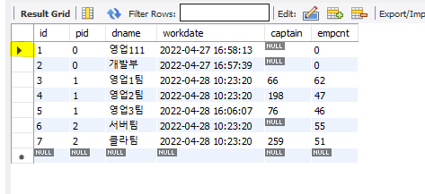

# 🎈 @시코 - MySQL 제대로 배우기 (inflearn)

우선 `mysql` 8버전을 [설치](https://www.mysql.com/)해주고, 설치 과정에서 `custom` 을 선택하여 `workbench`까지 8버전으로 설치해준다.

## Mysql 사용자

### mysql 접속

```sql
C:\Users\관리자>mysql -u root -p
Enter password: ************
Welcome to the MySQL monitor.  Commands end with ; or \g.
Your MySQL connection id is 34
Server version: 8.0.29 MySQL Community Server - GPL

Copyright (c) 2000, 2022, Oracle and/or its affiliates.
```

### 사용자 조회

```sql
mysql> use mysql;
Database changed
mysql> select user, host from user;
+------------------+-----------+
| user             | host      |
+------------------+-----------+
| mysql.infoschema | localhost |
| mysql.session    | localhost |
| mysql.sys        | localhost |
| root             | localhost |
+------------------+-----------+
4 rows in set (0.00 sec)
```

### 사용자 추가/권한부여

<b>create user</b>
`mysql> create user <user-name>@'<host>' identified by '<password>';`

```sql
mysql> create user 'test1234'@'localhost' identified by 'test1234';
Query OK, 0 rows affected (0.00 sec)

mysql> grant all privileges on test_database.* to test@'localhost';
Query OK, 0 rows affected (0.00 sec)
```

<b>grant</b>

```sql
mysql> grant all privileges on test_database.* to test_grant@'localhost' identified by 'test1234';
Query OK, 0 rows affected (0.00 sec)
```

<b>`localhost`대신에 `%`를 사용할 경우 외부에서도 접속 가능하다</b>

```sql
mysql> grant all privileges on test_database.* to test_grant@'%' identified by 'test1234';
Query OK, 0 rows affected (0.01 sec)
```

<b><u>적용하기 필수 !</u></b>

```sql
mysql> flush privileges;
```

### 비밀번호 변경

```sql
mysql> use mysql;
Database changed
mysql> update user set password=PASSWORD('변경할 비밀번호') where user='사용자이름';
Query OK, 1 row affected (0.00 sec)
Rows matched: 1  Changed: 1  Warnings: 0

mysql> flush privileges;
Query OK, 0 rows affected (0.00 sec)
```

### 사용자 삭제 

```sql
mysql> delete from user where user='USER_ID'; 
mysql> flush privileges;
mysql> delete from user where user='test';
Query OK, 1 row affected (0.00 sec)

mysql> delete from user where user='test_grant';
Query OK, 2 rows affected (0.00 sec)

mysql> flush privileges;
Query OK, 0 rows affected (0.00 sec)
```

## database 생성

```sql
mysql> show databases;
+--------------------+
| Database           |
+--------------------+
| information_schema |
| mysql              |
| performance_schema |
| sys                |
+--------------------+
4 rows in set (0.00 sec)

mysql> create database testdb;
Query OK, 1 row affected (0.02 sec)

mysql> show databases;
+--------------------+
| Database           |
+--------------------+
| information_schema |
| mysql              |
| performance_schema |
| sys                |
| testdb             |
+--------------------+
5 rows in set (0.00 sec)
```

## mysql workbench 연결


## table 생성

```sql
#부서
create table Dept(
	id tinyint unsigned not null auto_increment,
    pid tinyint unsigned not null default 0 comment '상위부서id',
    dname varchar(31) not null,
    PRIMARY KEY(id)
);

#직원
create table Emp(
	id int unsigned not null auto_increment,
    ename varchar(31) not null,
    dept tinyint unsigned not null,
    salary int not null default 0 ,
    primary key(id),
    foreign key(dept) references Dept(id)
);
```

<b>`workbench`에서 `refresh`해줘야 생성된 테이블 조회 가능</b>


::: tip unsigned
모든 Integer타입들은 `UNSIGNED`를 가지고 있다.

해당 컬럼이 <b>음수가 절대 될 일이 없는 경우,</b> (auto-increment로 primary key를 잡을 때와 같이) 수의 범위가 양수 쪽으로 더 넓으면 좋을 것이다.
이때 사용하는 게 `unsigned`타입이다.

* `unsigned` 아닐 때: `-2147483648 ~ 2147483647`
* `unsigned` 일 때:  `0 ~ 4294967295`
:::

## select/insert

```sql
#상위부서
insert into Dept(pid, dname) values (0, '영업부'), (0, '개발부');

#하위부서
insert into Dept(pid, dname) 
values (1, '영업1팀'), (1, '영업2팀'), (1, '영업3팀'), (2, '서버팀'), (2, '클라이언트팀');
```

## inner join

### 전체조회

```sql
mysql> select * from Dept;
+----+-----+--------------+
| id | pid | dname        |
+----+-----+--------------+
|  1 |   0 | 영업부       |
|  2 |   0 | 개발부       |
|  3 |   1 | 영업1팀      |
|  4 |   1 | 영업2팀      |
|  5 |   1 | 영업3팀      |
|  6 |   2 | 서버팀       |
|  7 |   2 | 클라이언트팀 |
+----+-----+--------------+
7 rows in set (0.00 sec)
```

### 하위 부서 조회

```sql
mysql> select d1.dname as '상위부서', d2.* from Dept d1 inner join Dept d2 on d1.id = d2.pid;
+----------+----+-----+--------------+
| 상위부서 | id | pid | dname        |
+----------+----+-----+--------------+
| 영업부   |  3 |   1 | 영업1팀      |
| 영업부   |  4 |   1 | 영업2팀      |
| 영업부   |  5 |   1 | 영업3팀      |
| 개발부   |  6 |   2 | 서버팀       |
| 개발부   |  7 |   2 | 클라이언트팀 |
+----------+----+-----+--------------+
5 rows in set (0.00 sec)
```

::: tip rand()
* 0과 1 사이의 난수 발생 

```sql
mysql> select rand();
+--------------------+
| rand()             |
+--------------------+
| 0.3301079471875987 |
+--------------------+
1 row in set (0.00 sec)
```

* 0~10 사이의 난수 하여 올림처리 (0이 나오지 않게 올림으로 처리)

```sql
mysql> select CEIL(rand() * 10);
+-------------------+
| CEIL(rand() * 10) |
+-------------------+
|                 3 |
+-------------------+
1 row in set (0.00 sec)
```
:::


## function 생성


::: tip function 생성 안 되는 경우
```sql
SET GLOBAL  log_bin_trust_function_creators=ON;
```
:::

### 1. 한글자를 랜덤으로 반환하는 함수를 만들어보자.

```sql
CREATE FUNCTION `f_rand1` (_str varchar(255)) -- 매개변수는 _
RETURNS varchar(31)
BEGIN
	declare v_ret varchar(31); -- 변수는 v_
    declare v_len tinyint;
    
    set v_len = char_length(_str); -- 한글은 3바이트이므로 char_length하면 글자수대로 길이 반환
    set v_ret = substring(_str, CEIL(rand() * v_len), 1); -- 단어에서 1글자만 랜덤으로 반환
RETURN v_ret;
END
```

```sql
mysql> select f_rand1('김이박');
+-------------------+
| f_rand1('김이박') |
+-------------------+
| 김                |
+-------------------+
1 row in set (0.00 sec)

mysql> select f_rand1('1234567');
+--------------------+
| f_rand1('1234567') |
+--------------------+
| 7                  |
+--------------------+
1 row in set (0.00 sec)

mysql> select f_rand1('1234567');
+--------------------+
| f_rand1('1234567') |
+--------------------+
| 3                  |
+--------------------+
1 row in set (0.00 sec)
```

### 2. `f_rand1`함수를 활용해서 이름을 만들어주는 함수를 만들어보자.

```sql
CREATE FUNCTION `f_randname` ()
RETURNS varchar(31)
BEGIN
	declare v_ret varchar(31);
    declare v_lasts varchar(255) default '김이박조최전천방지마유배원'; -- 성
    declare v_firsts varchar(255) default '순신세종성호지혜가은세호민국가나다라마바사아자차결찬'; -- 이름
    
    set v_ret = concat(f_rand1(v_lasts), f_rand1(v_firsts), f_rand1(v_firsts));
RETURN v_ret;
END
```

```sql
mysql> select f_randname();
+--------------+
| f_randname() |
+--------------+
| 유결은       |
+--------------+
1 row in set (0.00 sec)

mysql> select f_randname();
+--------------+
| f_randname() |
+--------------+
| 원다호       |
+--------------+
1 row in set (0.00 sec)
```

## Procedure

### 여러명의 직원을 프로시저로 넣어보자.


하위부서에 속하기 위해
```sql
CREATE PROCEDURE `sp_test_emp` (_cnt int)
BEGIN
	declare v_idx int default 0;
    while v_idx < _cnt
    do
        -- 하위부서에 속하기 위에 '34567', 급여는 *100하여 `100~900`까지
		insert into Emp(ename, dept, salary) values (f_randname(), f_rand1('34567'), f_rand1('123456789') * 100);        
        set v_idx = v_idx + 1;
    end while;
END
```

```sql
mysql> call sp_test_emp(10);
Query OK, 1 row affected (0.02 sec)

mysql> select * from emp;
+----+--------+------+--------+
| id | ename  | dept | salary |
+----+--------+------+--------+
|  1 | 전차종 |    7 |    100 |
|  2 | 마민종 |    4 |    800 |
|  3 | 조자라 |    6 |    500 |
|  4 | 최호순 |    5 |    400 |
|  5 | 조세호 |    6 |    200 |
|  6 | 최국세 |    5 |    200 |
|  7 | 조차마 |    7 |    500 |
|  8 | 방세지 |    3 |    700 |
|  9 | 전결은 |    3 |    100 |
| 10 | 이세사 |    6 |    800 |
| 11 | 천바가 |    5 |    300 |
| 12 | 유혜종 |    6 |    400 |
+----+--------+------+--------+
12 rows in set (0.00 sec)
```

## group by

### 부서별 직원 수 조회

```sql
mysql> select dept, count(*) from Emp group by dept;
+------+----------+
| dept | count(*) |
+------+----------+
|    3 |       62 |
|    4 |       47 |
|    5 |       47 |
|    6 |       55 |
|    7 |       51 |
+------+----------+
5 rows in set (0.00 sec)
```

## table 정보

```sql
mysql> desc Dept;
+-------+------------------+------+-----+---------+----------------+
| Field | Type             | Null | Key | Default | Extra          |
+-------+------------------+------+-----+---------+----------------+
| id    | tinyint unsigned | NO   | PRI | NULL    | auto_increment |
| pid   | tinyint unsigned | NO   |     | 0       |                |
| dname | varchar(31)      | NO   |     | NULL    |                |
+-------+------------------+------+-----+---------+----------------+
3 rows in set (0.00 sec)
```
```sql
mysql> show create table Dept;
+-------+-------------------------------------------------------------------------------------------------------------------------------------------------------------------------------------------------------------------------------------------------------------------------------------+
| Table | Create Table                                                                                                                                                                                                                                                                        |
+-------+-------------------------------------------------------------------------------------------------------------------------------------------------------------------------------------------------------------------------------------------------------------------------------------+
| Dept  | CREATE TABLE `dept` (
  `id` tinyint unsigned NOT NULL AUTO_INCREMENT,
  `pid` tinyint unsigned NOT NULL DEFAULT '0' COMMENT '상위부서id',
  `dname` varchar(31) NOT NULL,
  PRIMARY KEY (`id`)
) ENGINE=InnoDB AUTO_INCREMENT=8 DEFAULT CHARSET=utf8mb4 COLLATE=utf8mb4_0900_ai_ci |
+-------+-------------------------------------------------------------------------------------------------------------------------------------------------------------------------------------------------------------------------------------------------------------------------------------+
1 row in set (0.00 sec)
```

```sql
mysql> show index from Dept;
+-------+------------+----------+--------------+-------------+-----------+-------------+----------+--------+------+------------+---------+---------------+---------+------------+
| Table | Non_unique | Key_name | Seq_in_index | Column_name | Collation | Cardinality | Sub_part | Packed | Null | Index_type | Comment | Index_comment | Visible | Expression |
+-------+------------+----------+--------------+-------------+-----------+-------------+----------+--------+------+------------+---------+---------------+---------+------------+
| dept  |          0 | PRIMARY  |            1 | id          | A         |           0 |     NULL |   NULL |      | BTREE      |         |               | YES     | NULL       |
+-------+------------+----------+--------------+-------------+-----------+-------------+----------+--------+------+------------+---------+---------------+---------+------------+
1 row in set (0.00 sec)

mysql> show index from Emp;
+-------+------------+----------+--------------+-------------+-----------+-------------+----------+--------+------+------------+---------+---------------+---------+------------+
| Table | Non_unique | Key_name | Seq_in_index | Column_name | Collation | Cardinality | Sub_part | Packed | Null | Index_type | Comment | Index_comment | Visible | Expression |
+-------+------------+----------+--------------+-------------+-----------+-------------+----------+--------+------+------------+---------+---------------+---------+------------+
| emp   |          0 | PRIMARY  |            1 | id          | A         |           0 |     NULL |   NULL |      | BTREE      |         |               | YES     | NULL       |
| emp   |          1 | dept     |            1 | dept        | A         |           0 |     NULL |   NULL |      | BTREE      |         |               | YES     | NULL       |
+-------+------------+----------+--------------+-------------+-----------+-------------+----------+--------+------+------------+---------+---------------+---------+------------+
2 rows in set (0.00 sec)
```

## table 복제

### 데이터빼고 구조만 복제

```sql
create table Dept2 like Dpet;
```

### 데이터까지 복제

```sql
create table Dept3 AS select * from Dept;
```

:::  danger
<b>index</b>는 설정되지 않는다..!
foriegn key와 같은 설정은 복제되지 않으므로 따로 설정해주어야 함.
:::

## table 수정

```sql
-- on update: 데이터 수정됐을때 current_timestamp 업데이트
alter table Dept add column workdate timestamp not null default current_timestamp on update current_timestamp;
```

```sql
mysql> select * from Dept;
+----+-----+---------+---------------------+
| id | pid | dname   | workdate            |
+----+-----+---------+---------------------+
|  1 |   0 | 영업부  | 2022-04-27 14:17:46 |
|  2 |   0 | 개발부  | 2022-04-27 14:17:46 |
|  3 |   1 | 영업1팀 | 2022-04-27 14:17:46 |
|  4 |   1 | 영업2팀 | 2022-04-27 14:17:46 |
|  5 |   1 | 영업3팀 | 2022-04-27 14:17:46 |
|  6 |   2 | 서버팀  | 2022-04-27 14:17:46 |
|  7 |   2 | 클라팀  | 2022-04-27 14:18:06 |
+----+-----+---------+---------------------+
7 rows in set (0.00 sec)
```

### 아래와 같이 block처리해서 수정하는 연습하기 

```sql
select * from Dept
-- update Dept set dname='클라팀'
where id = 7;
```

### truncate 과 delete 차이

`truncate`은 테이블을 지웠다가 다시 생성하는 거나 다름 없다. auto_increment가 1부터 다시 시작한다.

`delete`해서 모든 데이터를 지우면 auto_increment가 이전 값에서 +1 된다.

## TCL: Commit & Rollback

::: danger
Session 단위로 Tx는 제어됨.
:::

### autocommit 확인

```sql
select @@autocommit;
-- 변경하는 방법 SET AUTOCOMMIT = FALSE; 
```

### 여러가지 작업을 할 때, 불안한 경우 `transcation`으로 작업해준다.

```sql
start transaction; -- transaction 시작
select * from Dept where id in (1,2);
update Dept set dname='영업111' where id = 1;
commit; -- 적용하고픈 경우,
rollback; -- 취소하고픈 경우,
```

### savepoint

```sql
start transaction; -- transaction 시작

savepoint sp1; -- savepoint1 시작
update Dept set dname='영업111' where id = 1;

savepoint sp2; -- savepoint2 시작
update Dept set dname='개발111' where id = 2;

rollback to savepoint sp2; --sp2 만 롤백

commit; -- 적용 (sp1만 적용됨)
```

## View

::: tip View를 사용하는 이유

* Security

    보안을 위해서 `view`를 많이 쓴다. 테이블 테이터를 수정하지 못하도록, 사용자 접근 권한을 `view` 조회만 가능하도록 하는 경우가 있다.

* Simplicity

    복잡한 쿼리를 단순하게 해준다.

* Performance

    네트워크 트래픽이 줄어들고, 컴파일하는 시간도 줄어든다.

:::

### 생성

생성 쿼리는 아래와 같고, 조회는 테이블 조회와 똑같이 `select`로 조회하면 된다.

```sql
create view v_Emp AS
select e.*, d.dname from Emp e inner join Dept d on e.dept = d.id;
```


### view schema 조회

```sql
mysql> select * from information_schema.views where table_schema = 'testdb';
+---------------+--------------+------------+----------------------------------------------------------------------------------------------------------------------------------------------------------------------------------------------------+--------------+--------------+----------------+---------------+----------------------+----------------------+
| TABLE_CATALOG | TABLE_SCHEMA | TABLE_NAME | VIEW_DEFINITION                                                                                                                                                                                    | CHECK_OPTION | IS_UPDATABLE | DEFINER        | SECURITY_TYPE | CHARACTER_SET_CLIENT | COLLATION_CONNECTION |
+---------------+--------------+------------+----------------------------------------------------------------------------------------------------------------------------------------------------------------------------------------------------+--------------+--------------+----------------+---------------+----------------------+----------------------+
| def           | testdb       | v_emp      | select `e`.`id` AS `id`,`e`.`ename` AS `ename`,`e`.`dept` AS `dept`,`e`.`salary` AS `salary`,`d`.`dname` AS `dname` from (`testdb`.`emp` `e` join `testdb`.`dept` `d` on((`e`.`dept` = `d`.`id`))) | NONE         | YES          | root@localhost | DEFINER       | utf8mb4              | utf8mb4_0900_ai_ci   |
+---------------+--------------+------------+----------------------------------------------------------------------------------------------------------------------------------------------------------------------------------------------------+--------------+--------------+----------------+---------------+----------------------+----------------------+
1 row in set (0.00 sec)
```

## Trigger

<h3>특정 조건을 만족하면 저절로 실행된다.</h3>

```sql
DELIMITER //
Create Trigger <trigger-name>
    { BEFORE | AFTER } { INSERT | UPDATE | DELETE } -- 특정 작업 수행 전/후 (보통 후에 많이 함)
    { PRECEDES | FOLLOWS } other-trigger-name -- 다른 트리거가 또 있는경우 PRECEDES: other타기전에 타라 / FOLLOWS: other타고 타라
    on <table-name> FOR EACH ROW
BEGIN
    ... OLD.<col>   ... NEW.<col>; -- OLD: update이전값 / NEW: update이후값

END //
DELIMITER;
```

### 우선 기존 `Dept` 테이블에 직원 수인 `empcnt` 컬럼을 추가해주고, 현재 직원수로 `update` 처리해주자.

```sql
alter table Dept add column empcnt int not null default 0;
update Dept d set empcnt = (select count(*) from Emp where dept = d.id);
```

### `Trigger` 를 적용해주자.

```sql
CREATE DEFINER = CURRENT_USER TRIGGER `testdb`.`emp_AFTER_INSERT` AFTER INSERT ON `emp` FOR EACH ROW
BEGIN
  update Dept set empcnt = empcnt + 1
  where id = NEW.dept;
END
```


### `insert` 해보면 `Trigger`가 적용되어 `empcnt`가 늘어나는 걸 확인할 수 있다.

```sql
mysql> select * from Dept;
+----+-----+---------+---------------------+---------+--------+
| id | pid | dname   | workdate            | captain | empcnt |
+----+-----+---------+---------------------+---------+--------+
|  1 |   0 | 영업111 | 2022-04-27 16:58:13 |    NULL |      0 |
|  2 |   0 | 개발부  | 2022-04-27 16:57:39 |    NULL |      0 |
|  3 |   1 | 영업1팀 | 2022-04-28 10:23:20 |      66 |     62 |
|  4 |   1 | 영업2팀 | 2022-04-28 10:23:20 |     198 |     47 |
|  5 |   1 | 영업3팀 | 2022-04-28 13:52:15 |      76 |     48 |
|  6 |   2 | 서버팀  | 2022-04-28 10:23:20 |    NULL |     55 |
|  7 |   2 | 클라팀  | 2022-04-28 10:23:20 |     259 |     51 |
+----+-----+---------+---------------------+---------+--------+
7 rows in set (0.01 sec)

mysql> insert into Emp(ename, dept, salary) values ('SSS', 5, 200);
Query OK, 1 row affected (0.01 sec)

mysql> select * from Dept;
+----+-----+---------+---------------------+---------+--------+
| id | pid | dname   | workdate            | captain | empcnt |
+----+-----+---------+---------------------+---------+--------+
|  1 |   0 | 영업111 | 2022-04-27 16:58:13 |    NULL |      0 |
|  2 |   0 | 개발부  | 2022-04-27 16:57:39 |    NULL |      0 |
|  3 |   1 | 영업1팀 | 2022-04-28 10:23:20 |      66 |     62 |
|  4 |   1 | 영업2팀 | 2022-04-28 10:23:20 |     198 |     47 |
|  5 |   1 | 영업3팀 | 2022-04-28 13:53:11 |      76 |     49 |
|  6 |   2 | 서버팀  | 2022-04-28 10:23:20 |    NULL |     55 |
|  7 |   2 | 클라팀  | 2022-04-28 10:23:20 |     259 |     51 |
+----+-----+---------+---------------------+---------+--------+
7 rows in set (0.00 sec)
```

### `delete`에도 `empcnt`가 -1 되도록 trigger를 걸어준다.

```sql
CREATE DEFINER = CURRENT_USER TRIGGER `testdb`.`emp_AFTER_DELETE` AFTER DELETE ON `emp` FOR EACH ROW
BEGIN
 update Dept set empcnt = empcnt - 1
  where id = OLD.dept; -- 새로 들어오는 NEW가 없으므로 OLD로 써준다.
END
```

### `update`에도 걸어준다. `dept`-속한 부서가 수정되는 경우도 `empcnt`를 변경해줘야한다.

```sql
CREATE DEFINER=`root`@`localhost` TRIGGER `emp_AFTER_UPDATE` AFTER UPDATE ON `emp` FOR EACH ROW BEGIN
  IF OLD.dept != NEW.dept THEN -- 부서가 변경되는 경우
    update Dept set empcnt = empcnt - 1
      where id = OLD.dept;
    
    update Dept set empcnt = empcnt + 1
      where id = NEW.dept;
  END IF;
END
```

## UNION

### `UNION`은 중복을 빼고, `UNION ALL`은 중복도 포함한다.

```sql
select * from subject where classroom < 3
{ UNION | UNION ALL}
select * from subject where classroom < 5
```

## @rownum

순번을 매기고 싶을 때 사용한다.

```sql
mysql> select s.*, (@rownum := @rownum + 1)from Emp s, (select @rownum := 0) rn;
+-----+--------+------+--------+--------------------------+
| id  | ename  | dept | salary | (@rownum := @rownum + 1) |
+-----+--------+------+--------+--------------------------+
|   1 | 전차종 |    7 |    100 |                        1 |
|   2 | 마민종 |    4 |    800 |                        2 |
|   3 | 조자라 |    6 |    500 |                        3 |
|   4 | 최호순 |    5 |    400 |                        4 |
|   5 | 조세호 |    6 |    200 |                        5 |
|   6 | 최국세 |    5 |    200 |                        6 |
|   7 | 조차마 |    7 |    500 |                        7 |
|   8 | 방세지 |    3 |    700 |                        8 |
|   9 | 전결은 |    3 |    100 |                        9 |
|  10 | 이세사 |    6 |    800 |                       10 |
|  11 | 천바가 |    5 |    300 |                       11 |
|  12 | 유혜종 |    6 |    400 |                       12 |
|  13 | 천가호 |    3 |    100 |                       13 |
|  14 | 유차순 |    5 |    300 |                       14 |
|  15 | 유가종 |    6 |    100 |                       15 |
|  16 | 전사바 |    4 |    400 |                       16 |
|  17 | 김찬아 |    3 |    100 |                       17 |
|  18 | 원가찬 |    4 |    300 |                       18 |
|  19 | 마아결 |    3 |    200 |                       19 |
...생략
```

## Procudure - OUT 출력 | into 사용

### 프로시저 작업 후, 변수를 출력하고 싶을 때 `OUT`을 사용한다.

```sql
CREATE PROCEDURE `sp_emp_del`(_empid int, OUT _empcnt int) -- 삭제 후, empcnt 가져오고 싶을떄
BEGIN
  declare v_deptid tinyint;
  select dept into v_deptid from Emp where id = _empid; -- into: dept를 v_deptid 변수에 입력
  
  delete from Emp where id = _empid;
  
  select empcnt into _empcnt from Dept where id = v_deptid; 
END
```

```sql
call sp_emp_del(6, @empcnt); -- empcnt를 받아온다.
select @empcnt;
```

::: tip Leave
`Leave`를 사용하면 프로시저 도중 중단 가능하다.
```sql
CREATE DEFINER=`root`@`localhost` PROCEDURE `sp_emp_range`(_sid int, _eid int)
prox:BEGIN
    ... 생략
    leave prox; -- 조건 만족 못했을 때, 취소시키고 싶은 경우
END
```
:::

## Prepare

### String으로 받아온 값 쿼리에 사용하기

```sql
CREATE PROCEDURE `sp_count`(_table varchar(31))
BEGIN
  SET @sql = CONCAT('select count(*) cnt from ', _table);
  
  PREPARE myQuery from @sql;
  EXECUTE myQuery;
  DEALLOCATE PREPARE myQuery; -- 메모리에서 삭제
END
```

## Cursor

### row를 선택하는 개념이라고 보면 된다. 



```sql
Declare <cursor-name> CURSOR FOR
    select ....
Declare Continue Handler
    For Not Found SET <end-flag> := True;

OPEN <cursor-name>;

    <cursor-loop-var>: LOOP
        Fetch <cursor-name> into <var-name>, ...;
        IF <end-flag> THEN
            LEAVE <cursor-loop-var>;
        END IF;
        ...
    END LOOP <cursor-loop-var>;

CLOSE <cursor-name>;
```

## Exception Handling

```sql
START TRANSACTION

DECLARE {EXIT | CONTINUE} HANDLER FOR [ SQLEXCEPTION | <code> ]

BEGIN
    SHOW ERRORS;
    SELECT '에러발생' as 'Result';
    ROLLBACK;
END;

-- 위에서 CONTINUE 라고 선언했다면, 오류 발생해도 아래 계속 수행!

COMMIT;
```

### 위 나온 내용을 전부 사용한 Procedure 예제

```sql
CREATE PROCEDURE `sp_emp_range`(_sid int, _eid int)
prox:BEGIN
  declare v_sid int default _sid;
  declare v_eid int default _eid;
  
  -- cursor 임시 변수
  declare v_empid int;
  declare v_ename varchar(31);
  declare v_dname varchar(31);
  
  -- cursor 종료 flag
  Declare _done boolean default False;
  
  Declare _cur CURSOR FOR
    select id, ename, dname  from v_Emp where id between v_sid and v_eid;
    
  Declare Continue Handler
    For Not Found SET _done := True;
    
    
  -- error handling
  DECLARE EXIT HANDLER FOR SQLEXCEPTION
  BEGIN
    SHOW ERRORS;
    SELECT '에러발생' as 'Result';
  END;
  
  IF _sid < 0 AND _eid < 0 THEN
    leave prox;
  END IF;
  
  IF _sid > _eid THEN
    set v_sid = _eid;
    set v_eid = _sid;
  END IF;
  
  -- 임시테이블 존재하는 경우 drop
  drop temporary table IF Exists Tmp;
  
  -- 임시 테이블 생성
  create temporary table Tmp (
    empid int,
    edname varchar(63)
  );

  OPEN _cur; -- 커서 열기
  
    cur_loop: LOOP
      Fetch _cur into v_empid, v_ename, v_dname;
      IF _done THEN
        LEAVE cur_loop;
      END IF;
      
      insert into Tmp(empid, edname) values(v_empid, concat(v_ename, '-', ifnull(v_dname,'소속팀없음')));
      
    END LOOP cur_loop;
  
  CLOSE _cur; -- 커서 닫기
  
  select * from Tmp;
  
END
```

```sql
mysql> call sp_emp_range(5,1);
+-------+----------------+
| empid | edname         |
+-------+----------------+
|     1 | 전차종-클라팀  |
|     2 | 마민종-영업2팀 |
|     3 | 조자라-서버팀  |
|     4 | 최호순-영업3팀 |
|     5 | 조세호-서버팀  |
+-------+----------------+
5 rows in set (0.00 sec)

Query OK, 0 rows affected (0.01 sec)
```

## WITH CTE

::: tip WITH -  CTE

메모리에 임시 결과 셋으로 올려놓고 재사용. (cf. View, Function)

* 장점
    순서에 의한 절차적으로 작성 -> 작성하기 쉽고 읽기 쉽다.

```sql
WITH [RECURSIVE]
    cte_name [(colr_name [, col_name] ...)] AS (subquery)
    [, cte_name [(colr_name [, col_name] ...)] AS (subquery)]
select * from cte_name;
```

MY SQL의 CTE에는 아래와 같이 2가지 CTE를 제공하고 있다.

<b>1. Common Table Expressions (기본 CTE)</b> - 순차적으로 쿼리 작성 가능
<b>2. Recursive Common Table Expressions (재귀 CTE)</b> - 스스로 추가적인 Row를 생성할 수 있다.
:::

```sql
WITH
  AvgSal AS ( -- 평균 급여
    select d.dname, avg(e.salary) avgsal
    from Dept d inner join Emp e on d.id = e.dept
    group by d.id
  ),
  MaxAvgSal AS ( -- 최고
    select * from AvgSal order by avgSal desc limit 1
  ),
  MinAvgSal AS ( -- 최소
    select * from AvgSal order by avgSal asc limit 1
  ),
  SumUp AS ( -- union
    select '최고' as gb, m1.* from MaxAvgSal m1
    UNION
    select '최저' as gb, m2.* from MinAvgSal m2
  )
select * from Sumup
UNION
select '', '평균급여차액', format((max(avgsal) - min(avgsal))* 10000, 0) from SumUp;  -- 차액

+------+--------------+----------+
| gb   | dname        | avgsal   |
+------+--------------+----------+
| 최고 | 서버팀       | 538.1818 |
| 최저 | 영업3팀      | 450.0000 |
|      | 평균급여차액 | 881,818  |
+------+--------------+----------+
3 rows in set (0.00 sec)
```

## 재귀 CTE

### 피보나치 수열

<b>변수에 맞춰서 조회해야 한다.</b>

```sql
WITH RECURSIVE fibonacci (n, fib_n, next_fib_n) AS -- 변수 3개
(
    select 1, 0, 1 -- 3개
    UNION ALL
    select n + 1, next_fib_n, fib_n + next_fib_n -- 3개
      from fibonacci where n < 10
)
select * from fibonacci;
+------+-------+------------+
| n    | fib_n | next_fib_n |
+------+-------+------------+
|    1 |     0 |          1 |
|    2 |     1 |          1 |
|    3 |     1 |          2 |
|    4 |     2 |          3 |
|    5 |     3 |          5 |
|    6 |     5 |          8 |
|    7 |     8 |         13 |
|    8 |    13 |         21 |
|    9 |    21 |         34 |
|   10 |    34 |         55 |
+------+-------+------------+
10 rows in set (0.00 sec)
```

### 계층 테스트를 위해 부서를 넣어주자

```sql
insert into Dept(pid, dname) values(6, '인프라셀');
insert into Dept(pid, dname) values(6, 'DB셀');
insert into Dept(pid, dname) values(7, '모바일셀');
```

### 우선 트리구조가 아닌 형태로 조회

```sql
WITH RECURSIVE CteDept (id, pid, npname, dname, d) AS -- d: depth : 실행순서
(
  select id, pid, cast('' as char(31)), dname, 0 from Dept where pid = 0
  UNION ALL
  select d.id, d.pid, cte.dname, d.dname,  d + 1 from Dept d inner join CteDept cte on d.pid = cte.id
)
select * from CteDept;

+------+------+--------+----------+------+
| id   | pid  | npname | dname    | d    |
+------+------+--------+----------+------+
|    1 |    0 |        | 영업부   |    0 |
|    2 |    0 |        | 개발부   |    0 |
|    3 |    1 | 영업부 | 영업1팀  |    1 |
|    4 |    1 | 영업부 | 영업2팀  |    1 |
|    5 |    1 | 영업부 | 영업3팀  |    1 |
|    6 |    2 | 개발부 | 서버팀   |    1 |
|    7 |    2 | 개발부 | 클라팀   |    1 |
|    9 |    6 | 서버팀 | 인프라셀 |    2 |
|   10 |    6 | 서버팀 | DB셀     |    2 |
|   11 |    7 | 클라팀 | 모바일셀 |    2 |
+------+------+--------+----------+------+
10 rows in set (0.00 sec)
```

### 트리 구조로 조회

```sql
WITH RECURSIVE CteDept (id, pid, npname, dname, d, h) AS 
(
  select id, pid, cast('' as char(31)), dname, 0, cast(id as char(10)) from Dept where pid = 0
  UNION ALL
  select d.id, d.pid, cte.dname, d.dname,  d + 1, concat(cte.h, '-', d.id) from Dept d inner join CteDept cte on d.pid = cte.id
)
select * from CteDept order by h;

+------+------+--------+----------+------+--------+
| id   | pid  | npname | dname    | d    | h      |
+------+------+--------+----------+------+--------+
|    1 |    0 |        | 영업부   |    0 | 1      |
|    3 |    1 | 영업부 | 영업1팀  |    1 | 1-3    |
|    4 |    1 | 영업부 | 영업2팀  |    1 | 1-4    |
|    5 |    1 | 영업부 | 영업3팀  |    1 | 1-5    |
|    2 |    0 |        | 개발부   |    0 | 2      |
|    6 |    2 | 개발부 | 서버팀   |    1 | 2-6    |
|   10 |    6 | 서버팀 | DB셀     |    2 | 2-6-10 |
|    9 |    6 | 서버팀 | 인프라셀 |    2 | 2-6-9  |
|    7 |    2 | 개발부 | 클라팀   |    1 | 2-7    |
|   11 |    7 | 클라팀 | 모바일셀 |    2 | 2-7-11 |
+------+------+--------+----------+------+--------+
10 rows in set (0.00 sec)
```

### 재귀 횟수 제한하기

<b><u>session으로 횟수 제한</u></b>

```sql
SET SESSION cte_max_recursion_depth = 20; -- 재귀 실행 제한
WITH RECURSIVE cte (n) AS
(
  SELECT 1
  UNION ALL
  SELECT n + 1 FROM cte -- limit 21 까지 가능
)
SELECT * FROM cte;

-- 20번 이상 실행되기때문에 루프에 빠지지 않도록 에러가 발생된다. 
```


<b><u>주석 힌트로 제한</u></b>

```sql
SET SESSION cte_max_recursion_depth = 20; -- 재귀 실행 제한
WITH RECURSIVE cte (n) AS
(
  SELECT 1
  UNION ALL
  SELECT n + 1 FROM cte limit 21
)
SELECT /*+ SET_VAR(cte_max_recursion_depth = 10) */ * FROM cte; -- HINT! 위에 session보다 우선..

-- 11번 까지만 가능하다고 에러가 발생됨.
```


## 윈도우 함수

[참고](https://dev.mysql.com/doc/refman/8.0/en/window-function-descriptions.html)

### windowFunc() over(PARTITION BY 그룹 ORDER BY 정렬기준) 이렇게 사용한다.

::: tip Window Function - 1 


| 함수 | 설명 |
| --- | --- |
| `ROW_NUMBER()` | 전체 결과에서 파티션 기준 출력되는 행 번호(순번) |
| `RANK()` | 값의 랭킹(순위), 공동 랭킹은 동일값을 보이며 다음 랭킹은 공동 랭킹을 건너뛰어 표시 |
| `DESNE_RANK()` | RANK() 함수와 동일한 기능이지만 공동 랭킹을 건너뛰지 않는다. |
| `PERCENT_RANK()` | 랭킹을 백분율로 나타낸다. 파티션 내에서 위치하는 랭킹의 %. |
| `CUME_DIST()` | 파티션 내 차지 하는 위치를 누적(cumulative)된 거리를 %로 나타내어 그래프를 그린다면 경계(outbound)를 나타낸다.  |
| `NTILE(n)` | 파티션 내 로우들을 n 개의 그룹으로 나눴을 때 그룹 번호. 보통 순서에 맞춰 그룹(영역)을 나눌 때 사용 |
:::

::: tip Window Function - 2


| 함수 | 설명 |
| --- | --- |
| `FIRST_VALUE(col)` | 파티션 내 첫번째 col 컬럼의 값 |
| `LAST_VALUE(col)` | 파티션 내 마지막 col 컬럼의 값 |
| `NTH_VALUE(col, n)` | 파티션 내 n번째 col 컬럼의 값 |
| `LAG(n)` | 현재 행 기준 앞(이전) n 번째 값 |
| `LEAD(n)` | 현재 행 기준 뒤(다음) n 번째 값 |
:::

```sql
select row_number() over(order by dept, salary desc) '순번',
    e.*,
    rank() over w '부서내 순위',
    dense_rank() over w '부서내 순위',
    percent_rank() over w '부서내 %순위',
    cume_dist() over w '부서내 %경계',
    ntile(3) over w '급여등급'
  from Emp e
where ename like '박%'
WINDOW w as (partition by dept order by dept, salary desc) -- 이걸 써주면 over()를 써주지 않아도 된다.
;

 +------+-----+--------+------+--------+-------------+-------------+--------------------+---------------------+----------+
| 순번 | id  | ename  | dept | salary | 부서내 순위 | 부서내 순위 | 부서내 %순위       | 부서내 %경계        | 급여등급 |
+------+-----+--------+------+--------+-------------+-------------+--------------------+---------------------+----------+
|    1 | 169 | 박국결 |    3 |    900 |           1 |           1 |                  0 |  0.3333333333333333 |        1 |
|    2 | 105 | 박호마 |    3 |    700 |           2 |           2 |                0.5 |  0.6666666666666666 |        2 |
|    3 | 137 | 박순다 |    3 |    400 |           3 |           3 |                  1 |                   1 |        3 |
|    4 | 147 | 박세차 |    4 |    900 |           1 |           1 |                  0 |                0.25 |        1 |
|    5 | 145 | 박민마 |    4 |    800 |           2 |           2 | 0.3333333333333333 |                 0.5 |        1 |
|    6 |  82 | 박사가 |    4 |    700 |           3 |           3 | 0.6666666666666666 |                   1 |        2 |
|    7 | 237 | 박민사 |    4 |    700 |           3 |           3 | 0.6666666666666666 |                   1 |        3 |
|    8 | 143 | 박다마 |    5 |    700 |           1 |           1 |                  0 |                 0.5 |        1 |
|    9 | 165 | 박순국 |    5 |    300 |           2 |           2 |                  1 |                   1 |        2 |
|   10 |  43 | 박아다 |    6 |    900 |           1 |           1 |                  0 |  0.3333333333333333 |        1 |
|   11 |  44 | 박종지 |    6 |    900 |           1 |           1 |                  0 |  0.3333333333333333 |        1 |
|   12 |  71 | 박호민 |    6 |    800 |           3 |           2 |                0.4 |                 0.5 |        2 |
|   13 | 241 | 박마찬 |    6 |    700 |           4 |           3 |                0.6 |  0.6666666666666666 |        2 |
|   14 |  93 | 박바호 |    6 |    300 |           5 |           4 |                0.8 |  0.8333333333333334 |        3 |
|   15 | 114 | 박국순 |    6 |    100 |           6 |           5 |                  1 |                   1 |        3 |
|   16 |  49 | 박신다 |    7 |    900 |           1 |           1 |                  0 | 0.16666666666666666 |        1 |
|   17 | 223 | 박차결 |    7 |    800 |           2 |           2 |                0.2 |  0.3333333333333333 |        1 |
|   18 |  47 | 박민자 |    7 |    600 |           3 |           3 |                0.4 |                 0.5 |        2 |
|   19 |  37 | 박자마 |    7 |    500 |           4 |           4 |                0.6 |  0.6666666666666666 |        2 |
|   20 |  21 | 박국세 |    7 |    200 |           5 |           5 |                0.8 |                   1 |        3 |
|   21 | 238 | 박차결 |    7 |    200 |           5 |           5 |                0.8 |                   1 |        3 |
+------+-----+--------+------+--------+-------------+-------------+--------------------+---------------------+----------+
21 rows in set (0.00 sec)
```

```sql
select row_number() over(order by dept, salary desc) '순번',
    e.*,
    sum(salary) over w '급여 누적치',
    first_value(salary) over w '부서내 1등 급여',
    last_value(salary) over w '부서내 현재까지의 꼴등 급여',
    nth_value(salary, 2) over w '부서내 2등 급여',
    lag(salary, 1) over w '이전 급여',
    lead(salary, 1) over w '다음 급여'
  from Emp e
where ename like '박%'
WINDOW w as (partition by dept order by dept, salary desc) -- 이걸 써주면 over()를 써주지 않아도 된다.
;

+------+-----+--------+------+--------+-------------+-----------------+-----------------------------+-----------------+-----------+-----------+
| 순번 | id  | ename  | dept | salary | 급여 누적치 | 부서내 1등 급여 | 부서내 현재까지의 꼴등 급여 | 부서내 2등 급여 | 이전 급여 | 다음 급여 |
+------+-----+--------+------+--------+-------------+-----------------+-----------------------------+-----------------+-----------+-----------+
|    1 | 169 | 박국결 |    3 |    900 |         900 |             900 |                         900 |            NULL |      NULL |       700 |
|    2 | 105 | 박호마 |    3 |    700 |        1600 |             900 |                         700 |             700 |       900 |       400 |
|    3 | 137 | 박순다 |    3 |    400 |        2000 |             900 |                         400 |             700 |       700 |      NULL |
|    4 | 147 | 박세차 |    4 |    900 |         900 |             900 |                         900 |            NULL |      NULL |       800 |
|    5 | 145 | 박민마 |    4 |    800 |        1700 |             900 |                         800 |             800 |       900 |       700 |
|    6 |  82 | 박사가 |    4 |    700 |        3100 |             900 |                         700 |             800 |       800 |       700 |
|    7 | 237 | 박민사 |    4 |    700 |        3100 |             900 |                         700 |             800 |       700 |      NULL |
|    8 | 143 | 박다마 |    5 |    700 |         700 |             700 |                         700 |            NULL |      NULL |       300 |
|    9 | 165 | 박순국 |    5 |    300 |        1000 |             700 |                         300 |             300 |       700 |      NULL |
|   10 |  43 | 박아다 |    6 |    900 |        1800 |             900 |                         900 |             900 |      NULL |       900 |
|   11 |  44 | 박종지 |    6 |    900 |        1800 |             900 |                         900 |             900 |       900 |       800 |
|   12 |  71 | 박호민 |    6 |    800 |        2600 |             900 |                         800 |             900 |       900 |       700 |
|   13 | 241 | 박마찬 |    6 |    700 |        3300 |             900 |                         700 |             900 |       800 |       300 |
|   14 |  93 | 박바호 |    6 |    300 |        3600 |             900 |                         300 |             900 |       700 |       100 |
|   15 | 114 | 박국순 |    6 |    100 |        3700 |             900 |                         100 |             900 |       300 |      NULL |
|   16 |  49 | 박신다 |    7 |    900 |         900 |             900 |                         900 |            NULL |      NULL |       800 |
|   17 | 223 | 박차결 |    7 |    800 |        1700 |             900 |                         800 |             800 |       900 |       600 |
|   18 |  47 | 박민자 |    7 |    600 |        2300 |             900 |                         600 |             800 |       800 |       500 |
|   19 |  37 | 박자마 |    7 |    500 |        2800 |             900 |                         500 |             800 |       600 |       200 |
|   20 |  21 | 박국세 |    7 |    200 |        3200 |             900 |                         200 |             800 |       500 |       200 |
|   21 | 238 | 박차결 |    7 |    200 |        3200 |             900 |                         200 |             800 |       200 |      NULL |
+------+-----+--------+------+--------+-------------+-----------------+-----------------------------+-----------------+-----------+-----------+
21 rows in set (0.00 sec)
```

## JSON 데이터 다루기

| JSON 함수 | 설명 |
| --- | --- |
| `JSON_VALID()` | 데이터의 유효성 검사 |
| `JSON_PRETTY()` | 들여쓰기를 포함해 보기 좋게 JSON 데이터 출력 |
| `JSON_OBJECT()` | 문자열 형태가 아닌 key, value 쌍으로 JSON 데이터 만들기 |
| `JSON_ARRAY()` | JSON 데이터를 배열(Array) 형태로 작성 및 변환 |
| `JSON_EXTRACT()` | 인라인 패스(->)와 같이 특정 값만 뽑아 추출 |
| `JSON_VALUE()` | 특정 값 추출, 출력 타입 정의 가능 |
| `JSON_QUOTE()` | 특정 값 추출시 값의 좌우에 큰따옴표 붙여서 출력 |
| `JSON_UNQUOTE()` | 특정 값 추출시 값의 좌우에 출력되는 큰따옴표 제거 |
| `JSON_LENGTH()` | JSON 데이터의 키 개수 |
| `JSON_DEPTH()` | JSON 데이터의 깊이(계층) |
| `JSON_KEYS()` | JSON 데이터의 key들만 추출 |
| `JSON_TYPE()` | JSON 데이터의 데이터 타입 출력 |
| `JSON_SEARCH()` | 특정값으로 JSON 패스(위치) 검색 |
| `JSON_CONTAINS()` | JSON 데이터에 특정 값의 존재 여부 확인 |
| `JSON_REPLACE()` | JSON 데이터의 값 부분 변경 |
| `JSON_INSERT()` | JSON 데이터에 특정 key, value 쌍을 추가 |
| `JSON_SET()` | JSON 데이터에서 특정 key에 해당되는 값만 변경 |
| `JSON_REMOVE()` | JSON 데이터의 특정 key, value 제거 |
| `JSON_MERGE()` | 기존 JSON 데이터에 값 추가, MySQL 8에서 deprecated됨 |
| `JSON_MERGE_PRESERVE()` | JSON 데이터 특정 위치의 값 변경(기존 값 유지) |
| `JSON_MERGE_PATCH()` | JSON 데이터 특정 위치의 값 변경(기존 값 대치) |
| `JSON_TABLE()` | JSON 데이터를 테이블 형태로 정의 |
| `JSON_ARRAYAGG()` | 전체 JSON 데이터를 취합(통합)하여 배열로 출력 |
| `JSON_OBJECTAGG()` | JSON 데이터를 취합(통합)하여 Object 형태로 출력 |
| `JSON_STORAGE_SIZE()` | JSON 데이터가 차지하는 데이터 크기 |
| `JSON_STORAGE_FREE()` | JSON 데이터 컬럼의 여유공간, JSON 데이터 있으면 항상 0 |

```sql
alter table Emp add column remark JSON;

desc Emp;

update Emp set remark = '{ "addr": "서울"}'
  where id = 1;
  
update Emp set remark = '{"addr": "부산", "age": 39}'
 where id = 2;
 
update Emp set remark = '{"addr": "대구", "age": 29, "family": [ {"name": "논개", "relation": "모"} ]}'
 where id = 3;
 
update Emp set remark = '{"addr": "강원", "age": 49, "family": [  {"name": "조조", "relation": "부"},  {"name": "배철균", "relation": "모"} ]}'
 where id = 4;
 
update Emp set remark = '{"addr": "서울", "addr": "대전"}'
 where id = 1;  
 
update Emp set remark = json_object('addr', "부산", "age", 38)
 where id = 2;

update Emp set remark = json_object('addr', "대구", "age", 28, 
          "family", json_array(
              json_object('name', '논개', 'relation', '모')
          )) 
where id = 3;

--  {
--    "age": 48,
--    "addr": "강원",
--    "family": [
--      {
--        "name": "조조",
--        "relation": "부"
--      },
--      {
--        "name": "배철균",
--        "relation": "모"
--      }
--    ]
--  }
update Emp set remark = json_object('addr', "강원", "age", 48, 
          "family", json_array(
              json_object("name", "조조", "relation", "부"), 
              json_object("name", "배철균", "relation", "모")
          ))
where id = 4;
```

::: tip JSON 값 추출
```sql
select remark,
  remark->'$.addr', -- $는 루트
  remark->>'$.addr', -- >> 꺽새가 두개면 쌍따옴표가 없어진다.
  json_value(remark, '$.addr'),
  json_value(remark, '$.age' returning decimal(4,2)),
  -- remark 나오기 전..
  json_extract(remark, '$.addr'),
  json_unquote(json_extract(remark, '$.addr'))
from Emp
where remark is not null;

+-------------------------------------------------------------------------------------------------------------------+------------------+-------------------+------------------------------+----------------------------------------------------+--------------------------------+----------------------------------------------+
| remark                                                                                                            | remark->'$.addr' | remark->>'$.addr' | json_value(remark, '$.addr') | json_value(remark, '$.age' returning decimal(4,2)) | json_extract(remark, '$.addr') | json_unquote(json_extract(remark, '$.addr')) |
+-------------------------------------------------------------------------------------------------------------------+------------------+-------------------+------------------------------+----------------------------------------------------+--------------------------------+----------------------------------------------+
| {"addr": "대전"}                                                                                                  | "대전"           | 대전              | 대전                         |                                               NULL | "대전"                         | 대전                                         |
| {"age": 38, "addr": "부산"}                                                                                       | "부산"           | 부산              | 부산                         |                                              38.00 | "부산"                         | 부산                                         |
| {"age": 28, "addr": "대구", "family": [{"name": "논개", "relation": "모"}]}                                       | "대구"           | 대구              | 대구                         |                                              28.00 | "대구"                         | 대구                                         |
| {"age": 48, "addr": "강원", "family": [{"name": "조조", "relation": "부"}, {"name": "배철균", "relation": "모"}]} | "강원"           | 강원              | 강원                         |                                              48.00 | "강원"                         | 강원                                         |
+-------------------------------------------------------------------------------------------------------------------+------------------+-------------------+------------------------------+----------------------------------------------------+--------------------------------+----------------------------------------------+
4 rows in set (0.00 sec)
```
:::

::: tip JSON 검색
```sql
select remark,
  json_search(remark, 'one', '부산'), -- 결과로 path를 알려준다.
  json_search(remark, 'one', '배철균'),
  json_value(remark, "$.family[0].name")
from Emp
where remark is not null;

+-------------------------------------------------------------------------------------------------------------------+------------------------------------+--------------------------------------+----------------------------------------+
| remark                                                                                                            | json_search(remark, 'one', '부산') | json_search(remark, 'one', '배철균') | json_value(remark, "$.family[0].name") |
+-------------------------------------------------------------------------------------------------------------------+------------------------------------+--------------------------------------+----------------------------------------+
| {"addr": "대전"}                                                                                                  | NULL                               | NULL                                 | NULL                                   |
| {"age": 38, "addr": "부산"}                                                                                       | "$.addr"                           | NULL                                 | NULL                                   |
| {"age": 28, "addr": "대구", "family": [{"name": "논개", "relation": "모"}]}                                       | NULL                               | NULL                                 | 논개                                   |
| {"age": 48, "addr": "강원", "family": [{"name": "조조", "relation": "부"}, {"name": "배철균", "relation": "모"}]} | NULL                               | "$.family[1].name"                   | 조조                                   |
+-------------------------------------------------------------------------------------------------------------------+------------------------------------+--------------------------------------+----------------------------------------+
4 rows in set (0.00 sec)
```
:::

::: tip JSON 검색 2
```sql
select remark,
    json_contains(remark, '"부산"', '$.addr'),
    json_contains(remark, '48', '$.age')
from Emp
where remark is not null;

+-------------------------------------------------------------------------------------------------------------------+-------------------------------------------+--------------------------------------+
| remark                                                                                                            | json_contains(remark, '"부산"', '$.addr') | json_contains(remark, '48', '$.age') |
+-------------------------------------------------------------------------------------------------------------------+-------------------------------------------+--------------------------------------+
| {"addr": "대전"}                                                                                                  |                                         0 |                                 NULL |
| {"age": 38, "addr": "부산"}                                                                                       |                                         1 |                                    0 |
| {"age": 28, "addr": "대구", "family": [{"name": "논개", "relation": "모"}]}                                       |                                         0 |                                    0 |
| {"age": 48, "addr": "강원", "family": [{"name": "조조", "relation": "부"}, {"name": "배철균", "relation": "모"}]} |                                         0 |                                    1 |
+-------------------------------------------------------------------------------------------------------------------+-------------------------------------------+--------------------------------------+
4 rows in set (0.01 sec)

select * from Emp where json_contains(remark, '48', '$.age');
+----+--------+------+--------+-------------------------------------------------------------------------------------------------------------------+
| id | ename  | dept | salary | remark                                                                                                            |
+----+--------+------+--------+-------------------------------------------------------------------------------------------------------------------+
|  4 | 최호순 |    5 |    400 | {"age": 48, "addr": "강원", "family": [{"name": "조조", "relation": "부"}, {"name": "배철균", "relation": "모"}]} |
+----+--------+------+--------+-------------------------------------------------------------------------------------------------------------------+
1 row in set (0.00 sec)

select * from Emp where json_value(remark, '$.age') = 48;
+----+--------+------+--------+-------------------------------------------------------------------------------------------------------------------+
| id | ename  | dept | salary | remark                                                                                                            |
+----+--------+------+--------+-------------------------------------------------------------------------------------------------------------------+
|  4 | 최호순 |    5 |    400 | {"age": 48, "addr": "강원", "family": [{"name": "조조", "relation": "부"}, {"name": "배철균", "relation": "모"}]} |
+----+--------+------+--------+-------------------------------------------------------------------------------------------------------------------+
1 row in set (0.00 sec)

select * from Emp where remark->>'$.age' = 48;
+----+--------+------+--------+-------------------------------------------------------------------------------------------------------------------+
| id | ename  | dept | salary | remark                                                                                                            |
+----+--------+------+--------+-------------------------------------------------------------------------------------------------------------------+
|  4 | 최호순 |    5 |    400 | {"age": 48, "addr": "강원", "family": [{"name": "조조", "relation": "부"}, {"name": "배철균", "relation": "모"}]} |
+----+--------+------+--------+-------------------------------------------------------------------------------------------------------------------+
1 row in set (0.00 sec)
```
:::

## rollup

```sql
select 
  (case when d.pid is not null then max(p.dname) else 'Total' end) '상위부서',
  (case when d.id is not null then max(d.dname) else '- 소계 -' end) '부서명', 
  format(sum(e.salary), 0) '급여합(단위:만원)'
from Dept p inner join Dept d on p.id = d.pid
            inner join Emp e on d.id = e.dept
group by d.pid, d.id
with rollup;
+----------+----------+-------------------+
| 상위부서 | 부서명   | 급여합(단위:만원) |
+----------+----------+-------------------+
| 영업부   | 영업1팀  | 28,600            |
| 영업부   | 영업2팀  | 24,900            |
| 영업부   | 영업3팀  | 20,700            |
| 영업부   | - 소계 - | 74,200            |
| 개발부   | 서버팀   | 29,600            |
| 개발부   | 클라팀   | 23,700            |
| 개발부   | - 소계 - | 53,300            |
| Total    | - 소계 - | 127,500           |
+----------+----------+-------------------+
8 rows in set (0.00 sec)
```

## pivot

```sql
select d.id, max(d.dname) '구분',
  format(avg(e.salary) * 10000, 0) '평균급여',
  format(sum(e.salary) * 10000, 0) '급여합계',
  format(min(e.salary) * 10000, 0) '최소급여',
  format(max(e.salary) * 10000, 0) '최대급여'
from Dept d inner join Emp e on d.id = e.dept
group by d.id
order by d.id;
+----+---------+-----------+-------------+-----------+-----------+
| id | 구분    | 평균급여  | 급여합계    | 최소급여  | 최대급여  |
+----+---------+-----------+-------------+-----------+-----------+
|  3 | 영업1팀 | 4,612,903 | 286,000,000 | 1,000,000 | 9,000,000 |
|  4 | 영업2팀 | 5,297,872 | 249,000,000 | 1,000,000 | 9,000,000 |
|  5 | 영업3팀 | 4,500,000 | 207,000,000 | 1,000,000 | 9,000,000 |
|  6 | 서버팀  | 5,381,818 | 296,000,000 | 1,000,000 | 9,000,000 |
|  7 | 클라팀  | 4,647,059 | 237,000,000 | 1,000,000 | 9,000,000 |
+----+---------+-----------+-------------+-----------+-----------+
5 rows in set (0.00 sec)
```

```sql
select '평균급여' as '구분',
  format(avg(case when dept = 3 then salary end) * 10000, 0) '영업1팀',
  format(avg(case when dept = 4 then salary end) * 10000, 0) '영업2팀',
  format(avg(case when dept = 5 then salary end) * 10000, 0) '영업3팀',
  format(avg(case when dept = 6 then salary end) * 10000, 0) '서버팀',
  format(avg(case when dept = 7 then salary end) * 10000, 0) '클라팀'
from Emp
UNION
select '급여합계',
  format(sum(salary * (dept = 3)) * 10000, 0), -- 부서가 3이면 1이니까.. 부서가 3인 직원의 salary만 가져온다
  format(sum(salary * (dept = 4)) * 10000, 0), 
  format(sum(salary * (dept = 5)) * 10000, 0), 
  format(sum(salary * (dept = 6)) * 10000, 0), 
  format(sum(salary * (dept = 7)) * 10000, 0)
from Emp
UNION
select '최소급여',    
  format(min(IF(dept = 3, salary, ~0)) * 10000, 0), -- ~0: integer의 최대값
  format(min(IF(dept = 4, salary, ~0)) * 10000, 0),
  format(min(IF(dept = 5, salary, ~0)) * 10000, 0),
  format(min(IF(dept = 6, salary, ~0)) * 10000, 0),
  format(min(IF(dept = 7, salary, ~0)) * 10000, 0)
from Emp
UNION
select '최대급여',    
  format(max(IF(dept = 3, salary, 0)) * 10000, 0),
  format(max(IF(dept = 4, salary, 0)) * 10000, 0),
  format(max(IF(dept = 5, salary, 0)) * 10000, 0),
  format(max(IF(dept = 6, salary, 0)) * 10000, 0),
  format(max(IF(dept = 7, salary, 0)) * 10000, 0)
from Emp
;
+----------+-------------+-------------+-------------+-------------+-------------+
| 구분     | 영업1팀     | 영업2팀     | 영업3팀     | 서버팀      | 클라팀      |
+----------+-------------+-------------+-------------+-------------+-------------+
| 평균급여 | 4,612,903   | 5,297,872   | 4,500,000   | 5,381,818   | 4,647,059   |
| 급여합계 | 286,000,000 | 249,000,000 | 207,000,000 | 296,000,000 | 237,000,000 |
| 최소급여 | 1,000,000   | 1,000,000   | 1,000,000   | 1,000,000   | 1,000,000   |
| 최대급여 | 9,000,000   | 9,000,000   | 9,000,000   | 9,000,000   | 9,000,000   |
+----------+-------------+-------------+-------------+-------------+-------------+
4 rows in set (0.00 sec)
```

## Reference

[inflearn_@시코 - MySQL 제대로 배우기](https://www.inflearn.com/course/mysql-%EC%A0%9C%EB%8C%80%EB%A1%9C/)
[강의 github](https://github.com/indiflex/refs/blob/main/mysql/MySQL_Make_SampleData)
[강의 slide](https://docs.google.com/presentation/d/1fhtpdjbIPi0fvZbY9TlUKJRqIeqoIsJIzeWCaRktwBI/edit#slide=id.p)
[mysql 사용자](https://technote.kr/32)