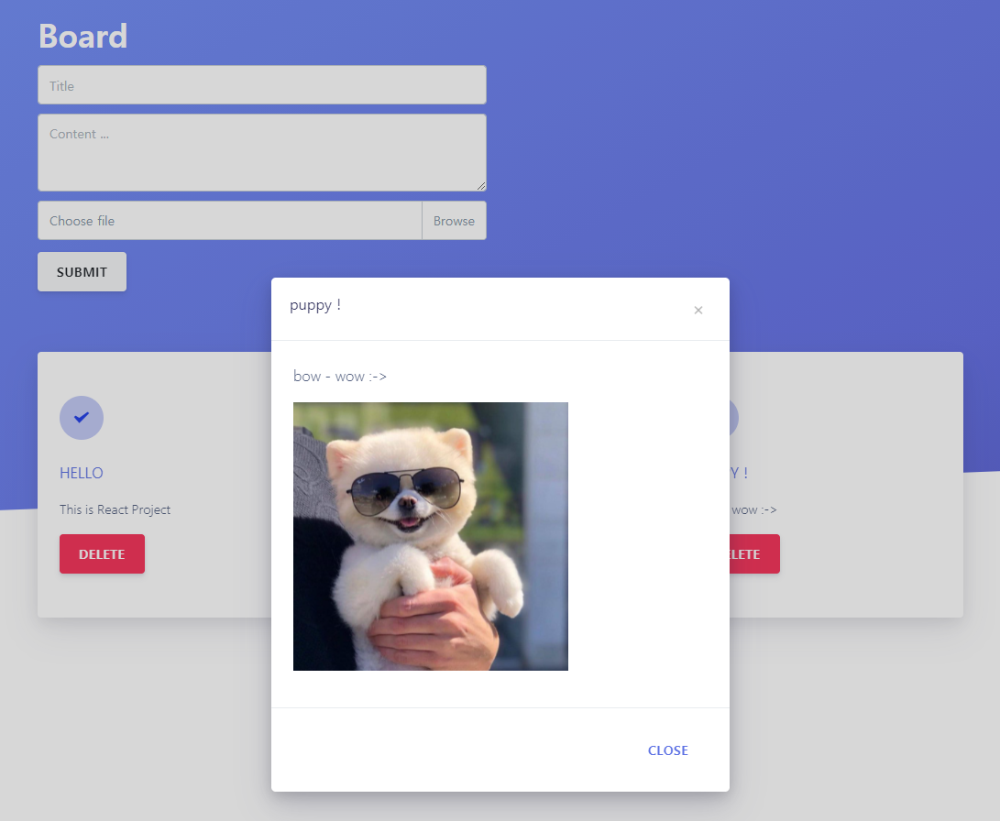

# 01. 간단한 React 메모장 (with react-persist)

원래 vueJS보다 react 쪽에 더 관심이 가서 react로 프로젝트를 하나 해볼까 했는데..

vueJS가 좀 더 심플하고 앞으로도 왠지 심플한 vueJS가 더 뜰거 같아서 이 쪽을 공부하고, 프로젝트를 하기로 마음 먹었다 -

이건 react공부할 때, 간단히 만들었던 메모장 -

git 소스에는 프로젝트하려고 분리해놔서 좀 섞여있긴 함..

간단하고 괜찮은 거 같아서 일단 page에 올려봤는데, 나쁘지 않은 거 같다.

올리기 전에, **react-persist**도 추가하여 메모가 local storage에 저장되게 하였다.

(새로고침 하여도 메모가 날아가지 않는다!)

디자인은 무료 템플릿을 사용하였다.

[https://www.creative-tim.com/product/argon-design-system-react?ref=madewithreact](https://www.creative-tim.com/product/argon-design-system-react?ref=madewithreact)

# Board (github page)

---

### 목록 및 등록 화면

### 조회 팝업

### etc

→ **validate/insert/delete 시, 상단에 toast 메세지도 뜬다!**

[React App](https://hueleev.github.io/react-board/)

# Git respository

---

[https://github.com/hueleev/react-board](https://github.com/hueleev/react-board)