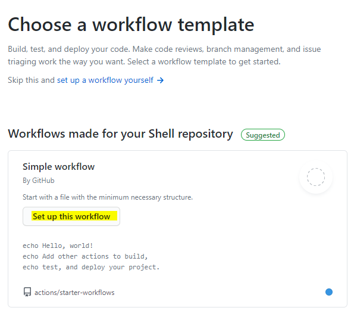
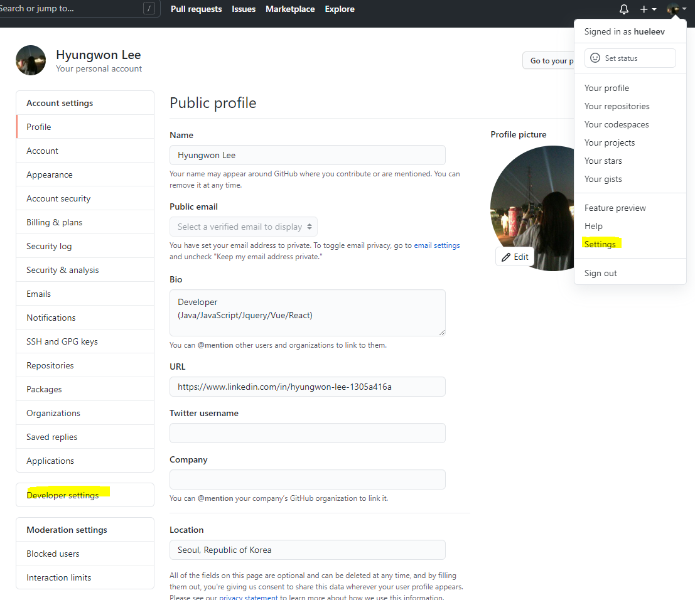
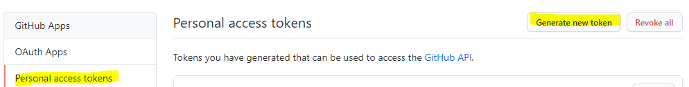
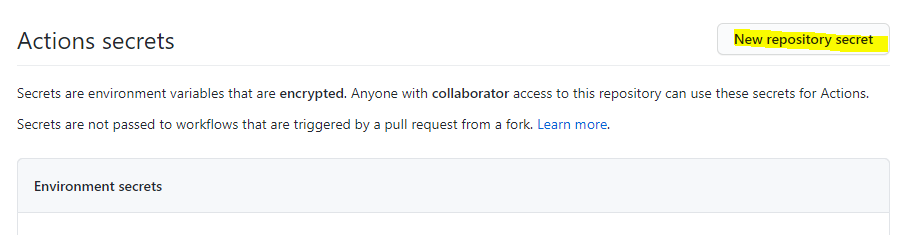
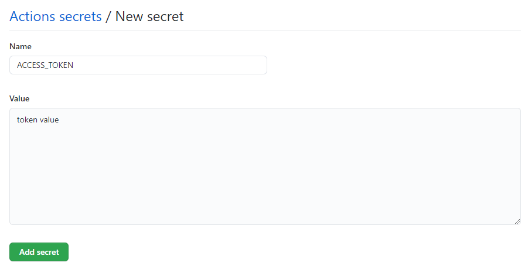
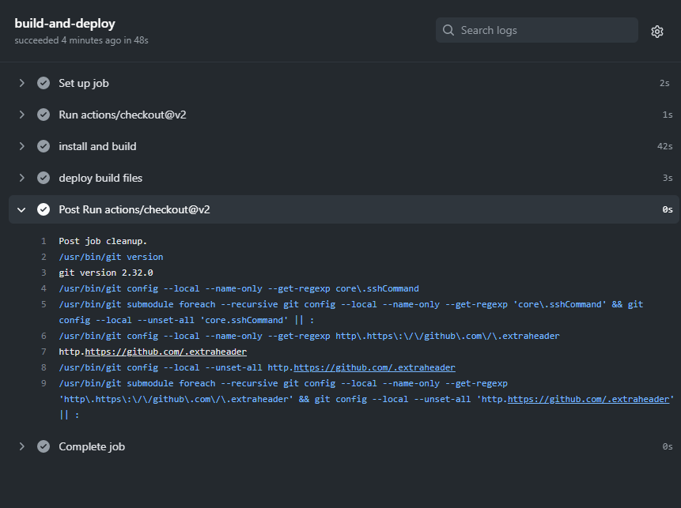

# 04. Github Action 적용하기

🍕 이전까지는 `deploy.sh`을 실행시켜 블로그를 배포했다면, github Action 을 활용하여 소스를 push 할때마다 자동 배포가 되도록 해보겠다. 

## workflow 생성

📌 **먼저, workflow 파일을 생성해주자.**

원하는 디렉토리 로 이동해 `Actions`로 이동해, `New workflow` 클릭해주자!


<br/>

📌 **그 다음에 `Set up this workflow`를 선택해주자.**



<br/>

📌 **다음 아래 소스를 입력한다.**

```css
# This is a basic workflow to help you get started with Actions

name: build & deploy # actions 의 workflow 이름

# workflow 가 동작되는 상황
# master 브랜치에 push 가 발생되는 상황에서 동작한다는 뜻
on:
  push:
    branches: [master]

# A workflow run is made up of one or more jobs that can run sequentially or in parallel
jobs:
  # This workflow contains a single job called "build"
  build-and-deploy: # job의 이름, 여러개의 job이 등록될 수 있음
    # The type of runner that the job will run on
    runs-on: ubuntu-latest # job 이 돌아가는 환경

    # Steps represent a sequence of tasks that will be executed as part of the job
    steps:
      # Checks-out your repository under $GITHUB_WORKSPACE, so your job can access it
      - uses: actions/checkout@v2 # GITHUB_WORKSPACE 로 체크아웃

      # node package 설치
      - name: install and build
        run: |
          npm install
          npm run docs:build
      # gh-pages 로 배포 (vuepress 배포 스크립트에서 차용)
      - name: deploy build files
        env:
          ACCESS_TOKEN: ${{ secrets.ACCESS_TOKEN }} # 해당 repository 의 Secrets 의 토큰정보를 환경변수에 저장한 후
        run: |
          cd docs/.vuepress/dist
          git config --global user.email "hueleev@gmail.com"
          git config --global user.name "leehyunwon"
          git init
          git add -A
          git commit -m 'deploy with vuepress'
          # 토큰정보를 바탕으로 gh-pages 브랜치에 push
          git push -f https://${ACCESS_TOKEN}@github.com/${GITHUB_REPOSITORY}.git master:gh-pages
```


이때, 내 프로젝트는 script에 build 명령어가 `docs:build` 여서 저렇게 입력한거고, 각자 정해놓은 script를 적어주면 된다.

## ACCESS_TOKEN 생성

📌 **다음, 프로필 `settings` > `Developer Settings` 로 이동해주자.**



<br/>

📌 **다음 `Personal access tokens` > `Generate new token` 으로 이동해주자.**



<br/>

📌 **토큰이 보이지 않을 경우, `Regenerate token` 을 생성 후 복사해준다.**


<br/>

📌 **다음, 다시 respository `settings` 로 이동 후, `secrets` 로 이동해준다.**

  **`New repository token` 을 클릭하고,**



  **`Name` 은 `ACCESS_TOKEN` , `value` 는 이전에 복사한 토큰을 입력한 후, `Add secret`을 클릭해준다.**



## build and deploy

📌 **vsc 터미널에서 `git pull` 명령어를 입력하여, yaml 파일을 받아온다.**

```bash
git pull
```

<br/>

📌 **이제부터 `master` 에 `push`할때마다 블로그가 바로 배포되는 것을 확인할 수 있다.**

그러면 이전에 작업한 `deploy.sh`을 굳이 실행할 필요없이 master에서 push 만 하면 프로젝트가 저절로 deploy된다.
해당 repository 에 Actions 에서 상태를 확인할 수 있다.




### Reference

---

[https://shockzinfinity.github.io/dev-log/vuepress.html#github-actions-를-이용한-자동-배포](https://shockzinfinity.github.io/dev-log/vuepress.html#github-actions-%E1%84%85%E1%85%B3%E1%86%AF-%E1%84%8B%E1%85%B5%E1%84%8B%E1%85%AD%E1%86%BC%E1%84%92%E1%85%A1%E1%86%AB-%E1%84%8C%E1%85%A1%E1%84%83%E1%85%A9%E1%86%BC-%E1%84%87%E1%85%A2%E1%84%91%E1%85%A9)