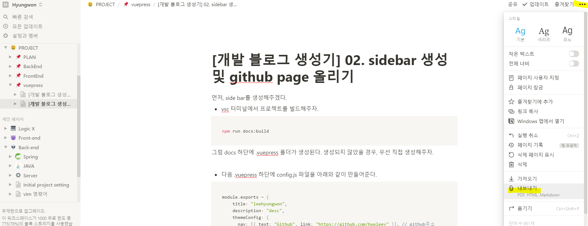
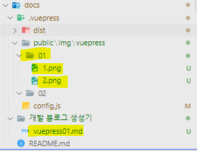

# 02. sidebar 생성 및 github page 올리기

✍🏻 먼저, side bar를 생성해주겠다.

- vsc 터미널에서 프로젝트를 빌드해주자.

```bash
npm run docs:build
```

그럼 docs 하단에 .vuepress 폴더가 생성된다. 생성되지 않았을 경우, 우선 직접 생성해주자.

- 다음 `.vuepress` 하단에 `config.js` 파일을 아래와 같이 만들어준다.

```jsx
module.exports = {
    title: "leehyungwon",
    description: "desc",
    themeConfig: {
      nav: [{ text: "Github", link: "https://github.com/hueleev" }], // github주소
      sidebar: getSidebarArr()
    },
    //<username>.github.io 뒤에 주소가 붙으시면 아래와 같이 ..
    base: "/leehyungwon/"
  };
  
  function getSidebarArr() {
    var fs = require("fs");
    var docsPath = __dirname + "/../";
    var sidebarArr = [];
    var HomeFilelist = [];
    var filelist = fs.readdirSync(docsPath);
    filelist.forEach(function(file) {
      if (file === ".vuepress") return;
      var stat = fs.lstatSync(docsPath + "/" + file);
      if (stat.isDirectory()) {
        // directory
        // title is file, children is readdirSync
        var docsFolderPath = docsPath + "/" + file;
        var list = fs.readdirSync(docsFolderPath);
        sidebarArr.push(makeSidebarObject(file, list));
      } else {
        // NOT directory
        // title is '/' children is file
        HomeFilelist.push(file);
      }
    });
    sidebarArr.unshift(makeSidebarObject("", HomeFilelist));
    return sidebarArr;
  }
  function makeSidebarObject(folder, mdfileList) {
    var path = folder ? "/" + folder + "/" : "/";
    mdfileList = aheadOfReadme(mdfileList);
    var tmpMdfileList = [];
    // remove .md, add Path
    mdfileList.forEach(function(mdfile) {
      if (mdfile.substr(-3) === ".md") {
        mdfile = mdfile.slice(0, -3) === "README" ? "" : mdfile.slice(0, -3);
        tmpMdfileList.push(path + mdfile);
      }
    });
    mdfileList = tmpMdfileList;
    // remove folder prefix number
    if (folder) {
      var dotIdx = folder.indexOf(".");
      var title = Number(folder.substr(0, dotIdx))
        ? folder.substr(dotIdx + 1)
        : folder;
    } else {
      title = "HOME";
    }
    return {
      title: title,
      children: mdfileList
    };
  }
  function aheadOfReadme(arr) {
    // ['1.test.md','README.md'] => ['README.md','1.test.md']
    var readmeIdx = arr.indexOf("README.md");
    if (readmeIdx > 0) {
      arr.unshift(arr.splice(readmeIdx, 1)[0]);
    }
    return arr;
  }
```

이제, github page로 프로젝트를 본격적으로 올려보겠다.

## git push

- vsc 터미널을 git bash로 우선 바꿔주자.


```bash
git add .
```

```bash
git commit -m 'commit 메시지'
```

```bash
git push -u origin master
```

명령어 입력 후, 깃헙에 들어가보면 소스가 올라온 걸 확인 할 수 있을 것이다.

## github page 설정

- 먼저, 깃헙에서 해당 프로젝트 setting에 들어간 후, pages를 클릭해준다.

    필자는 master를 사용했지만, gh-pages로 추후 수정하였고, gh-pages 브랜치를 만든 후, 사용하는 걸 추천한다.

    

## deploy 설정

- `package.json`과 같은 depth에 `deploly.sh`을 만들고 아래 내용을 붙여넣는다.

    하단에 있는 github 주소에는 본인 정보를 넣어준다.

```bash
#!/usr/bin/env sh

# abort on errors
set -e

git pull
git add -A
git commit -m "$1 $2 $3 --all.sh master"
git push origin master

# build
npm run docs:build
# navigate into the build output directory
cd docs/.vuepress/dist

# if you are deploying to a custom domain
# echo 'www.example.com' > CNAME

git init
git add -A
git commit -m 'deploy with vuepress'

# if you are deploying to https://<USERNAME>.github.io
# git push -f git@github.com:<USERNAME>/<USERNAME>.github.io.git master

# if you are deploying to https://<USERNAME>.github.io/<REPO>
git push -f <clone 시 사용했던 github 주소> master:gh-pages

cd -
```

- vsc 터미널에서 git bash를 선택 후, 아래 명령어를 입력해주자.

    (윈도우 cmd에서는 sh는 동작하지 않으므로)

```bash
sh deploy.sh
```

몇 분 후, [https://hueleev.github.io/leehyungwon](https://hueleev.github.io/leehyungwon/vuepress/vuepress01.html) 와 같은 경로를 입력하면, 프로젝트가 올라온 걸 확인할 수 있다!

## tip

필자는 markdown파일을 notion으로 작성한 후, markdown으로 export해준다.



이때, export된 이미지는 .vuepress 폴더 하단에 넣어주어야 빌드 후, 경로를 정확히 잡을 수 있다.



나의 초기 디렉토리 설정은 다음과 같다.

`.vuepress` 하단에 `public/img` 에 이미지를 넣어준 후,

```bash

```

위와 같이 markdown에 경로를 잡아주면, 이미지가 뜨는 걸 확인할 수 있을 것이다.
`dist` 하단에 경로를 잡을 경우, build 할 때 마다 clean되니, dist와 같은 depth에 폴더를 생성해주어야 한다.

### Reference

---

[https://kyounghwan01.github.io/blog/Vue/vuepress/vuepress-start/#설치](https://kyounghwan01.github.io/blog/Vue/vuepress/vuepress-start/#%E1%84%89%E1%85%A5%E1%86%AF%E1%84%8E%E1%85%B5)